# Instana Agent - Monitoring & Observability Operations

This agent allows you to interact with Instana monitoring platform via natural language using LangGraph and the Instana MCP server. It supports HTTP MCP transport mode for reliable communication with the mcp-instana server running in HTTP mode. **The agent integrates seamlessly with the [intelligent orchestrator system](../orchestrator/README.md) for automatic routing**.

## 🚀 **Smart Orchestrator Integration**

The Instana Agent integrates with the intelligent orchestrator for automatic routing:

### Direct Instana Operations
```
"Show me the latest alerts from Instana" → Instana Agent (100% confidence)
"Get Kubernetes events for the last 24 hours" → Instana Agent (100% confidence)
"Check application performance metrics" → Instana Agent (89% confidence)
```

### Skill-Based Routing
```
"application monitoring" → Instana Agent (99% confidence)
"infrastructure monitoring" → Instana Agent (95% confidence)
"performance analysis and troubleshooting" → Instana Agent (92% confidence)
```

## 🏗️ System Integration

This agent integrates seamlessly with the orchestrator system:

```mermaid
graph TD
    A[User Request] --> B[🤖 Smart Orchestrator]
    B --> C[A2A Card Resolver]
    C --> D[Skill Analysis]
    D --> E{Confidence Scoring}
    E -->|High Score| F[📊 Instana Agent - Port 8001]
    E -->|Low Score| G[Other Agents]
    
    F --> H[LangGraph Agent]
    H --> I[Instana MCP Server]
    I --> J[Instana API]
    J --> K[Instana Platform]
    
    subgraph "Agent Capabilities"
        F
        H
        I
        J
        K
    end
```



## ✨ Key Features

### 📊 Monitoring & Observability Operations
- **Event Analysis**: Retrieve and analyze application and infrastructure events
- **Alert Management**: Monitor alerts and alert configurations
- **Performance Metrics**: Access application and infrastructure performance data
- **Resource Monitoring**: Monitor Kubernetes clusters and infrastructure resources

### 🤖 Advanced AI Capabilities
- **Natural Language Interface**: Interact with Instana using plain English
- **Context-Aware Operations**: Understands complex monitoring scenarios
- **Error Handling**: Intelligent error detection and resolution suggestions
- **Streaming Updates**: Real-time progress updates during operations

### 🔗 Orchestrator Integration
- **Automatic Routing**: Intelligent routing based on monitoring/observability keywords
- **Skill Discovery**: Capabilities automatically discovered by orchestrator
- **Confidence Scoring**: High-confidence routing for Instana operations
- **Dynamic Registration**: Can be registered/unregistered at runtime

## 🎯 Supported Operations

### Application Monitoring
- **Events**: "Show me Kubernetes events for the last 24 hours"
- **Alerts**: "Get all active alerts for my applications"
- **Metrics**: "Show application performance metrics"
- **Health Status**: "Check the health of my services"

### Infrastructure Monitoring
- **Resources**: "List all infrastructure resources"
- **Topology**: "Show me the infrastructure topology"
- **Analysis**: "Analyze infrastructure performance issues"
- **Catalog**: "Get infrastructure catalog information"

### Performance Analysis
- **Event Analysis**: "Analyze recent performance events"
- **Troubleshooting**: "Help me troubleshoot application issues"
- **Trend Analysis**: "Show performance trends over time"
- **Capacity Planning**: "Analyze resource utilization patterns"

## 📊 Agent Card (A2A Integration)

### Orchestrator Recognition

The orchestrator recognizes this agent with the following capabilities:

```python
Instana Agent Card:
- agent_id: "instana"
- name: "Instana Agent"
- description: "Handles Instana monitoring and observability operations via MCP protocol"
- endpoint: "http://localhost:8001"
- skills: [
    "monitoring",                   # Application monitoring and APM
    "infrastructure_monitoring",    # Infrastructure monitoring
    "event_analysis",              # Event analysis and troubleshooting
    "alert_management",            # Alert configuration and management
    "performance_analysis",        # Performance analysis and optimization
    "kubernetes_monitoring"        # Kubernetes monitoring
  ]
- keywords: ["instana", "monitoring", "apm", "observability", "alerts", 
            "events", "performance", "infrastructure", "kubernetes"]
```

### Routing Examples

```bash
# High-confidence Instana routing (90%+)
"Show me the latest alerts from Instana" → Instana Agent (100%)
"Get Kubernetes events for the last 24 hours" → Instana Agent (99%)
"Analyze application performance issues" → Instana Agent (95%)

# Skill-based routing
"application monitoring" → Instana Agent (99%)
"infrastructure monitoring" → Instana Agent (95%)
"performance analysis and troubleshooting" → Instana Agent (92%)
```

## 🚀 Quick Start

### Prerequisites

Before running the agent, you need:

1. **Instana Instance**: Access to an Instana monitoring platform
2. **API Token**: A valid Instana API token with appropriate permissions
3. **MCP Instana Server**: The mcp-instana server running in HTTP mode at `http://127.0.0.1:8000/mcp`
4. **Google API Key**: For the Gemini model used by the agent

### Option 1: Via Orchestrator (Recommended)

Run as part of the intelligent orchestration system:

```bash
# Terminal 1: Start MCP Instana Server
cd ../mcp-instana
export INSTANA_BASE_URL="https://your-instana-instance.instana.io"
export INSTANA_API_TOKEN="your-instana-api-token"
python src/mcp_server.py --host 127.0.0.1 --port 8000

# Terminal 2: Start Instana Agent
cd instanaAgent
export INSTANA_BASE_URL="https://your-instana-instance.instana.io"
export INSTANA_API_TOKEN="your-instana-api-token"
export GOOGLE_API_KEY="your-google-api-key"
export MCP_SERVER_URL="http://127.0.0.1:8000/mcp"  # Optional, defaults to this
uv sync
uv run -m app

# Terminal 2: Start Orchestrator
cd ../orchestrator
export GOOGLE_API_KEY="your-google-api-key"
uv run -m app

# Terminal 3: Test routing
cd ../orchestrator
export GOOGLE_API_KEY="your-google-api-key"
uv run -m app -m "Show me the latest alerts from Instana" -v
uv run -m app -m "Get Kubernetes events for the last 24 hours" -v

# Using client
cd ../orchestrator_client
export GOOGLE_API_KEY="your-google-api-key"
uv run . --agent http://localhost:8000
# > "Show me the latest alerts from Instana"
```

### Option 2: Direct Agent Connection

Connect directly to the Instana agent:

```bash
# First, start the MCP server
cd ../mcp-instana
export INSTANA_BASE_URL="https://your-instana-instance.instana.io"
export INSTANA_API_TOKEN="your-instana-api-token"
python src/mcp_server.py --host 127.0.0.1 --port 8000 &

# Then start the agent
cd instanaAgent
export INSTANA_BASE_URL="https://your-instana-instance.instana.io"
export INSTANA_API_TOKEN="your-instana-api-token"
export GOOGLE_API_KEY="your-google-api-key"
export MCP_SERVER_URL="http://127.0.0.1:8000/mcp"

# Install dependencies and run
uv sync
uv run -m app

# Test directly
curl -X POST http://localhost:8001 \
  -H "Content-Type: application/json" \
  -d '{"method": "message/send", "params": {"message": {"parts": [{"text": "Show me recent events"}]}}}'
```

## 🧪 Testing & Validation

### Comprehensive Test Suite

```bash
# Run agent-specific tests
cd instanaAgent
uv run -m app

# Test orchestrator routing
cd ../orchestrator
export GOOGLE_API_KEY="your-google-api-key"
uv run -m app -m "Show me the latest alerts from Instana" -v
uv run -m app -m "Get Kubernetes events for the last 24 hours" -v

# Test direct agent communication
curl -X POST http://localhost:8001 \
  -H "Content-Type: application/json" \
  -d '{"method": "message/send", "params": {"message": {"parts": [{"text": "Show me recent alerts"}]}}}'
```

### Expected Test Results

**Instana Operations**:
```
✅ Get Events: "Found 25 Kubernetes events in the last 24 hours..."
✅ Get Alerts: "Found 5 active alerts: High CPU usage, Memory threshold exceeded..."
✅ Infrastructure Status: "Infrastructure topology shows 15 services across 3 clusters..."
✅ Performance Analysis: "Application performance shows latency spike at 14:30..."
```

## 🔧 Technical Architecture

### MCP Integration

The agent uses the mcp-instana MCP server for monitoring operations via HTTP:

```python
from mcp import ClientSession
from mcp.client.streamable_http import streamablehttp_client
from langchain_mcp_adapters.tools import load_mcp_tools

class InstanaAgent:
    async def _init_mcp_tools(self):
        # MCP server endpoint - default to localhost:8000/mcp
        mcp_server_url = os.getenv("MCP_SERVER_URL", "http://127.0.0.1:8000/mcp")
        
        # Use HTTP connection to MCP server
        async with streamablehttp_client(mcp_server_url) as (read_stream, write_stream, _):
            async with ClientSession(read_stream, write_stream) as session:
                await session.initialize()
                tools = await load_mcp_tools(session)
                return tools
```

### A2A Protocol Implementation

```python
from a2a.server.agent_execution import AgentExecutor

class InstanaAgentExecutor(AgentExecutor):
    def __init__(self):
        self.agent = InstanaAgent()
    
    async def execute(self, context: RequestContext, event_queue: EventQueue):
        # Handle A2A protocol requests
```

## 🔍 Available Tools

The agent provides access to comprehensive Instana monitoring tools:

### Event Tools
- `get_event`: Get specific event by ID
- `get_kubernetes_info_events`: Get Kubernetes events with time filtering
- `get_agent_monitoring_events`: Get agent monitoring events

### Infrastructure Tools
- `get_infrastructure_resources`: List infrastructure resources
- `get_infrastructure_catalog`: Get infrastructure catalog
- `get_infrastructure_topology`: Get infrastructure topology
- `analyze_infrastructure`: Analyze infrastructure performance

### Application Tools
- `get_application_resources`: Get application resources
- `get_application_metrics`: Get application performance metrics
- `get_application_alerts`: Get application alert configurations

## 🚨 Troubleshooting

### Common Issues

1. **MCP Server Connection Failed**
   ```bash
   # Check if mcp-instana is in the correct path
   ls ../mcp-instana/src/mcp_server.py
   
   # Check Python virtual environment
   ls ../mcp-instana/.mcp-instana/bin/python
   ```

2. **Instana API Authentication**
   ```bash
   # Verify environment variables
   echo $INSTANA_BASE_URL
   echo $INSTANA_API_TOKEN
   
   # Test API connectivity
   curl -H "Authorization: apiToken $INSTANA_API_TOKEN" \
        "$INSTANA_BASE_URL/api/instana/health"
   ```

3. **Missing Dependencies**
   ```bash
   # Reinstall dependencies
   uv sync --force
   ```

## 📚 Environment Variables

Required environment variables:

```bash
# Required
INSTANA_BASE_URL="https://your-instana-instance.instana.io"
INSTANA_API_TOKEN="your-instana-api-token"
GOOGLE_API_KEY="your-google-api-key"

# Optional
MCP_SERVER_URL="http://127.0.0.1:8000/mcp"  # MCP server endpoint (defaults to this)
```

## 🤝 Contributing

1. Fork the repository
2. Create a feature branch
3. Make your changes
4. Test with the mcp-instana server
5. Submit a pull request

## 📄 License

This project is licensed under the Apache License - see the parent repository for details.