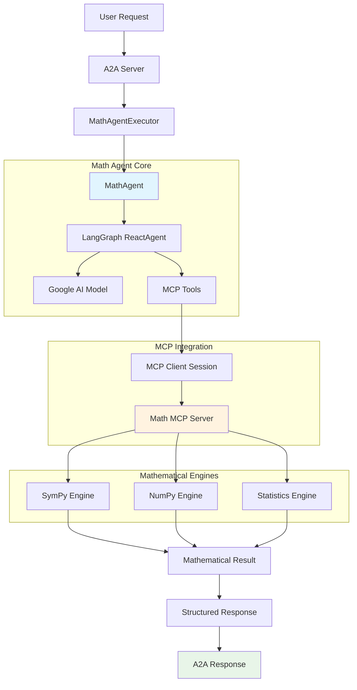
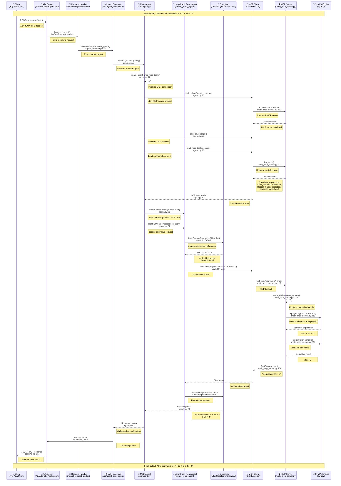

# Developer Guide: Math Agent

This document provides a comprehensive technical overview of the Math Agent, including its architecture, MCP integration, design patterns, and implementation details.

## 📋 Overview

The Math Agent is a sophisticated A2A-compatible agent that provides advanced mathematical computation capabilities through the Model Context Protocol (MCP). It combines LangGraph ReactAgent with a custom MCP server to deliver powerful mathematical tools including calculus, algebra, statistics, and matrix operations.

## 🔗 A2A SDK Integration

The Math Agent demonstrates modern A2A SDK integration patterns with proper agent card resolution, message handling, and response formatting.

### Key A2A Components

1. **A2ACardResolver**: Handles agent capability discovery
2. **A2AClient**: Manages message sending and response handling  
3. **Message Types**: Support for single messages, multiturn conversations, and streaming
4. **Agent Cards**: Public and authenticated extended card support

### Agent Card Structure

The Math Agent exposes its capabilities through a well-defined agent card:

```json
{
  "name": "Math Agent",
  "description": "Advanced mathematical computation agent",
  "skills": [
    {
      "name": "arithmetic",
      "description": "Basic arithmetic operations",
      "examples": ["2 + 2", "15 * 7", "100 / 4"],
      "tags": ["math", "basic", "calculator"]
    },
    {
      "name": "equation_solving", 
      "description": "Solve algebraic equations",
      "examples": ["x^2 - 4 = 0", "2x + 5 = 11"],
      "tags": ["algebra", "equations", "solving"]
    },
    {
      "name": "calculus",
      "description": "Differentiation and integration",
      "examples": ["derivative of x^2", "integral of sin(x)"],
      "tags": ["calculus", "derivatives", "integrals"]
    },
    {
      "name": "matrix_operations",
      "description": "Linear algebra operations",
      "examples": ["multiply matrices", "find determinant"],
      "tags": ["linear algebra", "matrices"]
    },
    {
      "name": "statistics",
      "description": "Statistical calculations",
      "examples": ["mean of [1,2,3,4,5]", "standard deviation"],
      "tags": ["statistics", "data analysis"]
    }
  ]
}
```

## 🏗️ Architecture Overview



## 🔄 Complete Function Call Flow



## 🔍 Core Components Analysis

### 1. Math Agent Class (app/agent.py)

**Key Features:**
- MCP-based mathematical tool integration
- Asynchronous processing with session management
- Google AI model with mathematical reasoning
- Dynamic tool loading from MCP server

**Architecture Pattern:**
```python
class MathAgent:
    def __init__(self):
        self._initialize_model()
    
    async def process_request(self, request: str) -> str:
        # Create fresh MCP connection for each request
        async with stdio_client(server_params) as (read, write):
            async with ClientSession(read, write) as session:
                await session.initialize()
                tools = await load_mcp_tools(session)
                agent = create_react_agent(self.model, tools)
                response = await agent.ainvoke({"messages": request})
                return self._extract_response(response)
```

### 2. MCP Server Implementation (math_mcp_server.py)

**Available Tools:**
1. **calculate_expression** - Safe expression evaluation
2. **solve_equation** - Algebraic equation solving
3. **derivative** - Calculus differentiation
4. **integral** - Calculus integration
5. **matrix_operations** - Linear algebra operations
6. **statistics_calculator** - Statistical analysis

**Tool Definition Example:**
```python
Tool(
    name="derivative",
    description="Calculate the derivative of a mathematical expression",
    inputSchema={
        "type": "object",
        "properties": {
            "expression": {
                "type": "string",
                "description": "Mathematical expression (e.g., 'x**2 + 3*x + 2')"
            },
            "variable": {
                "type": "string",
                "description": "Variable to differentiate with respect to",
                "default": "x"
            }
        },
        "required": ["expression"]
    }
)
```

### 3. Mathematical Engines Integration

#### SymPy Engine
- **Purpose**: Symbolic mathematics and calculus
- **Capabilities**: Expression parsing, differentiation, integration, equation solving
- **Safety**: Secure expression evaluation without eval()

#### NumPy Engine
- **Purpose**: Numerical computations and linear algebra
- **Capabilities**: Matrix operations, array processing
- **Performance**: Optimized numerical algorithms

#### Statistics Engine
- **Purpose**: Statistical analysis and data processing
- **Capabilities**: Mean, median, mode, standard deviation, variance

### 4. MCP Protocol Integration

**Connection Management:**
```python
server_params = StdioServerParameters(
    command="python",
    args=[str(math_server_path)],
)

async with stdio_client(server_params) as (read, write):
    async with ClientSession(read, write) as session:
        await session.initialize()
        tools = await load_mcp_tools(session)
```

**Tool Loading:**
- Dynamic tool discovery from MCP server
- Automatic tool registration with LangGraph
- Type-safe tool invocation

## 🎯 Key Design Patterns

### 1. MCP Integration Pattern
- **Protocol Compliance**: Full MCP specification adherence
- **Tool Discovery**: Dynamic tool loading from server
- **Session Management**: Proper connection lifecycle
- **Error Handling**: Graceful MCP communication failures

### 2. Fresh Session Pattern
- **Isolation**: Each request gets fresh MCP connection
- **Reliability**: Prevents connection state issues
- **Resource Management**: Automatic cleanup after requests

### 3. Symbolic Computation Pattern
- **Safety**: No eval() usage, only SymPy parsing
- **Flexibility**: Handles both numerical and symbolic results
- **Validation**: Input expression validation and sanitization

### 4. Multi-Engine Architecture
- **Specialization**: Different engines for different math domains
- **Optimization**: Best tool for each mathematical operation
- **Extensibility**: Easy addition of new mathematical engines

## 🔧 Mathematical Capabilities

### 1. Expression Evaluation
```python
# Examples:
"2 + 2"                    → 4.0
"sin(pi/4)"               → 0.7071067811865476
"sqrt(16)"                → 4.0
"log(e)"                  → 1.0
"factorial(5)"            → 120.0
```

### 2. Equation Solving
```python
# Examples:
"x**2 - 4 = 0"           → [-2, 2]
"2*x + 5 = 11"           → [3]
"x**3 - 8 = 0"           → [2, -1 - sqrt(3)*I, -1 + sqrt(3)*I]
```

### 3. Calculus Operations
```python
# Derivatives:
"x**2 + 3*x + 2"         → 2*x + 3
"sin(x)"                 → cos(x)
"e**x"                   → exp(x)

# Integrals:
"x**2"                   → x**3/3
"sin(x)"                 → -cos(x)
"1/x"                    → log(x)
```

### 4. Matrix Operations
```python
# Examples:
multiply([[1,2],[3,4]], [[5,6],[7,8]])  → [[19,22],[43,50]]
determinant([[1,2],[3,4]])               → -2.0
inverse([[1,2],[3,4]])                   → [[-2,1],[1.5,-0.5]]
```

### 5. Statistical Analysis
```python
# Examples:
mean([1,2,3,4,5])        → 3.0
std([1,2,3,4,5])         → 1.5811388300841898
median([1,2,3,4,5])      → 3.0
```

## 🧪 Testing and Debugging

### A2A SDK Test Client

The Math Agent includes a comprehensive test client (`app/test_client.py`) that demonstrates proper A2A SDK usage patterns:

**Key Features:**
- **Agent Card Resolution**: Fetches agent capabilities from `/.well-known/agent.json`
- **Extended Card Support**: Handles authenticated extended agent cards
- **Multiple Message Patterns**: Single messages, multiturn conversations, and streaming
- **Proper Logging**: Uses structured logging with JSON formatting for responses

**Test Client Architecture:**
```python
async def main() -> None:
    # Configure logging
    logging.basicConfig(level=logging.INFO)
    logger = logging.getLogger(__name__)
    
    # Initialize A2A components
    async with httpx.AsyncClient() as httpx_client:
        # 1. Agent Card Resolution
        resolver = A2ACardResolver(httpx_client=httpx_client, base_url=base_url)
        agent_card = await resolver.get_agent_card()
        
        # 2. A2A Client Initialization
        client = A2AClient(httpx_client=httpx_client, agent_card=agent_card)
        
        # 3. Message Sending Patterns
        await test_single_message(client, logger)
        await test_multiturn_conversation(client, logger)
        await test_streaming_response(client, logger)
```

**Testing Patterns Demonstrated:**

1. **Single Message Pattern:**
```python
send_message_payload = {
    'message': {
        'role': 'user',
        'parts': [{'kind': 'text', 'text': 'What is 1+2?'}],
        'messageId': uuid4().hex,
    },
}
request = SendMessageRequest(id=str(uuid4()), params=MessageSendParams(**send_message_payload))
response = await client.send_message(request)
logger.info("Response received:")
logger.info(response.model_dump_json(indent=2, exclude_none=True))
```

2. **Multiturn Conversation Pattern:**
```python
# First message: "What is 6*?"
first_response = await client.send_message(first_request)
task_id = first_response.root.result.id
contextId = first_response.root.result.contextId

# Second message: "6*7" (continues the conversation)
second_payload = {
    'message': {
        'role': 'user',
        'parts': [{'kind': 'text', 'text': '6*7'}],
        'messageId': uuid4().hex,
        'taskId': task_id,        # Link to previous message
        'contextId': contextId,   # Maintain conversation context
    },
}
```

3. **Streaming Response Pattern:**
```python
streaming_request = SendStreamingMessageRequest(id=str(uuid4()), params=MessageSendParams(**payload))
stream_response = client.send_message_streaming(streaming_request)

async for chunk in stream_response:
    logger.info("Streaming chunk received:")
    logger.info(chunk.model_dump_json(indent=2, exclude_none=True))
```

### Unit Testing MCP Tools

```python
import pytest
from unittest.mock import AsyncMock, patch

class TestMathMCPServer:
    @pytest.mark.asyncio
    async def test_calculate_expression(self):
        """Test expression calculation"""
        arguments = {"expression": "2 + 2"}
        result = await handle_calculate_expression(arguments)
        assert "Result: 4.0" in result[0].text
    
    @pytest.mark.asyncio
    async def test_derivative_calculation(self):
        """Test derivative calculation"""
        arguments = {"expression": "x**2", "variable": "x"}
        result = await handle_derivative(arguments)
        assert "2*x" in result[0].text
    
    @pytest.mark.asyncio
    async def test_solve_equation(self):
        """Test equation solving"""
        arguments = {"equation": "x**2 - 4 = 0", "variable": "x"}
        result = await handle_solve_equation(arguments)
        assert "[-2, 2]" in result[0].text
```

### Integration Testing

```python
class TestMathAgentIntegration:
    @pytest.mark.asyncio
    async def test_full_math_workflow(self):
        """Test complete mathematical workflow"""
        agent = MathAgent()
        
        # Test basic calculation
        result = await agent.process_request("What is 2 + 2?")
        assert "4" in result
        
        # Test calculus
        result = await agent.process_request("What is the derivative of x^2?")
        assert "2*x" in result or "2x" in result
        
        # Test equation solving
        result = await agent.process_request("Solve x^2 - 4 = 0")
        assert "2" in result and "-2" in result
```

### Running the A2A Test Client

```bash
# Start the Math Agent server (in one terminal)
cd a2a/mathAgent
python -m app

# Run the test client (in another terminal)
cd a2a/mathAgent
python app/test_client.py
```

**Expected Output:**
```
INFO:__main__:Attempting to fetch public agent card from: http://localhost:8003/.well-known/agent.json
INFO:__main__:Successfully fetched public agent card:
{
  "name": "Math Agent",
  "description": "Advanced mathematical computation agent with calculus, algebra, and statistics capabilities",
  "skills": [
    {
      "name": "arithmetic",
      "description": "Basic arithmetic operations",
      "examples": ["2 + 2", "15 * 7", "100 / 4"]
    },
    // ... more skills
  ]
}
INFO:__main__:A2AClient initialized.
INFO:__main__:Response received:
{
  "jsonrpc": "2.0",
  "result": {
    "id": "task_123",
    "status": "completed",
    "artifacts": [
      {
        "parts": [
          {
            "kind": "text",
            "text": "The result is 3."
          }
        ]
      }
    ]
  }
}
```

### MCP Server Testing

```bash
# Test MCP server directly
python math_mcp_server.py

# Test specific tools
echo '{"method": "tools/list", "params": {}}' | python math_mcp_server.py

# Test tool calls
echo '{"method": "tools/call", "params": {"name": "calculate_expression", "arguments": {"expression": "2+2"}}}' | python math_mcp_server.py
```

### Debug Mode

```python
# Enable debug logging
import logging
logging.basicConfig(level=logging.DEBUG)

# Test with debug output
agent = MathAgent()
result = await agent.process_request("Calculate the integral of x^2")
print(f"Debug result: {result}")
```

### Logging Best Practices

The Math Agent implements structured logging throughout the codebase:

**Logger Configuration:**
```python
# Configure logging to show INFO level messages
logging.basicConfig(level=logging.INFO)
logger = logging.getLogger(__name__)
```

**JSON Response Logging:**
```python
# Use logger.info instead of print for better control
logger.info("Response received:")
logger.info(response.model_dump_json(indent=2, exclude_none=True))

# Structured logging with context
logger.info("A2AClient initialized.")
logger.info("Multiturn response received:")
logger.info("Streaming chunk received:")
```

**Error Handling with Logging:**
```python
try:
    response = await client.send_message(request)
    logger.info("Request successful")
except Exception as e:
    logger.error(f"Request failed: {e}", exc_info=True)
```

**Benefits:**
- **Structured Output**: JSON responses are properly formatted and readable
- **Log Levels**: Control verbosity with standard logging levels
- **Context**: Each log message includes descriptive context
- **Error Tracking**: Full exception information with stack traces

## 🚀 Performance Optimization

### 1. Connection Pooling
```python
class MCPConnectionPool:
    def __init__(self, max_connections=10):
        self.max_connections = max_connections
        self.connections = []
        self.available = asyncio.Queue()
    
    async def get_connection(self):
        """Get available MCP connection"""
        if not self.available.empty():
            return await self.available.get()
        
        if len(self.connections) < self.max_connections:
            conn = await self._create_connection()
            self.connections.append(conn)
            return conn
        
        return await self.available.get()
```

### 2. Result Caching
```python
from functools import lru_cache

@lru_cache(maxsize=1000)
def cached_derivative(expression: str, variable: str = "x") -> str:
    """Cache derivative calculations"""
    return calculate_derivative(expression, variable)
```

### 3. Async Batch Processing
```python
async def process_multiple_expressions(expressions: List[str]) -> List[str]:
    """Process multiple expressions concurrently"""
    tasks = [agent.process_request(expr) for expr in expressions]
    return await asyncio.gather(*tasks)
```

## 🔒 Security Best Practices

### 1. Expression Validation
```python
def validate_expression(expression: str) -> bool:
    """Validate mathematical expression safety"""
    dangerous_patterns = ['import', 'exec', 'eval', '__']
    return not any(pattern in expression.lower() for pattern in dangerous_patterns)
```

### 2. Resource Limits
```python
import resource
import signal

def set_computation_limits():
    """Set resource limits for mathematical computations"""
    # Limit CPU time to 30 seconds
    resource.setrlimit(resource.RLIMIT_CPU, (30, 30))
    
    # Limit memory usage
    resource.setrlimit(resource.RLIMIT_AS, (512*1024*1024, 512*1024*1024))
```

### 3. Input Sanitization
```python
def sanitize_math_input(expression: str) -> str:
    """Sanitize mathematical input"""
    # Remove potentially harmful characters
    import re
    sanitized = re.sub(r'[^a-zA-Z0-9+\-*/()^.,\s=]', '', expression)
    return sanitized.strip()
```

## 🔧 Configuration and Extensibility

### Environment Variables
```bash
GOOGLE_API_KEY=your_api_key           # Google AI API key
MCP_SERVER_TIMEOUT=30                 # MCP server timeout
MAX_EXPRESSION_LENGTH=1000            # Maximum expression length
ENABLE_SYMBOLIC_RESULTS=true          # Enable symbolic mathematics
```

### Adding New Mathematical Tools

1. **Define Tool in MCP Server:**
```python
Tool(
    name="new_math_tool",
    description="Description of new mathematical capability",
    inputSchema={
        "type": "object",
        "properties": {
            "input_param": {
                "type": "string",
                "description": "Parameter description"
            }
        },
        "required": ["input_param"]
    }
)
```

2. **Implement Tool Handler:**
```python
async def handle_new_math_tool(arguments: Dict[str, Any]) -> List[TextContent]:
    """Handle new mathematical tool."""
    try:
        # Implementation logic
        result = perform_new_calculation(arguments)
        return [TextContent(type="text", text=f"Result: {result}")]
    except Exception as e:
        return [TextContent(type="text", text=f"Error: {str(e)}")]
```

3. **Register Tool:**
```python
@server.call_tool()
async def call_tool(name: str, arguments: Dict[str, Any]) -> List[TextContent]:
    if name == "new_math_tool":
        return await handle_new_math_tool(arguments)
    # ... existing tools
```

### Custom Mathematical Engines

```python
class CustomMathEngine:
    """Custom mathematical computation engine"""
    
    def __init__(self):
        self.capabilities = ["custom_operation"]
    
    def custom_operation(self, input_data):
        """Implement custom mathematical operation"""
        # Custom logic here
        return result

# Register custom engine
def register_custom_engine():
    """Register custom mathematical engine"""
    engine = CustomMathEngine()
    # Integration logic
```

## 📊 Monitoring and Metrics

### Performance Metrics
```python
import time
from collections import defaultdict

class MathAgentMetrics:
    def __init__(self):
        self.request_count = defaultdict(int)
        self.response_times = defaultdict(list)
        self.error_count = defaultdict(int)
    
    def record_request(self, tool_name: str, response_time: float, success: bool):
        """Record request metrics"""
        self.request_count[tool_name] += 1
        self.response_times[tool_name].append(response_time)
        if not success:
            self.error_count[tool_name] += 1
    
    def get_metrics(self) -> dict:
        """Get performance metrics"""
        return {
            "total_requests": sum(self.request_count.values()),
            "average_response_time": self._calculate_average_response_time(),
            "error_rate": self._calculate_error_rate(),
            "tool_usage": dict(self.request_count)
        }
```

### Health Checks
```python
async def health_check() -> dict:
    """Perform health check on math agent"""
    try:
        # Test basic functionality
        agent = MathAgent()
        test_result = await agent.process_request("2 + 2")
        
        return {
            "status": "healthy",
            "mcp_server": "running",
            "basic_math": "4" in test_result
        }
    except Exception as e:
        return {
            "status": "unhealthy",
            "error": str(e)
        }
```

## 📚 Best Practices

### 1. Error Handling
- Always validate mathematical expressions before processing
- Provide meaningful error messages for invalid inputs
- Handle MCP connection failures gracefully
- Implement timeout mechanisms for long-running calculations

### 2. Performance Optimization
- Use connection pooling for MCP sessions
- Implement result caching for expensive operations
- Set appropriate resource limits
- Monitor memory usage for large calculations

### 3. Security
- Validate all mathematical expressions
- Prevent code injection through expression parsing
- Set computation time and memory limits
- Log security-related events

### 4. Maintainability
- Keep mathematical engines separate and modular
- Use type hints for all function signatures
- Implement comprehensive test coverage
- Document mathematical algorithms and formulas

## 🔄 Extension Points

### Adding New Mathematical Domains
```python
# Example: Adding graph theory tools
@server.list_tools()
async def list_graph_tools() -> List[Tool]:
    return [
        Tool(
            name="shortest_path",
            description="Find shortest path in a graph",
            inputSchema={...}
        )
    ]
```

### Custom Response Formatting
```python
def format_mathematical_response(result: Any, context: str) -> str:
    """Format mathematical results based on context"""
    if context == "calculus":
        return format_calculus_result(result)
    elif context == "algebra":
        return format_algebra_result(result)
    else:
        return str(result)
```

## 📚 Related Documentation

- [Main README](../README.md) - Project overview
- [Math Agent README](README.md) - User guide
- [MCP Protocol](https://modelcontextprotocol.io/) - Model Context Protocol
- [SymPy Documentation](https://docs.sympy.org/) - Symbolic mathematics
- [NumPy Documentation](https://numpy.org/doc/) - Numerical computing
- [LangGraph Documentation](https://langchain-ai.github.io/langgraph/) - ReactAgent framework

---

*Last updated: January 2025*
