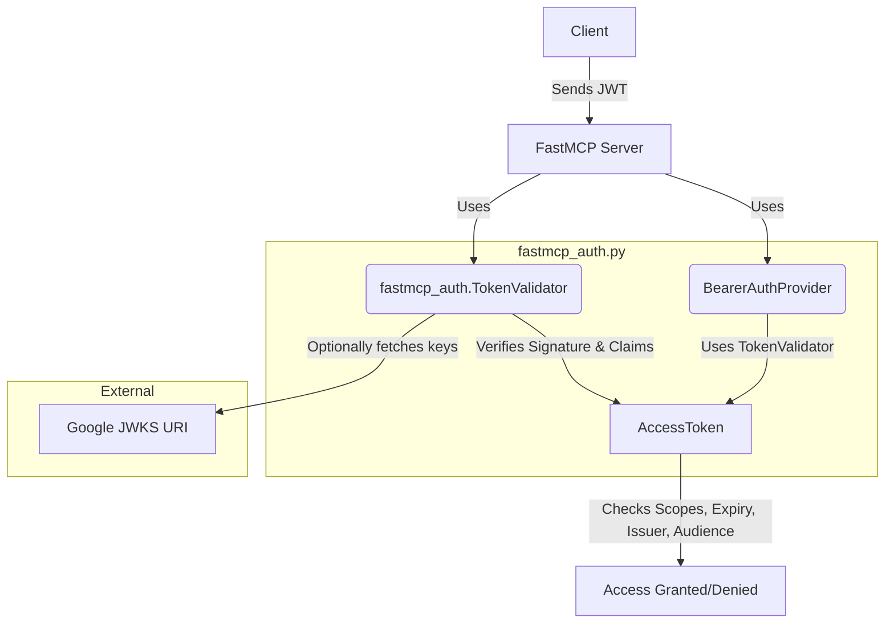

# fastmcp_auth

`fastmcp_auth.py` provides JWT authentication utilities for FastMCP servers and clients, supporting token creation, validation, and claims extraction. It is designed to work with FastMCP's Bearer Token Authentication and can integrate with public key providers like Google JWKS.

## How it Works

- **Token Creation**: Use `RSAKeyPair` to generate and sign JWTs with custom claims (email, scopes, etc).
- **Token Validation**: `TokenValidator` verifies JWTs, checking signature, issuer, audience, expiry, and required scopes. It can use a static public key or fetch keys from a JWKS URI (e.g., Google).
- **Claims Extraction**: Extracts email, client ID, scopes, and custom claims from valid tokens.
- **BearerAuthProvider**: Integrates with FastMCP server to enforce authentication and authorization using validated tokens.

## Authentication Flow



## Main Components

- **RSAKeyPair**: Generate RSA keys and sign JWTs for testing or custom auth.
- **TokenValidator**: Validate JWTs, enforce claims, and extract user info.
- **BearerAuthProvider**: FastMCP-compatible provider for server-side auth.
- **Google JWKS Integration**: Validate tokens signed by Google using their JWKS URI.

## Example Usage

```python
from fastmcp_auth import RSAKeyPair, TokenValidator

# Generate a test key pair
key_pair = RSAKeyPair.generate()

# Create a token
token = key_pair.create_token(subject="user@example.com", scopes=["read", "write"])

# Validate the token
validator = TokenValidator(public_key=key_pair.public_key, required_scopes=["read"])
access_token = validator.validate_token(token)
print(access_token.email)  # user@example.com

# Use Google JWKS for validation
google_validator = TokenValidator(
    jwks_uri="https://www.googleapis.com/service_accounts/v1/jwk/gsuitecse-tokenissuer-drive@system.gserviceaccount.com",
    issuer="https://accounts.google.com",
    algorithm="RS256"
)
```

## Running Tests

Run all tests with:

```sh
uv run python test_fastmcp_auth.py
```

## Security Notes
- Always use secure key management in production.
- Validate issuer, audience, and scopes for all tokens.
- Use JWKS URIs for dynamic key rotation when possible. 