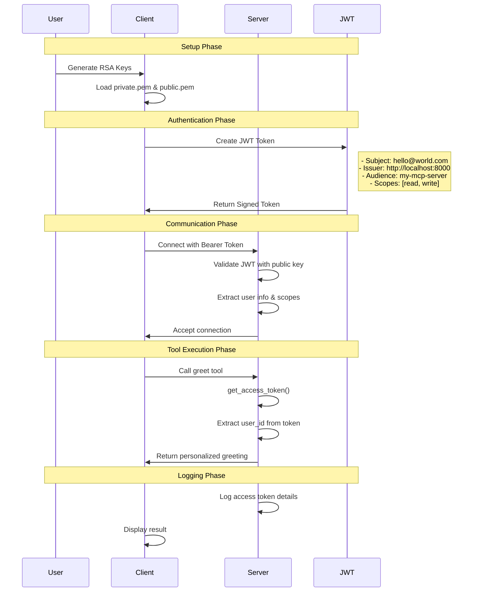

# FastMCP Auth Example

A complete FastMCP (Model Context Protocol) implementation with JWT authentication, demonstrating secure communication between client and server using RSA key pairs.

## Prerequisites

- Python 3.10 or higher
- `uv` package manager (install from https://docs.astral.sh/uv/getting-started/installation/)
- OpenSSL (for generating RSA keys)

## Quick Start

### 1. Navigate to the Project Directory

```bash
cd /Users/guangyaliu/go/src/github.com/gyliu513/langX101/fastmcp/auth
```

### 2. Install Dependencies

```bash
uv sync --extra dev
```

This installs all required dependencies including:
- `fastmcp` - The main FastMCP library
- `PyJWT` - JWT token handling
- `pydantic` - Data validation

### 3. Generate RSA Keys for JWT Authentication

```bash
# Generate private key
openssl genpkey -algorithm RSA -out private.pem -pkeyopt rsa_keygen_bits:2048

# Generate public key
openssl rsa -in private.pem -pubout -out public.pem
```

### 4. Start the Server

In your terminal, run:

```bash
uv run server.py
```

You should see:
```
Starting FastMCP server on http://localhost:8000/mcp
Available tools: greet
```

The server is now running with JWT authentication enabled.

### 5. Test the Client

Open a **new terminal window** and navigate to the same directory:

```bash
cd /Users/guangyaliu/go/src/github.com/gyliu513/langX101/fastmcp/auth
```

Then run the client:

```bash
uv run client.py
```

You should see output like:
```
🚀 Starting FastMCP client with JWT authentication...
🔐 Generated JWT token: eyJhbGciOiJSUzI1NiIsInR5cCI6IkpXVCJ9...
✅ Result: Hello, World! Your userid is hello@world.com.
```

## Authentication Workflow



## What's Happening

### Server (`server.py`)
- **JWT Authentication**: Uses `BearerAuthProvider` with RSA public key validation
- **Middleware**: Includes logging and error handling middleware
- **Token Extraction**: Uses `get_access_token()` to extract user information
- **Tool Access**: Validates tokens and extracts user details for each tool call

### Client (`client.py`)
- **Token Generation**: Creates JWT tokens using RSA private key
- **Authentication**: Sends Bearer tokens in Authorization header
- **Connection**: Establishes secure connection with server
- **Tool Execution**: Calls authenticated tools and displays results

### Security Features
- **RSA Key Pair**: Asymmetric encryption for secure token signing/validation
- **JWT Validation**: Server validates token signature, issuer, and audience
- **User Context**: Extracts user information from JWT claims
- **Logging**: Comprehensive logging for debugging and audit trails

## Project Structure

```
fastmcp/auth/
├── server.py          # FastMCP server with JWT auth
├── client.py          # Client with JWT token generation
├── __init__.py        # Makes this a Python package
├── pyproject.toml     # Project configuration and dependencies
├── private.pem        # RSA private key (generate this)
├── public.pem         # RSA public key (generate this)
└── README.md          # This file
```

## Available Tools

### `greet(name: str) -> str`
- **Description**: Returns a personalized greeting with user information
- **Authentication**: Required (JWT token)
- **Example**: `greet("Alice")` → `"Hello, Alice! Your userid is hello@world.com."`
- **Features**: 
  - Extracts user ID from JWT token
  - Logs access token details
  - Returns personalized response

## Key Components

### JWT Token Structure
```json
{
  "sub": "hello@world.com",
  "iss": "http://localhost:8000",
  "aud": "my-mcp-server",
  "scopes": ["read", "write"],
  "iat": 1640995200,
  "exp": 1640998800
}
```

### Authentication Flow
1. **Key Generation**: RSA private/public key pair for secure token signing
2. **Token Creation**: Client generates JWT with user claims and scopes
3. **Token Validation**: Server validates signature, issuer, and audience
4. **User Context**: Server extracts user information for tool execution
5. **Access Control**: Tools can access user details via `get_access_token()`

## Troubleshooting

### "private.pem and public.pem files not found" Error
Generate the RSA keys:
```bash
openssl genpkey -algorithm RSA -out private.pem -pkeyopt rsa_keygen_bits:2048
openssl rsa -in private.pem -pubout -out public.pem
```

### "No module named 'fastmcp'" Error
Install dependencies:
```bash
uv sync --extra dev
```

### Authentication Errors
Make sure the server and client are using the same:
- Issuer: `http://localhost:8000`
- Audience: `my-mcp-server`
- RSA key pair

### Debug Logging
The server includes comprehensive debug logging. Check the server output for:
- JWT validation details
- Access token information
- Tool execution logs

## Security Considerations

- **Key Management**: Keep private keys secure and never share them
- **Token Expiration**: JWT tokens have built-in expiration for security
- **Scope Validation**: Implement scope-based access control for sensitive operations
- **Audit Logging**: Server logs all authentication attempts and tool calls

## Next Steps

- Add more tools with different scope requirements
- Implement role-based access control (RBAC)
- Add token refresh functionality
- Create a more complex MCP server with multiple authentication methods
- Add audit logging for compliance requirements

## Resources

- [FastMCP Documentation](https://fastmcp.com/)
- [Model Context Protocol](https://modelcontextprotocol.io/)
- [JWT Authentication](https://jwt.io/)
- [RSA Encryption](https://en.wikipedia.org/wiki/RSA_(cryptosystem))
- [uv Package Manager](https://docs.astral.sh/uv/) 