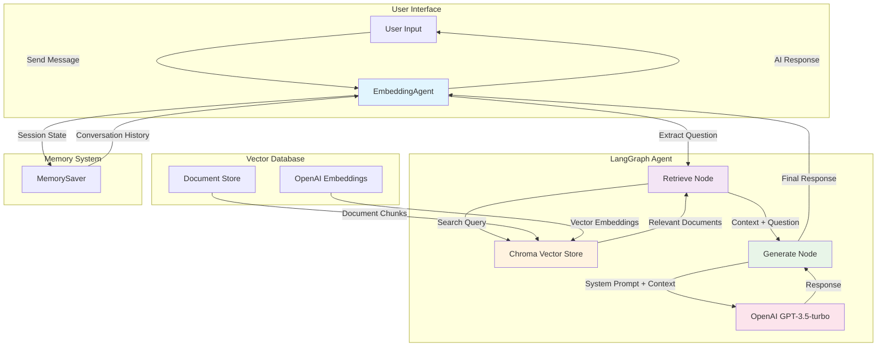
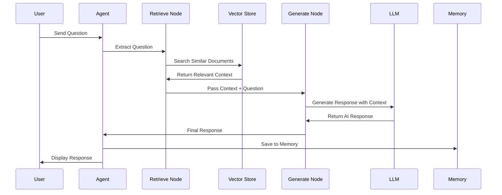

# LangGraph Embedding Agent

A conversational AI agent built with LangGraph that uses embedding retrieval to answer questions based on stored documents.

## Features

- **Document Storage**: Store documents in a Chroma vector database
- **Semantic Search**: Find relevant documents using OpenAI embeddings
- **Conversational Memory**: Maintain conversation history across sessions
- **RAG Pipeline**: Retrieval-Augmented Generation for accurate responses

## Prerequisites

- Python 3.9+
- OpenAI API key
- uv package manager

## Setup

1. **Set your OpenAI API key**:
   ```bash
   export OPENAI_API_KEY="your-api-key-here"
   ```

2. **Install dependencies**:
   ```bash
   uv sync
   ```

## Usage

Run the agent:
```bash
uv run main.py
```

The agent will:
1. Initialize the vector store
2. Load sample documents about LangGraph, embeddings, and AI
3. Start an interactive chat session

## Example Conversation

```
🤖 Initializing LangGraph Agent with Embedding Retrieval...
📚 Adding sample documents to vector store...
Added 4 document chunks to vector store

💬 Chat with the agent! (Type 'quit' to exit)
==================================================

You: What is LangGraph?
🤔 Thinking...
Retrieved context for: What is LangGraph?...
🤖 Assistant: LangGraph is a library for building stateful, multi-actor applications with LLMs. It extends the LangChain expression language with the ability to coordinate multiple chains (or actors) across multiple steps in a way that cycles are allowed.

You: How do embeddings work?
🤔 Thinking...
Retrieved context for: How do embeddings work?...
🤖 Assistant: Embeddings are numerical representations of text that capture semantic meaning. They allow us to find similar documents by comparing their vector representations in high-dimensional space.
```

## Architecture

The agent uses a LangGraph workflow with two main nodes:

1. **Retrieve Node**: Searches the vector store for relevant documents
2. **Generate Node**: Uses the retrieved context to generate responses

### System Architecture



### Workflow Diagram



### Components

- **DocumentStore**: Manages Chroma vector database operations
- **EmbeddingAgent**: Main LangGraph agent with conversation flow
- **AgentState**: Typed state management for the conversation

## Customization

### Adding Your Own Documents

You can modify the `create_sample_documents()` function to add your own content:

```python
def create_sample_documents():
    return [
        {
            "text": "Your document content here...",
            "metadata": {"source": "your_source", "topic": "your_topic"}
        }
    ]
```

### Changing the Model

Modify the LLM configuration in the `EmbeddingAgent` class:

```python
self.llm = ChatOpenAI(
    model="gpt-4",  # Change to gpt-4 for better performance
    temperature=0.1
)
```

### Adjusting Search Parameters

Modify the `get_relevant_context` method to change search behavior:

```python
def get_relevant_context(self, query: str, k: int = 5) -> str:  # Increase k for more results
```

## Project Structure

```
langgraph/embedding/
├── main.py              # Main agent implementation
├── pyproject.toml       # Project configuration
├── README.md           # This file
└── chroma_db/          # Vector database (created automatically)
```

## Dependencies

- `langchain`: Core LangChain functionality
- `langchain-openai`: OpenAI integration
- `langchain-community`: Community integrations (Chroma)
- `langgraph`: LangGraph for workflow orchestration
- `chromadb`: Vector database
- `openai`: OpenAI API client
- `tiktoken`: Token counting

## Troubleshooting

### OpenAI API Key Error
Make sure your API key is set:
```bash
export OPENAI_API_KEY="your-key-here"
```

### Vector Store Issues
The vector store is automatically created in `./chroma_db/`. If you encounter issues, delete this directory to start fresh.

### Memory Issues
The agent uses LangGraph's memory system. Each session maintains its own conversation history. 