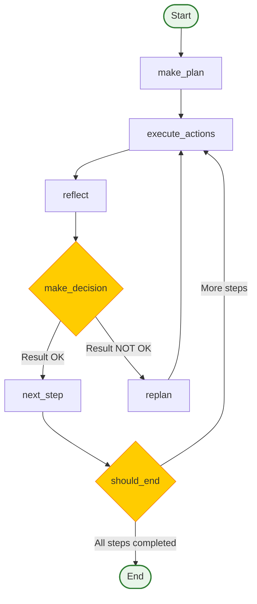

# LangGraph Agentic Workflow Implementation

This project demonstrates the **agentic workflow** pattern using LangGraph, implementing a complete workflow with planning, execution, reflection, and decision-making phases.

## 🎯 What is the Agentic Workflow?

The agentic workflow is a structured approach to problem-solving that mimics human reasoning by breaking down complex tasks into manageable steps. It consists of four main phases:

1. **Planning Phase**: An LLM creates a detailed, step-by-step plan to solve a problem
2. **Execution Phase**: The plan is executed step by step using available tools
3. **Reflection Phase**: Results are evaluated to determine if they meet requirements
4. **Decision Phase**: Either continue with next steps or replan if results are not satisfactory

### Key Benefits

- ✅ Better task decomposition and reasoning
- ✅ Ability to handle complex, multi-step problems
- ✅ Dynamic replanning when execution fails
- ✅ Continuous reflection and improvement
- ✅ More reliable and interpretable results
- ✅ Clear separation of concerns between planning and execution

### Related Resources

- 📝 For a detailed explanation of the agentic workflow pattern, see [agentic_workflow_blog.md](./agentic_workflow_blog.md)

## 🚀 Quick Start

### Prerequisites

- Python 3.9 or higher
- `uv` package manager installed
- Google API key for Gemini model access

### Installation

1. **Clone or navigate to this directory:**
   ```bash
   cd langgraph/plan-and-execute
   ```

2. **Install dependencies using uv:**
   ```bash
   uv sync
   ```

3. **Set up your environment variables:**
   Create a `.env` file in the project directory:
   ```bash
   echo "GOOGLE_API_KEY=your_google_api_key_here" > .env
   echo "TAVILY_API_KEY=your_tavily_api_key_here" >> .env  # Optional for search functionality
   ```

### Running the Demo

```bash
uv run plan_and_execute.py
```

## 📁 Project Structure

```
plan-and-execute/
├── plan_and_execute.py    # Main implementation file
├── agentic_workflow_blog.md # Detailed blog post about the pattern
├── pyproject.toml         # Project dependencies and configuration
├── README.md              # This file
└── .env                   # Environment variables (create this)
```

## 🔧 How It Works

### 1. State Management
The `AgenticWorkflow` TypedDict maintains the workflow state:
- **messages**: Conversation history of all messages exchanged
- **plan**: Current execution plan
- **current_step**: Current step number being executed
- **results**: Results from executed steps
- **reflection_results**: Reflections on each step's results
- **replan_count**: Number of replanning attempts
- **max_replans**: Maximum allowed replanning attempts
- **workflow_phase**: Current phase ("planning", "execution", "reflection", "decision")

### 2. Workflow Nodes

#### Planning Node (`make_plan`)
- Creates detailed, step-by-step plans
- Breaks down complex problems into manageable tasks
- Considers dependencies and research needs
- Formats plans as numbered lists for easy parsing

#### Execution Node (`execute_actions_with_tools`)
- Executes individual plan steps
- Parses the plan to extract the current step
- Uses LLM to simulate search when research is needed
- Tracks execution results

#### Reflection Node (`reflect_on_results`)
- Evaluates results against expected outcomes
- Provides detailed analysis of success or failure
- Considers completeness, accuracy, relevance, and quality

#### Decision Node (`make_decision`)
- Determines whether to continue or replan based on reflection
- Looks for "Result OK" indicators in reflection
- Routes the workflow to the appropriate next step

#### Next Step Node (`move_to_next_step`)
- Advances to the next step in the plan
- Checks if all steps have been completed
- Updates the workflow phase

#### Replanning Node (`replan_step`)
- Creates new plans when execution fails
- Builds on successful steps
- Addresses identified issues
- Limits replanning attempts to prevent infinite loops

### 3. Graph Flow

The workflow is implemented as a directed graph using LangGraph's `StateGraph`:



This graph structure enables:
- **Dynamic decision-making**: Based on reflection results, the workflow can branch to either continue execution or replan
- **Conditional branching**: The `reflect_decision` and `should_end` choice states direct the flow based on runtime conditions
- **Graceful termination**: When all steps are completed, the workflow ends naturally
- **Cyclical replanning**: When results don't meet expectations, the workflow can revise its approach and try again
- **Safety mechanisms**: The replan count prevents infinite loops by limiting the number of replanning attempts

## 🛠️ Customization

### Changing the LLM Model

Edit the `llm` configuration in `plan_and_execute.py`:

```python
llm = ChatGoogleGenerativeAI(
    model="gemini-1.5-flash",  # Change to your preferred model
    google_api_key=api_key,
    temperature=0
)
```

### Adding Search Functionality

The current implementation uses the LLM to simulate search results. To add real search functionality:

```python
# Uncomment and install the Tavily package
# pip install langchain-tavily

from langchain_tavily import TavilySearch

# Initialize the search tool
search_tool = TavilySearch(max_results=5)

# Then modify the execute_actions_with_tools function to use the search tool
def execute_actions_with_tools(state: AgenticWorkflow) -> AgenticWorkflow:
    # ... existing code ...
    
    # Check if tools are needed
    if "search" in full_step_text.lower() or "research" in full_step_text.lower():
        print("🔍 Research step detected, using search tool...")
        try:
            # Extract search query from the step
            search_query = full_step_text.replace("search for", "").replace("research", "").strip()
            
            # Use the actual search tool
            search_results = search_tool.invoke({"query": search_query})
            response = AIMessage(content=f"Research completed: {search_results}")
        except Exception as e:
            print(f"⚠️ Search failed: {e}")
            # Fall back to LLM simulation
            response = AIMessage(content=f"Research step completed (simulated): {response.content}")
    
    # ... rest of the function ...
```

### Modifying Prompts

Customize the prompt templates to match your use case:

```python
PLANNER_PROMPT = ChatPromptTemplate.from_messages([
    ("system", "Your custom system prompt here..."),
    MessagesPlaceholder(variable_name="messages"),
    ("human", "Your custom human prompt: {input}"),
])
```

## 📊 Example Output

When you run the script, you'll see output like:

```
🚀 LangGraph Agentic Workflow Demo
==================================================
🎯 Problem: what is the hometown of the current Australia open winner?...

🤔 Planning phase...
📋 Generated plan:
1. Research popular tourist attractions in San Francisco
2. Find local food recommendations within budget
3. Plan cultural activities and experiences
4. Create a 2-day itinerary with timing
5. Calculate total estimated costs

⚡ Executing step 1...
📝 Executing: 1. Research popular tourist attractions in San Francisco
✅ Step 1 completed: Research completed: Found Golden Gate Bridge, Alcatraz...

🔄 Moving to step 2
⚡ Executing step 2...
...
```

## 🔍 Troubleshooting

### Common Issues

1. **API Key Not Found**
   - Ensure your `.env` file exists and contains `GOOGLE_API_KEY`
   - Check that the file is in the correct directory

2. **Import Errors**
   - Run `uv sync` to install all dependencies
   - Verify Python version is 3.9+

3. **Rate Limiting**
   - The script automatically selects the best available model
   - If one model has rate limits, try another provider
   - Consider using local Ollama models for unlimited usage

4. **Search Tool Issues**
   - Tavily search requires an API key (optional)
   - Remove search functionality if not needed

### Debug Mode

Add debug prints by modifying the node functions or add logging:

```python
import logging
logging.basicConfig(level=logging.DEBUG)
```

## 🧪 Testing Different Problems

Modify the `problem` variable in the `main()` function to test different scenarios:

```python
problem = """
Your custom problem description here. Make it complex enough to require multiple steps.
"""
```
