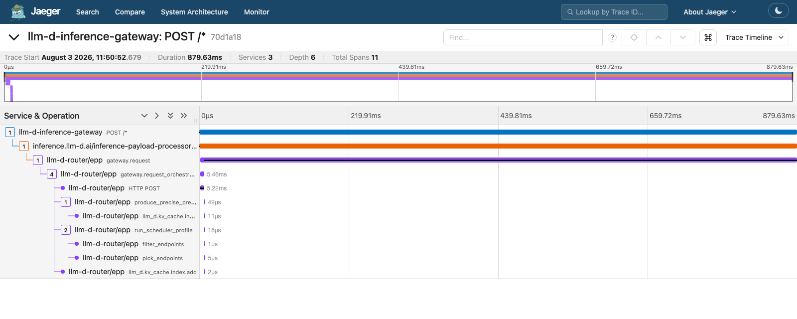
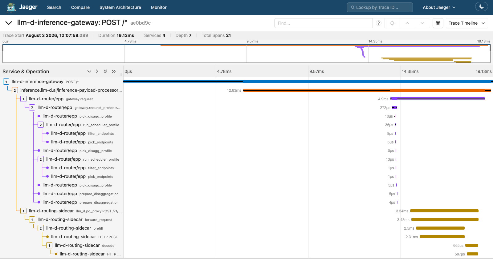
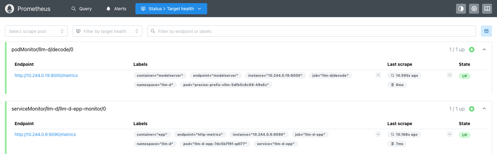
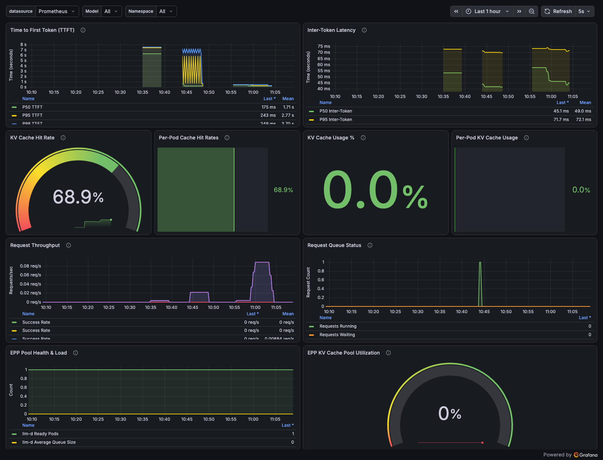
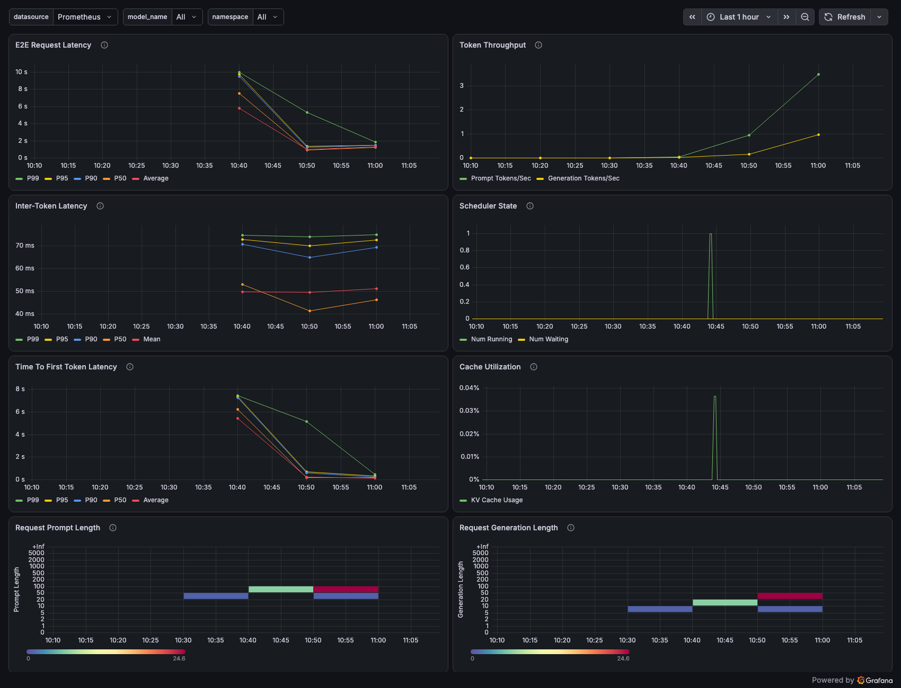

# llm-d on Kind — Gateway API Mode with Full Observability (Tracing + Metrics)

This document records a **no-GPU, Apple-Silicon (arm64) Kind** deployment of llm-d in
**Gateway API mode** (agentgateway) with a closed observability loop:

- **Distributed tracing** stitched across the gateway hop and the EPP into one Jaeger trace.
- **Metrics** scraped from the EPP and the vLLM model server into Prometheus and visualized in Grafana.

> Why Gateway API mode and not the standalone (self-managed Envoy) chart? The standalone
> Envoy roots its own trace and **does not propagate W3C trace context to its `ext_proc`
> servers**, so the EPP span (`gateway.request`) is always an orphan root. A real
> Gateway (agentgateway / Istio) propagates the trace context to the EPP `ext_proc`,
> which the EPP adopts (PR #1514) — so the gateway hop and the EPP land in **one** trace.

---

## 1. System Architecture / 系统架构

Two request paths share one Gateway. Plain requests go to the **precise-prefix** pool
(2 real vLLM replicas); requests carrying `x-llm-d-pool: pd` go to the **P/D-disaggregated**
pool. Both are fronted by the payload processor.

```text
                                    ┌──────── default route ────────▶ InferencePool llm-d
                                    │            (EPP: precise-prefix)      │
                                    │                                       ├──▶ vLLM replica 1  ┐ KV-events
 client ─HTTP─▶ agentgateway ─ext_proc─▶ IPP ─▶  (route)                    └──▶ vLLM replica 2  ┘ (ZMQ :5556)
              (Gateway API,          (PreRouting)  │                                              │
               trace ROOT)                         └── x-llm-d-pool: pd ──▶ InferencePool llm-d-pd│
                                                            (EPP: P/D)             │              │
                                                                                   ▼              │
                                                            routing-sidecar ──prefill──▶ pd-prefill
                                                             (in pd-decode)  ──decode───▶ pd-decode
   spans ─────────────────────────── OTLP gRPC :4317 ─────▶ otel-collector ──▶ Jaeger
   metrics ───────────────── ServiceMonitor / PodMonitor ─▶ Prometheus ──────▶ Grafana ◀───────────┘
```

| Component | Namespace | Role |
| --- | --- | --- |
| `agentgateway` (control plane) | `agentgateway-system` | Gateway API + Inference Extension controller; provisions the data-plane proxy and pushes config via xDS |
| `llm-d-inference-gateway` (data plane) | `llm-d` | The proxy. Trace **root** span `POST /*`; propagates W3C `traceparent` into every `ext_proc` call |
| `payload-processor` (IPP) | `llm-d` | llm-d **Inference Payload Processor**, attached as a `PreRouting` `ext_proc`. Rewrites body fields into routing headers (`model` → `X-Gateway-Model-Name`); adopts the gateway's trace context and re-injects it downstream |
| `llm-d-epp` | `llm-d` | llm-d Router **Endpoint Picker** for the precise-prefix pool. Emits `gateway.request` + scheduling spans, exposes `llm_d_epp_*` metrics |
| `llm-d-pd-epp` | `llm-d` | A **second** EPP release running the P/D plugin chain (`disagg-profile-handler`, prefill/decode filters). Emits `pick_disagg_profile` / `prepare_disaggregation` spans |
| `precise-prefix-vllm` (×2) | `llm-d` | Real **vLLM CPU** model servers (`Qwen2.5-0.5B-Instruct`); expose `vllm:*` metrics, publish KV-events on ZMQ `:5556`. Two replicas so the prefix scorer has a real choice |
| `pd-prefill` / `pd-decode` | `llm-d` | P/D pools on `llm-d-inference-sim`. `pd-decode` fronts the sim with the **`llm-d-routing-sidecar`** native sidecar, which drives the remote-prefill handshake |
| `otel-collector` + `jaeger` | `llm-d` | Trace pipeline (OTLP gRPC → Jaeger) |
| `kube-prometheus-stack` (`llmd` release) | `llm-d-monitoring` | Prometheus + Grafana + operator; scrapes the `ServiceMonitor`/`PodMonitor` |
| `HTTPRoute` / `InferencePool` | `llm-d` | Two routes on one Gateway: the chart's default `/` → pool `llm-d`, and a header-matched route → pool `llm-d-pd` |

Images are **built from `upstream/main`** of the respective llm-d repos (arm64).
All three are used: the EPP by both router releases, the payload processor by Step 3.11,
and the routing sidecar by the P/D pool in Step 3.12:

```console
gyliu-cary@Mac llm-d % docker images | grep main
ghcr.io/llm-d/llm-d-router-endpoint-picker-dev    main   51b24ccadc27   94.4MB
ghcr.io/llm-d/llm-d-routing-sidecar               main   3d43472e4bb9   58.3MB
ghcr.io/llm-d/llm-d-inference-payload-processor   main   9ba6034f43ec   74.4MB
```

> Last verified against `llm-d@4093435f`, `llm-d-router@a86cc45a`,
> `llm-d-inference-payload-processor@cf5d475` (2026-08-03).

---

## 2. Workflow

**Request path**

1. Client `POST /v1/chat/completions` → `llm-d-inference-gateway` (ClusterIP `:80`).
2. agentgateway starts the **root span** `POST /*`, injects a W3C `traceparent`, and calls the EPP via `ext_proc`.
3. EPP extracts the `traceparent` (PR #1514), starts `gateway.request` **as a child** of the gateway span, runs scheduling (`gateway.request_orchestration`), and picks an endpoint from the `InferencePool`.
4. agentgateway proxies the request to the chosen vLLM pod; vLLM returns the completion.

**Trace path** — agentgateway span and EPP spans are both exported (OTLP gRPC `:4317`) to `otel-collector` → `jaeger`, sharing one trace ID:

```console
gyliu-cary@Mac llm-d % # one trace, two services, parent→child
[llm-d-inference-gateway] POST /*
  [llm-d-router/epp] gateway.request
    [llm-d-router/epp] gateway.request_orchestration
      [llm-d-router/epp] HTTP POST                      # token-producer -> vllm-render
      [llm-d-router/epp] produce_precise_prefix_cache
        [llm-d-router/epp] llm_d.kv_cache.index
      [llm-d-router/epp] run_scheduler_profile
        [llm-d-router/epp] filter_endpoints
        [llm-d-router/epp] pick_endpoints
      [llm-d-router/epp] llm_d.kv_cache.index.add
```

**Metric path** — the `ServiceMonitor` (EPP) and `PodMonitor` (vLLM) are discovered by the Prometheus operator; Prometheus scrapes `:9090/metrics` (EPP) and the vLLM `/metrics`, stores them in its TSDB, and Grafana renders the llm-d dashboards.

---

## 3. Installation Steps / 安装步骤

Set up shared variables (adjust to your checkouts):

```console
gyliu-cary@Mac llm-d % export LLMD_REPO=$HOME/go/src/github.com/llm-d/llm-d
gyliu-cary@Mac llm-d % export ROUTER_REPO=$HOME/go/src/github.com/llm-d/llm-d-router
gyliu-cary@Mac llm-d % export IPP_REPO=$HOME/go/src/github.com/llm-d/llm-d-inference-payload-processor
gyliu-cary@Mac llm-d % export DEMO=$HOME/go/src/github.com/gyliu513/langX101/llm-d/llm-d-full-demo
```

### 3.1 Build images from `upstream/main` (arm64)

```console
gyliu-cary@Mac llm-d % cd $ROUTER_REPO && git fetch upstream && git checkout upstream/main
gyliu-cary@Mac llm-d % docker build --platform linux/arm64 -f Dockerfile.epp \
  -t ghcr.io/llm-d/llm-d-router-endpoint-picker-dev:main .        # required
gyliu-cary@Mac llm-d % docker build --platform linux/arm64 -f Dockerfile.sidecar \
  -t ghcr.io/llm-d/llm-d-routing-sidecar:main .                   # optional (P/D path)
gyliu-cary@Mac llm-d % cd $IPP_REPO && git fetch upstream && git checkout upstream/main
gyliu-cary@Mac llm-d % docker build --platform linux/arm64 -f Dockerfile \
  -t ghcr.io/llm-d/llm-d-inference-payload-processor:main .       # optional (IPP path)
```

> Note: `llm-d-kv-cache` is a Go library (pinned in the router `go.mod` at `v0.9.0`, which
> equals its `upstream/main`), not a separate image — building the EPP already includes its
> observability fixes.

### 3.2 Create the Kind cluster and load images

```console
gyliu-cary@Mac llm-d % kind create cluster --config $DEMO/kind/kind-config.yaml
gyliu-cary@Mac llm-d % kind load docker-image ghcr.io/llm-d/llm-d-router-endpoint-picker-dev:main --name llm-d
gyliu-cary@Mac llm-d % kubectl create namespace llm-d
```

### 3.3 Install Gateway API + GAIE CRDs

```console
gyliu-cary@Mac llm-d % kubectl apply -f https://github.com/kubernetes-sigs/gateway-api/releases/download/v1.5.1/standard-install.yaml
gyliu-cary@Mac llm-d % kubectl apply -k "$ROUTER_REPO/config/crd"
# or, without a local checkout:
# kubectl apply -k "https://github.com/llm-d/llm-d-router/config/crd?ref=v0.9.0"
```

> The git ref `v0` does not exist on `llm-d-router` — use a local checkout or `ref=v0.9.0`
> (or any recent release tag).

> llm-d also ships an installer that pins both CRD sets
> (`bash $LLMD_REPO/guides/recipes/gateway/install-gateway-crds.sh`, Gateway API `v1.5.1`
> + GAIE `v1.5.0`). It does **not** install the `llm-d.ai` CRDs
> (`InferenceObjective`, `InferenceModelRewrite`) that the router's `config/crd` adds,
> so prefer the two commands above for this demo.

### 3.4 Install the agentgateway control plane

```console
gyliu-cary@Mac llm-d % helm upgrade --install agentgateway-crds \
  oci://cr.agentgateway.dev/charts/agentgateway-crds \
  --namespace agentgateway-system --create-namespace --version v1.1.0
gyliu-cary@Mac llm-d % helm upgrade --install agentgateway \
  oci://cr.agentgateway.dev/charts/agentgateway \
  --namespace agentgateway-system --create-namespace --version v1.1.0 \
  --set inferenceExtension.enabled=true
gyliu-cary@Mac llm-d % kubectl get gatewayclass agentgateway
NAME           CONTROLLER                      ACCEPTED   AGE
agentgateway   agentgateway.dev/agentgateway   True       2s
```

### 3.5 Deploy the Gateway

```console
gyliu-cary@Mac llm-d % kubectl apply -k $LLMD_REPO/guides/recipes/gateway/agentgateway -n llm-d
gyliu-cary@Mac llm-d % kubectl get gateway -n llm-d
NAME                      CLASS          ADDRESS   PROGRAMMED   AGE
llm-d-inference-gateway   agentgateway             True         8s
```

### 3.6 Deploy OTel Collector + Jaeger

```console
gyliu-cary@Mac llm-d % bash $LLMD_REPO/guides/recipes/observability/install-otel-collector-jaeger.sh -n llm-d
```

### 3.7 Install the router in Gateway API mode (`llm-d-router-gateway-dev`)

`tracing.values.yaml` turns on EPP span export; the override file sets the EPP image
`pullPolicy: IfNotPresent` (so Kind uses the locally-built image) and the model-server
selector. The chart also creates the `HTTPRoute` to the Gateway.

Use **`precise-prefix-router.values.yaml`** (not `optimized-baseline.values.yaml`) so the
EPP runs `precise-prefix-cache-producer` + `token-producer` against the real vLLM KV-events
on ZMQ `:5556`. The chart deploys a `vllm-render` sidecar in the EPP pod for tokenization.

> **Important ordering:** the chart deploys the `vllm-render` sidecar in the EPP pod, which
> needs the vLLM image **and** the `llm-d-hf-token` secret at startup. Load/create both
> **before** installing the chart, otherwise the EPP pod stays at
> `1/2 CreateContainerConfigError` (`secret "llm-d-hf-token" not found`).

```console
gyliu-cary@Mac llm-d % # (a) vLLM image -- kind load fails for this multi-arch manifest list,
gyliu-cary@Mac llm-d %  #     so import it into the node via ctr:
gyliu-cary@Mac llm-d % docker pull --platform linux/arm64 docker.io/vllm/vllm-openai-cpu:v0.19.1
gyliu-cary@Mac llm-d % docker save docker.io/vllm/vllm-openai-cpu:v0.19.1 | \
  docker exec -i llm-d-control-plane ctr -n k8s.io images import -
gyliu-cary@Mac llm-d % # (b) HF token secret (copy .env.example -> .env, set HF_TOKEN)
gyliu-cary@Mac llm-d % cp $DEMO/.env.example $DEMO/.env   # then edit HF_TOKEN
gyliu-cary@Mac llm-d % set -a && source $DEMO/.env && set +a
gyliu-cary@Mac llm-d % kubectl create secret generic llm-d-hf-token -n llm-d \
  --from-literal=HF_TOKEN="$HF_TOKEN" --dry-run=client -o yaml | kubectl apply -f -
gyliu-cary@Mac llm-d % # (c) monitoring CRDs (the chart creates a ServiceMonitor)
gyliu-cary@Mac llm-d % bash $LLMD_REPO/guides/recipes/observability/install-prometheus-grafana.sh --crds-only
gyliu-cary@Mac llm-d % helm install llm-d oci://ghcr.io/llm-d/charts/llm-d-router-gateway-dev \
  -f $LLMD_REPO/guides/recipes/router/base.values.yaml \
  -f $DEMO/manifests/optional/precise-prefix/precise-prefix-router.values.yaml \
  -f $LLMD_REPO/guides/recipes/router/features/monitoring.values.yaml \
  -f $DEMO/helm-values/tracing.values.yaml \
  -f $DEMO/helm-values/gw-kind.values.yaml \
  --set provider.name=none \
  --set httpRoute.create=true \
  --set httpRoute.inferenceGatewayName=llm-d-inference-gateway \
  -n llm-d --version v0
gyliu-cary@Mac llm-d % kubectl get httproute,inferencepool -n llm-d
NAME                                        HOSTNAMES   AGE
httproute.gateway.networking.k8s.io/llm-d               5s
NAME                                              AGE
inferencepool.inference.networking.k8s.io/llm-d   5s
gyliu-cary@Mac llm-d % kubectl get pod -n llm-d -l llm-d-router-gateway=llm-d-epp \
  -o jsonpath='EPP containers: {.items[0].spec.containers[*].name}{"\n"}'
EPP containers: epp vllm-render
```

`$DEMO/helm-values/gw-kind.values.yaml`:

```yaml
router:
  epp:
    replicas: 1
    image:
      registry: ghcr.io/llm-d
      repository: llm-d-router-endpoint-picker-dev
      tag: main
      pullPolicy: IfNotPresent
    resources:
      requests: { cpu: "500m", memory: "512Mi" }
      limits:   { cpu: "2", memory: "2Gi" }
  modelServers:
    matchLabels:
      llm-d.ai/guide: "precise-prefix-cache-routing"
```

### 3.8 Deploy a real vLLM CPU model server (arm64)

The `vllm/vllm-openai-cpu:v0.19.1` image has an **arm64** variant (native, no emulation).
Serves `Qwen2.5-0.5B-Instruct`, block-size 64, publishing KV-events on ZMQ `:5556`.
The image and the `llm-d-hf-token` secret were already prepared in Step 3.7; here we only
pre-seed the model cache, then create the ServiceAccount and the Deployment.

**(a) Pre-seed the model cache (strongly recommended).** The pod pulls ~1 GB of weights
from HuggingFace on first start. `kind/kind-config.yaml` mounts host `/tmp/llm-d-cache`
into the node at `/root/.cache`, and the model-server manifest mounts that node path as
`HF_HOME`, so a cache you fill once is reused by every pod restart *and* by a re-created
cluster. Fill it from the host, where the download gets the full link bandwidth:

```console
gyliu-cary@Mac llm-d % mkdir -p /tmp/llm-d-cache/huggingface
gyliu-cary@Mac llm-d % docker run --rm -e HF_HOME=/hf -e HF_TOKEN="$HF_TOKEN" \
  -v /tmp/llm-d-cache/huggingface:/hf --entrypoint hf \
  docker.io/vllm/vllm-openai-cpu:v0.19.1 download Qwen/Qwen2.5-0.5B-Instruct
Fetching 10 files: 100%|██████████| 10/10 [22:10<00:00, 133.04s/it]
✓ Downloaded
gyliu-cary@Mac llm-d % du -sh /tmp/llm-d-cache/huggingface
960M	/tmp/llm-d-cache/huggingface
```

**(b) Deploy the model server.**

```console
gyliu-cary@Mac llm-d % # Model-server manifest references serviceAccountName: sa -- create it
gyliu-cary@Mac llm-d %  #     first (the gateway chart with provider.name=none does not):
gyliu-cary@Mac llm-d % kubectl apply -f $LLMD_REPO/guides/recipes/modelserver/common/sa.yaml -n llm-d
gyliu-cary@Mac llm-d % kubectl apply -f $DEMO/manifests/optional/cpu-vllm/model-server.yaml
gyliu-cary@Mac llm-d % kubectl rollout status deploy/precise-prefix-vllm -n llm-d --timeout=600s
deployment "precise-prefix-vllm" successfully rolled out
gyliu-cary@Mac llm-d % kubectl logs -n llm-d deploy/precise-prefix-vllm | grep -E 'Loading weights|startup complete'
(EngineCore pid=75) INFO 08-03 14:02:52 [default_loader.py:384] Loading weights took 1.51 seconds
(APIServer pid=1) INFO:     Application startup complete.
```

With the cache pre-seeded the pod is serving ~35 s after it starts; the `--timeout=600s`
above is then plenty.

> **Skipped the pre-seed and the pod keeps restarting?** This is the failure mode to know
> about. A cold HF download of the weights takes ~50 min on a slow link, and the HF
> downloader **restarts from zero** after every container restart — so if the `startupProbe`
> budget is shorter than the download, the pod loops forever and never converges. The
> manifest therefore sets `failureThreshold: 360` (60 min) *and* a persistent cache mount;
> both matter. Watch progress with
> `kubectl exec -n llm-d deploy/precise-prefix-vllm -c modelserver -- du -sh /root/.cache/huggingface`.

> **Rollout stuck at `0 out of 1 new replicas`?** Check events:
> `kubectl get events -n llm-d | grep precise-prefix`. If you see
> `serviceaccount "sa" not found`, apply `sa.yaml` above, then
> `kubectl rollout restart deploy/precise-prefix-vllm -n llm-d`.

> **Why `strategy: Recreate`?** A second vLLM pod (4 CPU / 6 Gi requested) does not fit
> beside the first one on a single Kind node, so the default rolling update deadlocks with
> the new pod `Pending` and the old one never terminating.

> **Kind/Docker-on-Mac gotcha:** vLLM CPU crashes with
> `AssertionError: Not enough allowed NUMA nodes ... Allowed NUMA nodes are []`
> because containers expose no NUMA topology. Fix by pinning OMP threads in the pod env:
> `VLLM_CPU_OMP_THREADS_BIND="0-3"`.

### 3.9 Enable gateway tracing export (AgentgatewayPolicy)

This makes agentgateway export **its own** spans to `otel-collector` and root a trace even
for requests without an incoming `traceparent` (`randomSampling: "true"`).

```console
gyliu-cary@Mac llm-d % kubectl apply -f - <<'EOF'
apiVersion: agentgateway.dev/v1alpha1
kind: AgentgatewayPolicy
metadata:
  name: gateway-tracing
  namespace: llm-d
spec:
  targetRefs:
    - group: gateway.networking.k8s.io
      kind: Gateway
      name: llm-d-inference-gateway
  frontend:
    tracing:
      backendRef:
        kind: Service
        name: otel-collector
        port: 4317
      protocol: GRPC
      randomSampling: "true"
EOF
```

### 3.10 Install Prometheus + Grafana

```console
gyliu-cary@Mac llm-d % bash $LLMD_REPO/guides/recipes/observability/install-prometheus-grafana.sh
gyliu-cary@Mac llm-d % kubectl apply -k $LLMD_REPO/guides/recipes/modelserver/components/monitoring/ -n llm-d
podmonitor.monitoring.coreos.com/decode created
gyliu-cary@Mac llm-d % kubectl get pods -n llm-d-monitoring
NAME                                                     READY   STATUS    RESTARTS   AGE
alertmanager-llmd-kube-prometheus-stack-alertmanager-0   2/2     Running   0          125m
llmd-grafana-5c77cd47b4-nsnnt                            3/3     Running   0          126m
llmd-kube-prometheus-stack-operator-f96fc6d6c-6qpkq      1/1     Running   0          126m
llmd-kube-state-metrics-77cb8dbcf9-j7nbg                 1/1     Running   0          126m
llmd-prometheus-node-exporter-xjqbl                      1/1     Running   0          126m
prometheus-llmd-kube-prometheus-stack-prometheus-0       2/2     Running   0          125m
```

> **`podMonitor/llm-d/decode` missing from the Prometheus targets?** If the `PodMonitor` is
> created in the same moment the operator regenerates the scrape config, it can be left out
> of the generated config and nothing retriggers a sync. Touch it to force a resync:
> `kubectl annotate podmonitor -n llm-d decode resync="$(date +%s)" --overwrite`.
> Confirm with
> `curl -s http://localhost:9091/api/v1/status/config | grep -c 'podMonitor/llm-d/decode'`.

### 3.11 Add the Inference Payload Processor (IPP) to the trace

The IPP is a second `ext_proc` server. In Gateway API mode you attach it with an
`AgentgatewayPolicy` — its own chart only templates `provider.name: istio | gke | none`,
so there is no agentgateway wiring to reuse.

It joins the trace **for free**: `pkg/handlers/server.go` starts its span from
`extractTraceContext(ctx, v.RequestHeaders)` (a W3C propagator `Extract` over the
`ext_proc` request headers), and `request.go` `Inject`s the context back into the headers
it forwards. Running it at `PreRouting` therefore makes the EPP a **child of the IPP**.

```console
gyliu-cary@Mac llm-d % kind load docker-image ghcr.io/llm-d/llm-d-inference-payload-processor:main --name llm-d
gyliu-cary@Mac llm-d % helm install ipp $IPP_REPO/config/charts/payload-processor -n llm-d \
  --set provider.name=none \
  --set payloadProcessor.image.tag=main \
  --set payloadProcessor.image.pullPolicy=IfNotPresent \
  --set payloadProcessor.tracing.enabled=true \
  --set payloadProcessor.tracing.otelExporterEndpoint=http://otel-collector:4317 \
  --set payloadProcessor.tracing.sampling.samplerArg=1.0 \
  --set payloadProcessor.flags.secure-serving=false
```

> **`--secure-serving=false` is mandatory here.** The IPP defaults `SecureServing: true`
> (`pkg/server/options.go`) and serves gRPC with a self-signed cert, while agentgateway's
> `extProc` backendRef speaks plaintext h2. Leave it on and every request 500s with
> `failed to initialize endpoint picker: ... connection reset ... failure_mode=FailClosed`
> in the gateway log — note that a broken `ext_proc` takes down **all** traffic, not just
> the IPP hop. (The chart's Istio path instead wraps it in a `DestinationRule` with
> `tls.mode: SIMPLE, insecureSkipVerify: true`.)

```console
gyliu-cary@Mac llm-d % kubectl apply -f - <<'EOF'
apiVersion: agentgateway.dev/v1alpha1
kind: AgentgatewayPolicy
metadata:
  name: ipp-extproc
  namespace: llm-d
spec:
  targetRefs:
    - group: gateway.networking.k8s.io
      kind: Gateway
      name: llm-d-inference-gateway
  traffic:
    phase: PreRouting
    extProc:
      backendRef:
        kind: Service
        name: payload-processor
        port: 9004
EOF
gyliu-cary@Mac llm-d % kubectl get agentgatewaypolicy -n llm-d ipp-extproc \
  -o jsonpath='{.status.ancestors[0].conditions[*].reason}{"\n"}'
Valid Attached
```

### 3.12 Add the P/D-disaggregated pool

**CPU vLLM cannot do P/D.** Prefill→decode KV transfer needs a connector (NIXL);
`docker.io/vllm/vllm-openai-cpu:v0.19.1` has no `nixl` module
(`python3 -c "import nixl"` → `ModuleNotFoundError`), and upstream only ships P/D
model-server variants for `gpu` / `xpu` / `tpu`. The P/D pool therefore runs on
`llm-d-inference-sim`, which fakes the handshake — the **scheduling and proxying
components are real**, only the KV transfer is simulated.

Because an EPP runs exactly one plugin config, P/D gets its **own router release**
alongside the precise-prefix one. The chart namespaces everything by release name
(`llm-d-pd-epp`, InferencePool `llm-d-pd`), so the two coexist cleanly.

```console
gyliu-cary@Mac llm-d % kind load docker-image ghcr.io/llm-d/llm-d-routing-sidecar:main --name llm-d
gyliu-cary@Mac llm-d % kind load docker-image ghcr.io/llm-d/llm-d-inference-sim:v0.10.2-arm64 --name llm-d
gyliu-cary@Mac llm-d % helm install llm-d-pd oci://ghcr.io/llm-d/charts/llm-d-router-gateway-dev --version v0 \
  -f $LLMD_REPO/guides/recipes/router/base.values.yaml \
  -f $DEMO/manifests/optional/pd/pd-router.values.yaml \
  -f $LLMD_REPO/guides/recipes/router/features/monitoring.values.yaml \
  -f $DEMO/helm-values/tracing.values.yaml \
  -f $DEMO/helm-values/gw-kind-pd.values.yaml \
  --set provider.name=none --set httpRoute.create=false -n llm-d
gyliu-cary@Mac llm-d % kubectl apply -f $DEMO/manifests/optional/pd/model-servers-pd.yaml
gyliu-cary@Mac llm-d % kubectl apply -f $DEMO/manifests/optional/pd/httproute-pd.yaml
gyliu-cary@Mac llm-d % kubectl get inferencepool -n llm-d
NAME       AGE
llm-d      3h15m
llm-d-pd   30s
```

`httproute-pd.yaml` matches on a header so both pools share one Gateway — a rule with a
header match outranks the chart's bare `/` PathPrefix, so tagged requests go to the P/D
pool and everything else still reaches the precise-prefix pool:

```yaml
  rules:
    - matches:
        - path: { type: PathPrefix, value: / }
          headers:
            - { type: Exact, name: x-llm-d-pool, value: pd }
      backendRefs:
        - { group: inference.networking.k8s.io, kind: InferencePool, name: llm-d-pd, weight: 1 }
```

> **routing-sidecar flags changed on `main`.** `--connector` was renamed
> **`--kv-connector`** (unknown-flag crash-loop otherwise) and `--vllm-port` is deprecated
> in favour of **`--model-server-port`**. `main` also adds **`--tracing`**, which is what
> puts the sidecar's `prefill` / `decode` legs into the trace — set it plus the usual
> `OTEL_*` env vars.

### Final state

```console
gyliu-cary@Mac llm-d % kubectl get pod -A   # kube-system omitted
NAMESPACE             NAME                                                     READY   STATUS    RESTARTS   AGE
agentgateway-system   agentgateway-5448f46756-g7zmb                            1/1     Running   0          3h51m
llm-d                 jaeger-587f6c758f-rdvp6                                  1/1     Running   0          3h49m
llm-d                 llm-d-epp-64b9497cd9-5mdzs                               2/2     Running   0          24m
llm-d                 llm-d-inference-gateway-6bbf846c56-qxjhs                 1/1     Running   0          3h49m
llm-d                 llm-d-pd-epp-59d77ccd8-94tbv                             1/1     Running   0          20m
llm-d                 otel-collector-7fd7c98767-ng6nn                          1/1     Running   0          3h49m
llm-d                 payload-processor-576ffd57bf-vp77g                       1/1     Running   0          41m
llm-d                 pd-decode-5bb64c487f-rhh9s                               2/2     Running   0          6m52s
llm-d                 pd-prefill-58c7555d5f-g5q5m                              1/1     Running   0          19m
llm-d                 precise-prefix-vllm-5bdc47b459-8t7jm                     1/1     Running   0          38m
llm-d                 precise-prefix-vllm-5bdc47b459-cjkfm                     1/1     Running   0          38m
llm-d-monitoring      alertmanager-llmd-kube-prometheus-stack-alertmanager-0   2/2     Running   0          3h32m
llm-d-monitoring      llmd-grafana-5c77cd47b4-99hgz                            3/3     Running   0          63m
llm-d-monitoring      llmd-kube-prometheus-stack-operator-f96fc6d6c-6qpkq      1/1     Running   0          3h33m
llm-d-monitoring      llmd-kube-state-metrics-77cb8dbcf9-j7nbg                 1/1     Running   0          3h33m
llm-d-monitoring      llmd-prometheus-node-exporter-xjqbl                      1/1     Running   0          3h33m
llm-d-monitoring      prometheus-llmd-kube-prometheus-stack-prometheus-0       2/2     Running   0          3h32m

gyliu-cary@Mac llm-d % helm list -A
NAME                NAMESPACE             CHART                          APP VERSION   STATUS
agentgateway        agentgateway-system   agentgateway-v1.1.0            v1.1.0        deployed
agentgateway-crds   agentgateway-system   agentgateway-crds-v1.1.0       v1.1.0        deployed
ipp                 llm-d                 payload-processor-0.2.0        v0.2.0        deployed
llm-d               llm-d                 llm-d-router-gateway-dev-v0    v0            deployed
llm-d-pd            llm-d                 llm-d-router-gateway-dev-v0    v0            deployed
llmd                llm-d-monitoring      kube-prometheus-stack-88.1.3   v0.93.0       deployed

gyliu-cary@Mac llm-d % kubectl describe node llm-d-control-plane | grep -A4 'Allocated resources'
Allocated resources:
  Resource           Requests        Limits
  cpu                7500m (53%)     20100m (143%)
  memory             18538Mi (79%)   33414Mi (143%)
```

> Everything above fits on **one 14-CPU / 23Gi Kind node** only because two chart defaults
> were cut down: the EPP's `vllm-render` sidecar (`router.tokenizer.resources`, 4 CPU/8Gi by
> default — see `gw-kind.values.yaml`) and the model server itself (2 CPU/5Gi per replica).
> Leave the tokenizer default in place and the second vLLM replica never schedules
> (`0/1 nodes are available: 1 Insufficient memory`).

> The precise-prefix EPP pod is `2/2` (`epp` + the `vllm-render` sidecar), the P/D EPP is
> `1/1` (its plugin chain has no `token-producer`, so no sidecar), and
> `llm-d-router-gateway-dev` only publishes the floating **`v0`** tag — there is no pinned
> release, so the chart content can change under you. This run pulled digest
> `sha256:4da0c96b8ecb4881ee72b29284f9da0b14d52494fd584f68c84f7d906f2eaab1`.

---

## 4. Test Steps / 测试步骤

### 4.1 Trigger a request (and a connected trace)

```console
gyliu-cary@Mac llm-d % GWIP=$(kubectl get svc llm-d-inference-gateway -n llm-d -o jsonpath='{.spec.clusterIP}')
gyliu-cary@Mac llm-d % kubectl run trig --rm -i --restart=Never --image=curlimages/curl:8.7.1 -n llm-d -- \
  curl -sS -o /dev/null -w "http=%{http_code}\n" -X POST http://$GWIP:80/v1/chat/completions \
  -H 'Content-Type: application/json' \
  -d '{"model":"Qwen/Qwen2.5-0.5B-Instruct","messages":[{"role":"user","content":"hi"}],"max_tokens":8}'
http=200
```

### 4.2 Verify the stitched trace in Jaeger

```console
gyliu-cary@Mac llm-d % kubectl port-forward -n llm-d svc/jaeger-collector 16686:16686 &
gyliu-cary@Mac llm-d % # open http://localhost:16686 → Service = llm-d-inference-gateway → Find Traces
```

Confirm the EPP span is no longer an orphan root (it has the gateway as parent):

```console
gyliu-cary@Mac llm-d % curl -s "http://localhost:16686/api/services" | python3 -c "import sys,json;print(sorted(json.load(sys.stdin)['data']))"
['llm-d-inference-gateway', 'llm-d-router/epp']

gyliu-cary@Mac llm-d % curl -s "http://localhost:16686/api/traces?service=llm-d-inference-gateway&limit=1&lookback=1h" | python3 -c "
import sys, json
t = json.load(sys.stdin)['data'][0]
procs = t['processes']
span_by_id = {s['spanID']: s for s in t['spans']}
for s in t['spans']:
    svc = procs[s['processID']]['serviceName']
    refs = [r for r in (s.get('references') or []) if r.get('refType')=='CHILD_OF']
    parent = 'ROOT'
    if refs:
        ps = span_by_id.get(refs[0]['spanID'])
        if ps: parent = procs[ps['processID']]['serviceName']
    print(f'  [{svc}] {s[\"operationName\"]} <- {parent}')
"
  [llm-d-inference-gateway] POST /* <- ROOT
  [inference.llm-d.ai/inference-payload-processor] gateway.request <- llm-d-inference-gateway
  [llm-d-router/epp] gateway.request <- inference.llm-d.ai/inference-payload-processor
  [llm-d-router/epp] gateway.request_orchestration <- llm-d-router/epp
  [llm-d-router/epp] HTTP POST <- llm-d-router/epp
  [llm-d-router/epp] produce_precise_prefix_cache <- llm-d-router/epp
  [llm-d-router/epp] llm_d.kv_cache.index <- llm-d-router/epp
  [llm-d-router/epp] run_scheduler_profile <- llm-d-router/epp
  [llm-d-router/epp] filter_endpoints <- llm-d-router/epp
  [llm-d-router/epp] pick_endpoints <- llm-d-router/epp
  [llm-d-router/epp] llm_d.kv_cache.index.add <- llm-d-router/epp
```

A single `/v1/chat/completions` produces an **11-span, 3-service** trace: the gateway root,
the IPP hop, the EPP request/orchestration pair, the scheduler subtree
(`run_scheduler_profile` → `filter_endpoints`, `pick_endpoints`), the precise-prefix
producer with its kv-cache index spans, and the `HTTP POST` the `token-producer` makes to
the `vllm-render` sidecar.

Note the parentage: because the IPP runs at `PreRouting` and re-injects the trace context
into the headers it forwards, **the EPP is a child of the IPP**, not of the gateway.

> `llm-d-kv-cache` never appears as its own Jaeger service — it is a Go library compiled
> into the EPP (pinned at `v0.9.0` in the router's `go.mod`), and OTel service names are a
> per-process resource attribute. Its spans are the `llm_d.kv_cache.*` ones above.

### 4.2.1 Drive a prefix-cache hit

The kv-cache spans only carry interesting values once a prompt is at least one block
(64 tokens) long and is repeated. Send the same long prompt ~6 times, then inspect the
attributes:

```console
gyliu-cary@Mac llm-d % PROMPT="Explain in detail how a distributed key-value cache works in a large
language model inference system, covering block-based paging, prefix reuse across requests, eviction
policy, event publication over ZeroMQ, and how a router can use those events to steer traffic to the
replica that already holds the longest matching prefix. Please be thorough and specific."
gyliu-cary@Mac llm-d % kubectl run drive --rm -i --restart=Never --image=curlimages/curl:8.7.1 -n llm-d \
  --command -- sh -c 'for i in 1 2 3 4 5 6; do curl -sS -o /dev/null -w "req$i http=%{http_code}\n" \
  -X POST http://'"$GWIP"':80/v1/chat/completions -H "Content-Type: application/json" \
  -d "{\"model\":\"Qwen/Qwen2.5-0.5B-Instruct\",\"messages\":[{\"role\":\"user\",\"content\":\"'"$PROMPT"'\"}],\"max_tokens\":16}"; sleep 3; done'
req1 http=200
...
req6 http=200
gyliu-cary@Mac llm-d % # then the span attributes look like:
llm_d.kv_cache.index            {'llm_d.kv_cache.index.lookup.block_count': 1,
                                 'llm_d.kv_cache.lookup.blocks_found': 1,
                                 'llm_d.kv_cache.lookup.cache_hit': True,
                                 'llm_d.kv_cache.lookup.pod_filter_count': 1}
produce_precise_prefix_cache    {'llm_d.epp.producer.candidate_endpoints': 1,
                                 'llm_d.epp.producer.max_match_blocks': 1,
                                 'llm_d.epp.producer.total_blocks': 1}
pick_endpoints                  {'llm_d.epp.picker.candidate_endpoints': 1,
                                 'llm_d.epp.picker.top_endpoints': '["llm-d/precise-prefix-vllm-...-rank-0"]',
                                 'llm_d.epp.picker.top_scores': '[7]'}
```

`cache_hit: True` with `max_match_blocks: 1` is the real KV-cache-aware routing loop
closing: vLLM published the block over ZMQ, the EPP indexed it, and the next request
matched it. An `llm_d.kv_cache.index.evict` span also appears once blocks age out.

**With two replicas the routing decision itself becomes visible.** `pick_endpoints` across
a run of identical long prompts:

```console
gyliu-cary@Mac llm-d % # llm_d.epp.picker.{candidate_endpoints,top_endpoints,top_scores}
cand=1  top=...vllm-5dfb5c8c89-49s6z-rank-0  scores=[4]      # single replica: nothing to decide
cand=2  top=...vllm-5bdc47b459-cjkfm-rank-0  scores=[4,4]    # both replicas cold, tied
cand=2  top=...vllm-5bdc47b459-8t7jm-rank-0  scores=[7,4]    # prefix landed on 8t7jm
cand=2  top=...vllm-5bdc47b459-8t7jm-rank-0  scores=[7,4]    # ...and every later request sticks to it
```

7 = `prefix-cache-scorer` (weight 3.0) on a hit + `kv-cache-utilization-scorer` (2.0) +
`queue-scorer` (2.0); the replica without the prefix scores 4. This is the whole point of
running **2 replicas** — with one endpoint the scorers have nothing to rank.

The gateway, the IPP and the EPP are stitched into one trace:



`Services 3 | Depth 6 | Total Spans 11` — one trace, rooted at the gateway.

### 4.2.2 Verify the P/D-disaggregated trace

Tag the request with `x-llm-d-pool: pd` to take the second route:

```console
gyliu-cary@Mac llm-d % kubectl run tpd --rm -i --restart=Never --image=curlimages/curl:8.7.1 -n llm-d -- \
  curl -sS -o /dev/null -w "pd http=%{http_code}\n" -X POST http://$GWIP:80/v1/chat/completions \
  -H 'Content-Type: application/json' -H 'x-llm-d-pool: pd' \
  -d '{"model":"Qwen/Qwen2.5-0.5B-Instruct","messages":[{"role":"user","content":"hello pd"}],"max_tokens":16}'
pd http=200
```

That single request yields a **21-span, 4-service** trace:

```console
[llm-d-inference-gateway] POST /*
  [inference.llm-d.ai/inference-payload-processor] gateway.request
    [llm-d-router/epp] gateway.request
      [llm-d-router/epp] gateway.request_orchestration
        [llm-d-router/epp] pick_disagg_profile            # prefill profile
        [llm-d-router/epp] run_scheduler_profile
          [llm-d-router/epp] filter_endpoints
          [llm-d-router/epp] pick_endpoints
        [llm-d-router/epp] pick_disagg_profile            # decode profile
        [llm-d-router/epp] run_scheduler_profile
          [llm-d-router/epp] filter_endpoints
          [llm-d-router/epp] pick_endpoints
        [llm-d-router/epp] pick_disagg_profile
        [llm-d-router/epp] prepare_disaggregation
        [llm-d-router/epp] prepare_disaggregation
    [llm-d-routing-sidecar] llm_d.pd_proxy.POST /v1/chat/completions
      [llm-d-routing-sidecar] forward_request
        [llm-d-routing-sidecar] prefill
          [llm-d-routing-sidecar] HTTP POST               # -> pd-prefill
          [llm-d-routing-sidecar] decode
            [llm-d-routing-sidecar] HTTP POST             # -> pd-decode
```



`Services 4 | Depth 7 | Total Spans 21`. Two things worth reading off it:

- The EPP runs the **disagg profile handler**: `pick_disagg_profile` fires once per profile
  and each drives its own `run_scheduler_profile` → `filter_endpoints` / `pick_endpoints`
  subtree, so you can see the prefill and the decode endpoint being chosen separately,
  then `prepare_disaggregation` stitching the two legs together.
- The **routing sidecar** contributes its own service and the actual two-leg proxying
  (`prefill` → `decode`), which only shows up because `main` added `--tracing`.

> The KV transfer itself is simulated (`llm-d-inference-sim`); scheduling, header
> handling and proxying are the real components. See Step 3.12 for why CPU vLLM cannot
> do the real thing.

### 4.3 Verify the metrics scrape loop in Prometheus

```console
gyliu-cary@Mac llm-d % kubectl port-forward -n llm-d-monitoring svc/llmd-kube-prometheus-stack-prometheus 9091:9090 &
gyliu-cary@Mac llm-d % # Status → Targets: both UP
gyliu-cary@Mac llm-d % curl -s "http://localhost:9091/api/v1/targets?state=active" | grep -o 'serviceMonitor/llm-d/llm-d-epp-monitor\|podMonitor/llm-d/decode'
serviceMonitor/llm-d/llm-d-epp-monitor
podMonitor/llm-d/decode

gyliu-cary@Mac llm-d % curl -s "http://localhost:9091/api/v1/query?query=llm_d_epp_request_total" | python3 -c "import sys,json;print(json.load(sys.stdin)['data']['result'][0]['value'][1])"
7
gyliu-cary@Mac llm-d % curl -s "http://localhost:9091/api/v1/query?query=llm_d_epp_prefix_indexer_size" | python3 -c "import sys,json;print(json.load(sys.stdin)['data']['result'][0]['value'][1])"
3
gyliu-cary@Mac llm-d % curl -s "http://localhost:9091/api/v1/query?query=vllm:num_requests_running" | python3 -c "import sys,json;print(len(json.load(sys.stdin)['data']['result']),'series')"
1 series
```

The EPP `ServiceMonitor` and the vLLM `PodMonitor` are scraped (targets `up`):



### 4.4 View the Grafana dashboards

```console
gyliu-cary@Mac llm-d % kubectl port-forward -n llm-d-monitoring svc/llmd-grafana 3000:80 &
gyliu-cary@Mac llm-d % # open http://localhost:3000  (admin / admin)
gyliu-cary@Mac llm-d % curl -s -u admin:admin "http://localhost:3000/api/search?type=dash-db" | \
  python3 -c "import sys,json;[print('-',d['title']) for d in json.load(sys.stdin) if 'llm-d' in d['title'] or 'Inference' in d['title'] or 'P/D' in d['title']]"
- Inference Gateway
- llm-d Diagnostic Drill-Down
- llm-d Failure & Saturation Indicators
- llm-d Performance Dashboard
- llm-d SGLang Overview
- llm-d vLLM Overview
- P/D Coordinator Metrics
```

The installer now loads **7** llm-d dashboards (Inference Gateway and SGLang Overview were
added upstream).

**llm-d Performance Dashboard** (TTFT, inter-token latency, KV-cache hit rate, request
throughput) — this run reached a **68.9 % KV cache hit rate** after the repeated long
prompts of Step 4.2.1:



**llm-d vLLM Overview** (E2E latency, token throughput, scheduler state, cache utilization):



---

## Observability verification summary

| Item | How verified | Result |
| --- | --- | --- |
| EPP metric rename (`llm_d_router_epp` → `llm_d_epp`, #1661) | `llm_d_epp_request_total` in Prometheus TSDB | ✅ live |
| IPP standardized OTel naming (#164) | Jaeger service `inference.llm-d.ai/inference-payload-processor` | ✅ live (Step 3.11) |
| IPP trace-context adoption | EPP span is a **child of the IPP** span | ✅ live |
| EPP span namespace `llm_d.epp.*` (#1670) | `produce_precise_prefix_cache` + `pick_endpoints` span attrs | ✅ live |
| kv-cache index tracing (#653 / #637) | `llm_d.kv_cache.index{,.add,.evict}` spans with real vLLM KV-events | ✅ live |
| kv-cache **hit** on the routing path | `llm_d.kv_cache.lookup.cache_hit=true`, `max_match_blocks=1` | ✅ live |
| KV-aware **routing decision** (2 replicas) | `pick_endpoints` `top_scores=[7,4]`, sticky to the prefix holder | ✅ live |
| Scheduler subtree spans | `run_scheduler_profile` → `filter_endpoints` / `pick_endpoints` | ✅ live |
| P/D disagg scheduling | `pick_disagg_profile` ×3 + `prepare_disaggregation` ×2, two scheduler profiles | ✅ live (sim) |
| routing-sidecar tracing (`--tracing`, #1667) | `llm_d.pd_proxy.*` → `forward_request` → `prefill` → `decode` | ✅ live (sim) |
| Upstream traceparent adoption (#1514) | gateway → IPP → EPP → sidecar stitched trace | ✅ live |
| Metrics scrape loop | Prometheus targets UP + TSDB + Grafana dashboards | ✅ closed loop |

> Requires `precise-prefix-router.values.yaml` in Step 3.7 (not `optimized-baseline`).
> Without it the vLLM KV-events ZMQ socket is wired but the EPP runs the baseline
> prefix-cache-scorer only — no `llm_d.kv_cache.*` or `produce_precise_prefix_cache` spans.

> The standalone (self-managed Envoy) chart **cannot** stitch the proxy hop to the EPP
> (Envoy injects `traceparent` only at the router, after `ext_proc`; it sends no trace
> context — neither HTTP header nor gRPC metadata — to the EPP). This is why this demo
> uses the Gateway API mode, which is also llm-d's recommended production topology.

---

## Re-run log — 2026-08-03 against `main`

Full clean re-run (fresh Kind cluster, images rebuilt from `upstream/main`). Everything in
this document was re-executed. What changed since the previous run:

| Area | Change |
| --- | --- |
| Upstream install flow | **No breaking changes.** Every path, chart, script and flag in Steps 3.1–3.10 still works verbatim. |
| Model cache | The vLLM pod used to download ~1 GB of weights into an `emptyDir` on every pod re-creation. It now mounts the Kind node cache (`hostPath /root/.cache/huggingface`, backed by host `/tmp/llm-d-cache` from `kind-config.yaml`) and Step 3.8 pre-seeds it — startup drops from ~50 min to ~35 s. |
| Startup probe | Raised to `failureThreshold: 360` (60 min). The HF downloader restarts from zero after each container restart, so a probe budget shorter than the download made the pod loop forever without converging. |
| Deployment strategy | `strategy: Recreate` — a rolling update deadlocks on a single Kind node (two 4 CPU / 6 Gi pods do not fit). |
| Trace shape | A request now yields **10** spans (was 6): `run_scheduler_profile` → `filter_endpoints` / `pick_endpoints`, plus the `token-producer`'s `HTTP POST` and an `llm_d.kv_cache.index.evict`. |
| Jaeger services | `jaeger` no longer self-reports as a service; only `llm-d-inference-gateway` and `llm-d-router/epp` appear. |
| Monitoring stack | `kube-prometheus-stack` 86.1.0 → **88.1.3** (operator v0.93.0); the install now also brings up Alertmanager, kube-state-metrics and node-exporter. 7 llm-d dashboards load. |
| PodMonitor race | `podMonitor/llm-d/decode` can be missing from the generated scrape config if it is created exactly when the operator syncs; annotate it to force a resync (Step 3.10). |
| Gateway CRDs | llm-d now ships `guides/recipes/gateway/install-gateway-crds.sh` (Gateway API v1.5.1 + GAIE v1.5.0) as an alternative to Step 3.3 — but it omits the `llm-d.ai` CRDs the router needs. |
| Chart tag | `llm-d-router-gateway-dev` still publishes only the floating `v0` tag (no pinned release); this run used digest `sha256:4da0c96b…`. |
| Screenshots | All images under `docs/screenshots/` were re-captured from this run. |

### Components added in this pass

| Added | Why / what it buys |
| --- | --- |
| **IPP** (Step 3.11) | A third service in the trace. Needs `--secure-serving=false` and an `AgentgatewayPolicy` `traffic.extProc` — its own chart has no agentgateway template. |
| **2 model-server replicas** | Turns the prefix scorer from a formality into a visible decision (`top_scores=[7,4]`). Required cutting `router.tokenizer.resources` (4 CPU/8Gi default) and the model-server requests, or the second replica cannot schedule. |
| **P/D pool** (Step 3.12) | A fourth service and the richest trace in the demo (21 spans): disagg profile scheduling + the sidecar's prefill/decode legs. Runs on `llm-d-inference-sim` because CPU vLLM has no NIXL. |
| Second router release `llm-d-pd` | An EPP runs one plugin config, so P/D needs its own release; the chart namespaces by release name and the two pools coexist on one Gateway via a header-matched `HTTPRoute`. |
