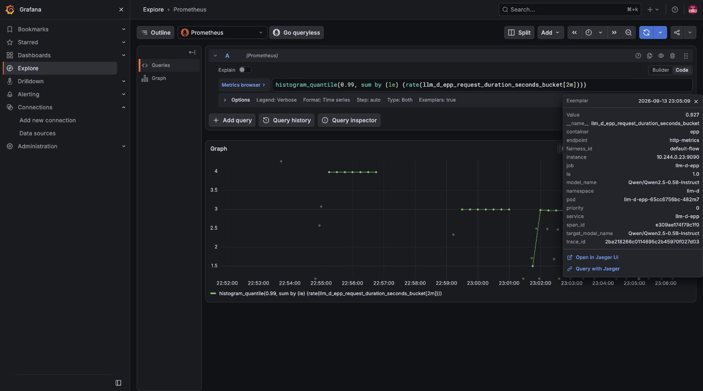
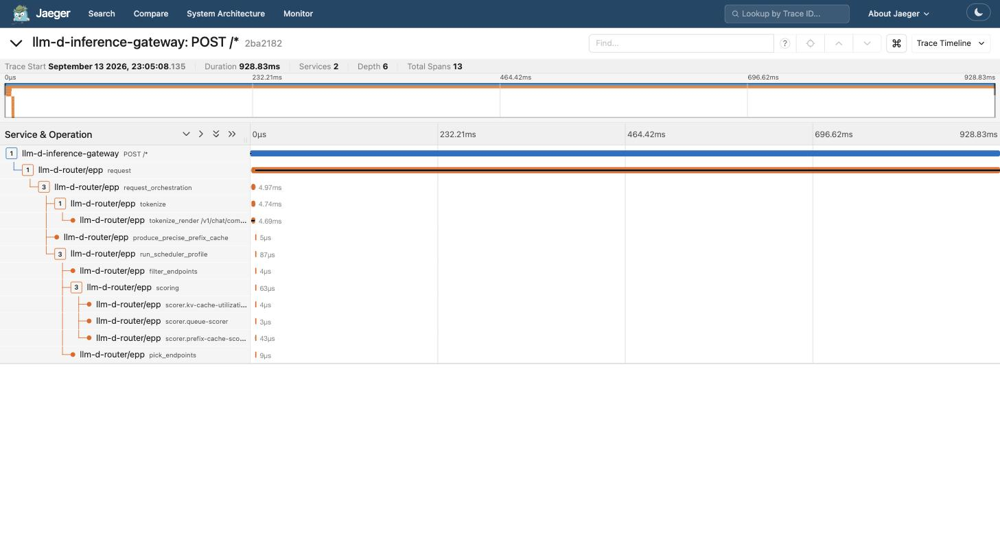

# 验证 llm-d-router PR #2774：用 Prometheus Exemplar 把指标和 Trace 串起来

- Issue: <https://github.com/llm-d/llm-d-router/issues/2637> — `[Observability] Link metrics to traces with Prometheus exemplars`
- PR: <https://github.com/llm-d/llm-d-router/pull/2774> — `feat(metrics): link metrics to traces with Prometheus exemplars`
  （2 个 commit：`d5e4c397` 加 trace_id exemplar，`9674dd1d` 再加 span_id；base 是 `47201115`）
- 验证日期：2026-09-13，环境保留着，见 [§7 怎么登录、怎么验证](#7-环境保留怎么登录怎么验证)

## 0. 一句话结论

**PR 能工作，且符合 issue 里约定的所有点。** 在按 [README](../README.md) 搭的 Kind + agentgateway + 真 vLLM CPU 环境里，
把 EPP 换成 PR 分支构建的镜像后：

| 验证点 | 结果 |
| --- | --- |
| PR 自带 5 个单元测试 | 全部 PASS |
| `Accept: application/openmetrics-text` 抓 EPP `/metrics` | 返回 `application/openmetrics-text; version=1.0.0`，`llm_d_epp_request_duration_seconds_bucket` 每个桶带 `# {trace_id="…",span_id="…"} <value> <ts>` |
| `Accept: text/plain;version=0.0.4`（老 scraper） | 仍返回经典格式，不带 exemplar，**对现有 scraper 无破坏** |
| exemplar 里的 `trace_id` / `span_id` | 在 Jaeger 里都能查到；`span_id` 正好是 EPP 的 `request` span，exemplar 的值和 span 的 duration 一致（0.669 s ↔ 669 ms，4.685 s ↔ 4686 ms） |
| `--metrics-endpoint-auth=false`（issue 里我提的那个分支） | exemplar 正常，说明 FilterProvider 已和 auth 解耦 |
| `--metrics-endpoint-auth=true`（大多数部署的默认值） | 无 token → 401；带 SA token → OpenMetrics + exemplar 正常；Prometheus 用 bearer token 抓取 `up` |
| Prometheus（开 `exemplar-storage`） | `/api/v1/query_exemplars` 能查到 exemplar（跑完 15 分钟流量后 111 个） |
| Grafana 面板 → Jaeger | Explore 里 exemplar 点的 tooltip 显示 trace_id/span_id，点 "Open in Jaeger UI" 直接打开那条 trace |

PR 之外我额外补了两处（不是 PR 的 bug，是链路上的其他环节）：Prometheus 要开 `exemplar-storage`；Grafana 的 Prometheus datasource 自带的
"Query with Jaeger" 内部链接在 Jaeger datasource 上会 "No data"（Grafana 把 queryType 硬编码成 Tempo 的 `traceql`），改成 URL 跳 Jaeger UI 就好了。细节见 [§5](#5-遇到的问题和怎么修的)。

## 1. PR 改了什么（读 diff 的理解）

只有 4 个文件，+337/-9：

| 文件 | 改动 |
| --- | --- |
| `pkg/epp/metrics/metrics.go` | `RecordRequestLatencies` 不再直接 `Observe`，改走新加的 `observeWithTraceExemplar(ctx, observer, value)`：从 `ctx` 取 `SpanContext`，**只有 `IsSampled()` 时**才 `ObserveWithExemplar(value, {trace_id, span_id})`，否则退回普通 `Observe`。exemplar 标签总长 63 rune，低于 OpenMetrics 128 rune 上限。 |
| `cmd/epp/runner/runner.go` | 原来 `FilterProvider` 只在 `opts.MetricsEndpointAuth` 为 true 时才设成 `filters.WithAuthenticationAndAuthorization`，否则是 `nil`。现在无条件设为新的 `openMetricsFilterProvider(authEnabled)`：filter 里丢掉 controller-runtime 给的 handler，用 `promhttp.HandlerFor(ctrlmetrics.Registry, {ErrorHandling: HTTPErrorOnError, EnableOpenMetrics: true})` 重建一个，auth 开着就再把 auth filter 包在外面。 |
| `pkg/epp/metrics/exemplars_test.go` | 3 个单测：sampled 附 exemplar / unsampled 不附 / 没 span 也照常记录观测值 |
| `cmd/epp/runner/openmetrics_wire_test.go` | 2 个"线上"测试：直接调 `openMetricsFilterProvider(false)` 产出的 handler，用 Prometheus 默认 Accept 抓一次要看到 exemplar；用经典 Accept 抓一次不能看到 |

我核对了 controller-runtime v0.24.1 `pkg/metrics/server/server.go:221`，它原本就是
`promhttp.HandlerFor(metrics.Registry, promhttp.HandlerOpts{ErrorHandling: promhttp.HTTPErrorOnError})`，
所以 PR 替换的 handler 和原版**唯一**区别就是 `EnableOpenMetrics: true`，没有丢东西。

## 2. 环境和版本

| 组件 | 版本 / 来源 |
| --- | --- |
| Mac / Docker | Apple Silicon (arm64)，Docker 28.4.0，14 CPU / 24 GiB |
| Kind / K8s | kind v0.31.0，Kubernetes v1.35.0，集群名 `llm-d`（`kind/kind-config.yaml`） |
| llm-d-router | PR 分支 `pr-2774`（head `9674dd1d`），worktree 在 `/tmp/llm-d-router-pr2774`；EPP 镜像 `ghcr.io/llm-d/llm-d-router-endpoint-picker-dev:pr2774`（本地 `docker build -f Dockerfile.epp`） |
| llm-d（guides/recipes） | 本地 checkout `$HOME/go/src/github.com/llm-d/llm-d` @ `0f88aa84` |
| Router chart | **PR 分支本地 chart** `config/charts/llm-d-router-gateway`（原因见 §5.1） |
| Gateway API / GAIE CRD | v1.5.1 / router repo `config/crd` |
| agentgateway | v1.1.0（`inferenceExtension.enabled=true`） |
| vLLM | `docker.io/vllm/vllm-openai-cpu:v0.19.1`，`Qwen/Qwen2.5-0.5B-Instruct`，2 副本 |
| OTel Collector + Jaeger | `install-otel-collector-jaeger.sh`，Jaeger 2.15.0 |
| kube-prometheus-stack | `install-prometheus-grafana.sh`，Prometheus v3.14.0，Grafana 13.2.1 |
| EPP tracing | `helm-values/tracing.values.yaml`：`parentbased_traceidratio`，`samplerArg=1.0`；agentgateway `randomSampling: "true"` |

## 3. 我是怎么测的（步骤）

### 3.1 拉 PR、跑单测、构建镜像

```console
$ cd $ROUTER_REPO && git fetch upstream pull/2774/head:pr-2774
$ git worktree add /tmp/llm-d-router-pr2774 pr-2774      # 不动本地正在用的分支
$ cd /tmp/llm-d-router-pr2774
$ go test ./pkg/epp/metrics/ ./cmd/epp/runner/ -run 'Exemplar|OpenMetrics|MetricsEndpoint' -count=1 -v
--- PASS: TestObserveWithTraceExemplar_SampledSpanAttachesTraceID
--- PASS: TestObserveWithTraceExemplar_UnsampledSpanAttachesNothing
--- PASS: TestObserveWithTraceExemplar_NoSpanStillObserves
ok   github.com/llm-d/llm-d-router/pkg/epp/metrics
--- PASS: TestMetricsEndpointServesExemplarsOnTheWire
--- PASS: TestMetricsEndpointKeepsClassicFormatForClassicScrapers
ok   github.com/llm-d/llm-d-router/cmd/epp/runner
$ docker build --platform linux/arm64 -f Dockerfile.epp \
    -t ghcr.io/llm-d/llm-d-router-endpoint-picker-dev:pr2774 .
```

### 3.2 按 README 3.2 – 3.10 搭环境

和 README 完全一样的步骤不重复，只列**不同点**：

1. `kind load docker-image ghcr.io/llm-d/llm-d-router-endpoint-picker-dev:pr2774 --name llm-d`
2. `/tmp/llm-d-cache` 因为 mac 重启被清空了，重新 `hf download` 预热（956 MB，README 3.8(a)）
3. Router chart 用 PR 分支的本地 chart（`ghcr.io/llm-d/charts/llm-d-router-gateway-dev` 已不存在，见 §5.1）：

```console
$ cd /tmp/llm-d-router-pr2774/config/charts/llm-d-router-gateway && helm dependency build .
$ helm install llm-d /tmp/llm-d-router-pr2774/config/charts/llm-d-router-gateway \
    -f $LLMD_REPO/guides/recipes/router/base.values.yaml \
    -f $DEMO/manifests/optional/precise-prefix/precise-prefix-router.values.yaml \
    -f $LLMD_REPO/guides/recipes/router/features/monitoring.values.yaml \
    -f $DEMO/helm-values/tracing.values.yaml \
    -f $DEMO/helm-values/gw-kind.values.yaml \
    --set router.epp.image.tag=pr2774 \
    --set provider.name=none \
    --set httpRoute.create=true \
    --set httpRoute.inferenceGatewayName=llm-d-inference-gateway \
    -n llm-d
```

4. 跳过了 3.11 IPP 和 3.12 P/D pool —— 和 exemplar 无关。

### 3.3 直接抓 EPP `/metrics`（PR 的核心）

```console
$ kubectl port-forward -n llm-d deploy/llm-d-epp 9090:9090 &
$ for i in 1 2 3; do curl -s http://localhost:8080/v1/chat/completions -H 'Content-Type: application/json' \
    -d '{"model":"Qwen/Qwen2.5-0.5B-Instruct","messages":[{"role":"user","content":"Say hello in 5 words."}],"max_tokens":20}'; done

# Prometheus 默认发的 Accept 头
$ curl -s -D - http://localhost:9090/metrics \
    -H 'Accept: application/openmetrics-text;version=1.0.0,text/plain;version=0.0.4;q=0.5' | grep -iE 'content-type|# \{'
Content-Type: application/openmetrics-text; version=1.0.0; charset=utf-8; escaping=underscores
llm_d_epp_request_duration_seconds_bucket{...,le="0.8"} 2 # {trace_id="b82ea9faea15b4c990c818bb3cd34767",span_id="a303b4a850474212"} 0.669057084 1.7893544243074634e+09
llm_d_epp_request_duration_seconds_bucket{...,le="5.0"} 4 # {span_id="b8d40c57d883294e",trace_id="307343f956c79a8efbf3a24186e69b5c"} 4.685395377 1.7893544236132984e+09

# 老 scraper 的 Accept 头：经典格式，0 个 exemplar
$ curl -s -D - http://localhost:9090/metrics -H 'Accept: text/plain;version=0.0.4' | grep -ci 'content-type: text/plain'   # 1
$ curl -s http://localhost:9090/metrics -H 'Accept: text/plain;version=0.0.4' | grep -c '# {'                            # 0

# 不带 Accept 的 curl：也是经典格式
$ curl -s -D - -o /dev/null http://localhost:9090/metrics | grep -i content-type
Content-Type: text/plain; version=0.0.4; charset=utf-8; escaping=underscores
```

这一步时 EPP 是 `--metrics-endpoint-auth=false`（chart `monitoring.values.yaml` 默认 `auth.enabled: false`），
正好覆盖 issue 里担心的"auth 关掉时 FilterProvider 为 nil、exemplar 静默失效"的分支 —— PR 已解耦，工作正常。

### 3.4 exemplar 指向的 trace / span 是真的吗

```console
$ kubectl port-forward -n llm-d svc/jaeger-collector 16686:16686 &
$ curl -s http://localhost:16686/api/traces/307343f956c79a8efbf3a24186e69b5c \
    | jq -r '.data[0].spans[] | "\(.spanID)  \(.operationName)  \(.duration/1000)ms"'
b8d40c57d883294e  request  4685.555ms        <-- exemplar 的 span_id，值 4.685395377 s
11615126887555c1  POST /*  4686.312ms        <-- agentgateway 根 span
483ce870987ea94d  request_orchestration  4.506ms
...（共 13 个 span）
```

两条 exemplar 的 `trace_id` 在 Jaeger 里都存在，`span_id` 都是 EPP 的 `request` span，值和 duration 吻合。
`span_id` 的价值在 Grafana 里能看到：datasource 内部链接会带 `panelsState.trace.spanId=<span_id>`，打开 trace 时直接定位到那个 span。

### 3.5 auth=true 分支

```console
$ helm upgrade llm-d /tmp/llm-d-router-pr2774/config/charts/llm-d-router-gateway ...（同上）... \
    --set router.monitoring.prometheus.auth.enabled=true -n llm-d
# chart 会：去掉 --metrics-endpoint-auth=false（EPP 默认 true）、创建 SA token secret
# inference-gateway-sa-metrics-reader-secret、ServiceMonitor 加 authorization.credentials

$ TOKEN=$(kubectl get secret -n llm-d inference-gateway-sa-metrics-reader-secret -o jsonpath='{.data.token}' | base64 -d)
$ curl -s -o /dev/null -w '%{http_code}\n' http://localhost:9090/metrics -H 'Accept: application/openmetrics-text;version=1.0.0'
401
$ curl -s -D - http://localhost:9090/metrics -H "Authorization: Bearer $TOKEN" \
    -H 'Accept: application/openmetrics-text;version=1.0.0,text/plain;version=0.0.4;q=0.5' | grep -iE '^HTTP|content-type|# \{'
HTTP/1.1 200 OK
Content-Type: application/openmetrics-text; version=1.0.0; charset=utf-8; escaping=underscores
llm_d_epp_request_duration_seconds_bucket{le="1.0"} 1 # {trace_id="1d382a814f5899ed23117937500bbb34",span_id="73a3c2eb7447bcda"} 0.901379209 1.7893547494936988e+09
...
$ curl -s 'http://localhost:9091/api/v1/targets' | jq -r '.data.activeTargets[] | select(.scrapePool|test("llm-d-epp")) | "\(.scrapePool) \(.health)"'
serviceMonitor/llm-d/llm-d-epp-monitor/0 up
```

**环境现在就停在这个 auth=true 的状态**（更接近真实部署），所以后面手动 curl EPP 要带 token，见 §7。

### 3.6 Prometheus 端到端

```console
$ kubectl patch prometheus -n llm-d-monitoring llmd-kube-prometheus-stack-prometheus \
    --type merge -p '{"spec":{"enableFeatures":["exemplar-storage"]}}'
$ curl -s "http://localhost:9091/api/v1/query_exemplars?query=llm_d_epp_request_duration_seconds_bucket&start=$(date -v-1H +%s)&end=$(date +%s)" \
    | jq -r '.data[] | .seriesLabels.le as $le | .exemplars[] | "le=\($le)\tvalue=\(.value)s\ttrace_id=\(.labels.trace_id)\tspan_id=\(.labels.span_id)"'
le=0.8   value=0.647200042s  trace_id=6cff658b7c226d7d62cac85455754389  span_id=26f7b1954c2429cb
le=1.25  value=1.11346275s   trace_id=935a8fa65d535bbac0184b7760196276  span_id=8be39463dc22c96e
le=2.0   value=1.610574626s  trace_id=2b31c00d3d5f4dee209c928173c80406  span_id=961739ba6bf4b3aa
le=3.0   value=2.096782876s  trace_id=4f3d7e57d73fff7f4b26dd6436d091bb  span_id=3cc0d1439ae1b5b8
le=4.0   value=3.102992043s  trace_id=6eac528587816f75cefe428b3042b91a  span_id=3eeb8b229ef92f99
le=5.0   value=4.685395377s  trace_id=307343f956c79a8efbf3a24186e69b5c  span_id=b8d40c57d883294e
```

Prometheus 3.x 默认 `scrape_protocols` 把 OpenMetrics 1.0.0 排第一，所以 ServiceMonitor 不用改任何东西就能收到 exemplar；
但 **不开 `exemplar-storage` 特性它就直接丢弃**（开之前 `query_exemplars` 返回 `[]`）。

### 3.7 Grafana：从面板跳到 trace

给 kube-prometheus-stack 加 Jaeger datasource，并把 Prometheus datasource 的 `exemplarTraceIdDestinations` 指过去
（values 在 [`helm-values/grafana-exemplar-datasources.values.yaml`](../helm-values/grafana-exemplar-datasources.values.yaml)）：

```console
$ helm upgrade llmd prometheus-community/kube-prometheus-stack -n llm-d-monitoring \
    --reuse-values -f $DEMO/helm-values/grafana-exemplar-datasources.values.yaml
```

Explore → Prometheus，查询 `histogram_quantile(0.99, sum by (le) (rate(llm_d_epp_request_duration_seconds_bucket[2m])))`，
Options 里 `Exemplars: true`，图上就会出现 exemplar 点；点一个：



点 "Open in Jaeger UI"，直接打开 exemplar 对应的那条 trace（0.927 s 的观测值 ↔ 928.83 ms 的 trace）：



## 4. 一键复验脚本

上面 §3.3 – §3.7 我压成了一个脚本，环境活着随时能跑：

```console
$ $DEMO/scripts/port-forward.sh &          # 见 §7
$ $DEMO/scripts/verify-exemplars.sh
1) send 3 requests through the gateway
  ✅ request 1 -> HTTP 200
  ✅ request 2 -> HTTP 200
  ✅ request 3 -> HTTP 200
2) EPP /metrics: OpenMetrics negotiation + exemplar on the wire
  (metrics-endpoint-auth is on: using the chart's SA token)
  ✅ Accept openmetrics -> Content-Type: application/openmetrics-text; version=1.0.0; charset=utf-8; escaping=underscores
  ✅ exemplar on the wire: # {trace_id="0ac7b302e58111256fd1d1f34da07dac",span_id="18c90e4038682060"} 0.00455675 1.7893548877570221e+09
  ✅ classic Accept -> text/plain, no exemplars (unchanged for old scrapers)
3) exemplar trace_id/span_id resolve in Jaeger
  ✅ trace 0ac7b302e58111256fd1d1f34da07dac / span 18c90e4038682060 = EPP span 'request 4.816ms'
4) Prometheus stored the exemplars (exemplar-storage feature)
  ✅ 111 exemplars in Prometheus (/api/v1/query_exemplars)
5) Grafana Prometheus datasource links trace_id -> Jaeger
  ✅ exemplarTraceIdDestinations configured (open http://localhost:3000/explore, query the histogram with Exemplars: true)
```

## 5. 遇到的问题和怎么修的

### 5.1 `oci://ghcr.io/llm-d/charts/llm-d-router-gateway-dev` 不存在了（上游漂移，非 PR 问题）

README 3.7 的 `helm install ... oci://ghcr.io/llm-d/charts/llm-d-router-gateway-dev --version v0` 报 403；
用匿名 token 查 ghcr `tags/list` 返回 `NAME_UNKNOWN`。上游 `guides/env.sh` 现在是
`ROUTER_GATEWAY_CHART=oci://ghcr.io/llm-d/charts/llm-d-router-gateway`（去掉了 `-dev`）。

**修法**：直接用 PR 分支里的本地 chart `config/charts/llm-d-router-gateway`（先 `helm dependency build`，它依赖 `file://../routerlib`），
这样 chart 和被测代码一定一致。README 后续应把 chart 名改成 `llm-d-router-gateway`。

### 5.2 HF 模型缓存被清空

`/tmp/llm-d-cache/huggingface` 是空的（mac 重启清 `/tmp`），按 README 3.8(a) 重新 `hf download`。
用了 Docker 里的 `hf` 直接下到宿主机目录，几分钟就好，不会踩 startupProbe 那个坑。

### 5.3 Prometheus 默认不存 exemplar

`query_exemplars` 一开始返回 `[]`。kube-prometheus-stack 的 `install-prometheus-grafana.sh` 没有开这个特性。

**修法**：`kubectl patch prometheus ... '{"spec":{"enableFeatures":["exemplar-storage"]}}'`，operator 自动滚动，
Pod args 出现 `--enable-feature=exemplar-storage`。这条应该进 PR 作者说的 follow-up（Grafana 面板 + 文档）里，
否则用户按现有 observability 脚本装完看不到 exemplar 会以为 PR 没生效。

### 5.4 Grafana "Query with Jaeger" 打开是 "No data"（Grafana 侧的坑）

`exemplarTraceIdDestinations` 用 `datasourceUid: jaeger` 时，Grafana 13.2.1 的 Prometheus datasource 生成的内部链接是
`{"query":"<trace_id>","queryType":"traceql","datasource":{"uid":"jaeger"}}` —— `queryType: traceql` 是 Tempo 的，
Jaeger datasource 不认识，Explore 页面显示 "No data"（`docs/screenshots/grafana-exemplar-tooltip-before-fix.jpg` 是修之前只有一个链接的样子）。
我把 URL 里的 `queryType` 去掉再打开，同一个 trace ID 正常渲染，所以定位为 Grafana 的链接生成问题，和 PR、Jaeger 数据都无关。

**修法**：加一个 `url` 形式的 destination 直接跳 Jaeger UI（`http://localhost:16686/trace/${__value.raw}`），
保留 datasource 形式作为第二个链接。两个小坑：

- Grafana provisioning 会展开 `${VAR}` 环境变量，`${__value.raw}` 会被吃成空串 → values 里要写 `$${__value.raw}`。
- helm 对 list 是整体替换，所以 values 里要把 Prometheus datasource 也完整重写一遍（不能只 append Jaeger）。

### 5.5 `kubectl port-forward` 一断就退出

Grafana 的 websocket 一断，port-forward 进程就退出，页面 "Failed to fetch"。写了 `scripts/port-forward.sh`，每条 forward 套 `while true` 循环。

### 5.6 Grafana Pod 重启后浏览器 session 失效

helm upgrade Grafana 后需要重新 `admin/admin` 登录一次，不算问题，提一下免得奇怪。

## 6. 对 PR 的 review 意见

功能上没发现问题，下面是可以在 PR 里提的点（我没有在 GitHub 上发任何评论）：

1. **（建议）文档 / follow-up 里写清 Prometheus 侧前提**：`--enable-feature=exemplar-storage`，否则 exemplar 被静默丢弃（§5.3）。
   同样值得写一句：exemplar 只走 OpenMetrics，Prometheus ≥ 2.x 默认 `scrape_protocols` 已经优先 OpenMetrics，不用改 ServiceMonitor。
2. **（建议）Grafana follow-up 用 Jaeger 时注意 §5.4** —— datasource 内部链接对 Jaeger 不工作，要用 `url` 形式或换 Tempo。
   如果 follow-up 的面板放到 `guides/recipes/observability/grafana/dashboards/`，datasource provisioning 里的 `$${__value.raw}` 转义别漏。
3. **（nit）版权头不一致**：`cmd/epp/runner/openmetrics_wire_test.go` 是 `Copyright 2025 The Kubernetes Authors`，
   同目录 `runner.go` 是 `2026 The Kubernetes Authors`，`pkg/epp/metrics/exemplars_test.go` 是 `2026 The llm-d Authors`。
4. **（nit / 观察）** `openmetrics_wire_test.go` 里 `exemplarLabels` 只取第一条带 `# {` 的行，且两个测试共用全局 registry
   （`eppmetrics.Register()`），当前没问题；如果以后其他测试也往 `llmdRequestLatencies` 里写观测值，第一条 exemplar 可能不是本测试写的。
   可以用带唯一 `modelName` 的标签过滤一下更稳。
5. **（确认）** `ObserveWithExemplar` 在标签超过 128 rune 时会 panic，PR 固定 63 rune 并有测试断言 `<= prometheus.ExemplarMaxRunes`，OK。
6. **（确认）** `IsSampled()` 门控在真实链路里是对的：agentgateway `randomSampling: "true"` + EPP `parentbased_traceidratio`，
   所以本环境 100% 采样，每个 exemplar 都指向已导出的 trace。unsampled 分支靠单测覆盖（本环境无法构造 parent 未采样的请求）。

## 7. 环境保留：怎么登录、怎么验证

集群没删，Kind 集群 `llm-d` 一直在跑（`kind get clusters`）。EPP 用的是 `pr2774` 镜像，`metrics-endpoint-auth=true`。

### 7.1 起 port-forward

```console
$ export DEMO=$HOME/go/src/github.com/gyliu513/langX101/llm-d/llm-d-full-demo
$ $DEMO/scripts/port-forward.sh          # 前台跑着，Ctrl-C 退出；或者加 & 放后台
```

| 地址 | 是什么 | 登录 |
| --- | --- | --- |
| <http://localhost:3000> | Grafana | `admin` / `admin`（首次会让改密码，点 Skip） |
| <http://localhost:9091> | Prometheus | 无 |
| <http://localhost:16686> | Jaeger UI | 无 |
| <http://localhost:9090/metrics> | EPP metrics | 需要 Bearer token，见下 |
| <http://localhost:8080> | agentgateway（`POST /v1/chat/completions`） | 无 |

### 7.2 一键验证

```console
$ $DEMO/scripts/verify-exemplars.sh      # 输出见 §4，5 项全 ✅ 即通过
```

### 7.3 手动验证

```console
# 发几条请求（每条 = 一个 sampled trace = 一个 exemplar）
$ curl -s http://localhost:8080/v1/chat/completions -H 'Content-Type: application/json' \
    -d '{"model":"Qwen/Qwen2.5-0.5B-Instruct","messages":[{"role":"user","content":"hi"}],"max_tokens":30}' | jq .choices[0].message.content

# 看 EPP 线上输出（auth 开着，要 token）
$ TOKEN=$(kubectl get secret -n llm-d inference-gateway-sa-metrics-reader-secret -o jsonpath='{.data.token}' | base64 -d)
$ curl -s http://localhost:9090/metrics -H "Authorization: Bearer $TOKEN" \
    -H 'Accept: application/openmetrics-text;version=1.0.0' | grep 'llm_d_epp_request_duration_seconds_bucket' | grep '# {'

# 拿一个 trace_id 去 Jaeger 里查
$ curl -s http://localhost:16686/api/traces/<trace_id> | jq -r '.data[0].spans[] | "\(.spanID) \(.operationName) \(.duration/1000)ms"'

# Prometheus 里查 exemplar
$ curl -s "http://localhost:9091/api/v1/query_exemplars?query=llm_d_epp_request_duration_seconds_bucket&start=$(date -v-1H +%s)&end=$(date +%s)" | jq .
```

Grafana 里看：登录 → Explore → datasource 选 Prometheus → Code 模式输入
`histogram_quantile(0.99, sum by (le) (rate(llm_d_epp_request_duration_seconds_bucket[2m])))` →
展开 Options 把 **Exemplars** 打开 → 图上的小菱形点就是 exemplar，点一下 → tooltip 底部 "Open in Jaeger UI"。
（直接打开这个 URL 也行：<http://localhost:3000/explore?schemaVersion=1&panes=%7B%22a%22%3A%7B%22datasource%22%3A%22prometheus%22%2C%22queries%22%3A%5B%7B%22refId%22%3A%22A%22%2C%22expr%22%3A%22histogram_quantile(0.99%2C%20sum%20by%20(le)%20(rate(llm_d_epp_request_duration_seconds_bucket%5B2m%5D)))%22%2C%22exemplar%22%3Atrue%2C%22datasource%22%3A%7B%22type%22%3A%22prometheus%22%2C%22uid%22%3A%22prometheus%22%7D%7D%5D%2C%22range%22%3A%7B%22from%22%3A%22now-30m%22%2C%22to%22%3A%22now%22%7D%7D%7D&orgId=1>）

### 7.4 想切回 auth=false（README 默认）或换镜像

```console
$ helm upgrade llm-d /tmp/llm-d-router-pr2774/config/charts/llm-d-router-gateway \
    -f $LLMD_REPO/guides/recipes/router/base.values.yaml \
    -f $DEMO/manifests/optional/precise-prefix/precise-prefix-router.values.yaml \
    -f $LLMD_REPO/guides/recipes/router/features/monitoring.values.yaml \
    -f $DEMO/helm-values/tracing.values.yaml \
    -f $DEMO/helm-values/gw-kind.values.yaml \
    --set router.epp.image.tag=pr2774 \            # 改成 main 就是对照组（upstream/main 没有 exemplar）
    --set provider.name=none \
    --set httpRoute.create=true \
    --set httpRoute.inferenceGatewayName=llm-d-inference-gateway \
    --set router.monitoring.prometheus.auth.enabled=false \
    -n llm-d
```

### 7.5 清理

```console
$ kind delete cluster --name llm-d
$ git -C $HOME/go/src/github.com/llm-d/llm-d-router worktree remove /tmp/llm-d-router-pr2774
$ docker rmi ghcr.io/llm-d/llm-d-router-endpoint-picker-dev:pr2774
```

## 8. 本次新增 / 修改的文件

| 文件 | 用途 |
| --- | --- |
| `docs/pr2774-exemplars-verify-zh.md` | 本文 |
| `docs/screenshots/grafana-exemplar-tooltip.jpg` | Grafana exemplar tooltip（修复后，两个跳转链接） |
| `docs/screenshots/grafana-exemplar-tooltip-before-fix.jpg` | 修复前只有 "Query with Jaeger"（点开 No data） |
| `docs/screenshots/jaeger-trace-from-exemplar.jpg` | 从 exemplar 跳到 Jaeger 打开的 trace |
| `helm-values/grafana-exemplar-datasources.values.yaml` | Grafana Jaeger datasource + exemplar 跳转配置 |
| `scripts/port-forward.sh` | 自动重连的 port-forward |
| `scripts/verify-exemplars.sh` | 一键验证 |
