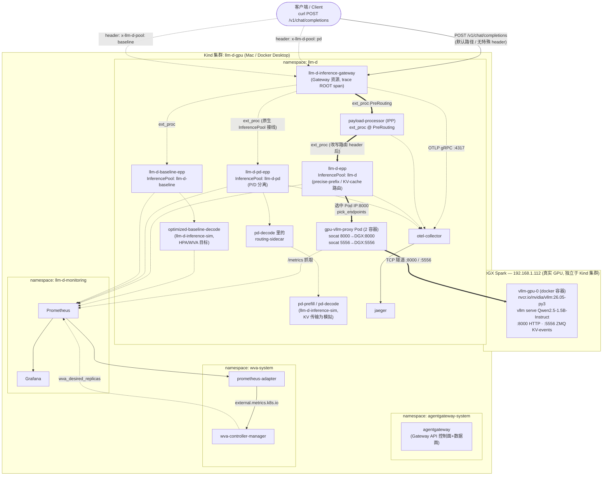

# llm-d on Kind —— 真实 DGX Spark GPU 推理 + 完整可观测性

*[English](README.md)*

## 一句话总结 / TL;DR

这篇文档假设你**完全没有背景知识**,带你从零开始,在本地
[Kind](https://kind.sigs.k8s.io/) Kubernetes 集群上搭一套完整的
[llm-d](https://github.com/llm-d/llm-d) 推理栈:**真实的 GPU 推理**跑在另一
台机器(NVIDIA DGX Spark)上,同时打通一条**完整的可观测性链路**(分布式追踪
+ 指标看板),覆盖每一跳。下面每一条命令都是你真正要敲的命令 —— 本文档刻意不
把安装步骤藏进一堆包装脚本里,你应该在运行每条命令之前,就能看懂、理解它在做
什么。照着顺序做完,你会得到一套真正能跑起来的系统:可以发真实请求,也能在
Jaeger 和 Grafana 里实时看到 trace 和指标。

本文档里出现的所有命令、输出、截图,都是 2026-08-24 一次真实运行**实际抓取到
的结果**,不是示意性样例。

它是 [`../llm-d-full-demo`](../llm-d-full-demo)(因为构建机没有 GPU,用的是
CPU vLLM / 模拟器)的延伸,增加了:

- 在 precise-prefix(KV-cache 感知路由)路径上的**真实 GPU 推理**。
- 同样闭环的可观测性:跨 gateway → IPP → EPP → model server 的分布式追踪
  (Jaeger)与指标(Prometheus/Grafana)。
- P/D 分离(调度是真实的,KV 传输是模拟的 —— 只有一块物理 GPU)。
- Workload Variant Autoscaler(WVA)基于实时 Prometheus 指标驱动 HPA。

---

## 1. 架构 / Architecture

### 参考资料 / References —— 本文档的依据都来自 llm-d 官方文档

下面每一处架构性描述和术语选择,都遵循 [llm-d](https://github.com/llm-d) 官
方文档,不是我自己编出来的说法。建议对照着这些原始文档一起看:

- [`llm-d/llm-d` — `docs/architecture/README.md`](https://github.com/llm-d/llm-d/blob/main/docs/architecture/README.md) —— 顶层架构(Router / InferencePool / Model Server)
- [`docs/architecture/core/router/README.md`](https://github.com/llm-d/llm-d/blob/main/docs/architecture/core/router/README.md) —— llm-d Router = Proxy + EPP;"Inference Gateway" 这个术语的由来
- [`docs/architecture/core/inferencepool.md`](https://github.com/llm-d/llm-d/blob/main/docs/architecture/core/inferencepool.md) —— `InferencePool` 如何在 Gateway ↔ EPP ↔ model-server Pod 之间搭桥
- [`docs/architecture/advanced/kv-management/prefix-cache-aware-routing.md`](https://github.com/llm-d/llm-d/blob/main/docs/architecture/advanced/kv-management/prefix-cache-aware-routing.md) —— 本 demo 演示的"精确"KV-cache 感知路由
- [`docs/architecture/advanced/disaggregation/README.md`](https://github.com/llm-d/llm-d/blob/main/docs/architecture/advanced/disaggregation/README.md) —— P/D 分离的请求流程(带时序图)
- [`docs/architecture/advanced/autoscaling/README.md`](https://github.com/llm-d/llm-d/blob/main/docs/architecture/advanced/autoscaling/README.md) 和 [`hpa-wva.md`](https://github.com/llm-d/llm-d/blob/main/docs/architecture/advanced/autoscaling/hpa-wva.md) —— WVA 的设计
- [`docs/infrastructure/gateway/agentgateway.md`](https://github.com/llm-d/llm-d/blob/main/docs/infrastructure/gateway/agentgateway.md) —— 第 3 节步骤 4~13 依据的官方 agentgateway 安装指南
- [`guides/workload-autoscaling/README.wva.md`](https://github.com/llm-d/llm-d/blob/main/guides/workload-autoscaling/README.wva.md) 和 [`llm-d-workload-variant-autoscaler/deploy/README.md`](https://github.com/llm-d/llm-d-workload-variant-autoscaler/blob/main/deploy/README.md) —— WVA 的部署方式
- [Gateway API Inference Extension(GAIE)一致性规范](https://gateway-api-inference-extension.sigs.k8s.io/concepts/conformance/) —— `InferencePool`/EPP 实现的上游 Kubernetes SIG 规范

本 demo 在哪些地方偏离了这些官方文档 —— 因为有一台 GPU 节点在集群之外,或者因
为组件本身的文档写好之后上游又变了 —— 都会在正文里明确标出来、说明原因,而不
是悄悄当成"标准做法"呈现。

### 1.1 回顾 llm-d 官方架构,以及为什么这里要用一个 proxy Pod 而不是 Service

按官方架构文档([`docs/architecture/README.md`](https://github.com/llm-d/llm-d/blob/main/docs/architecture/README.md)、
[`docs/architecture/core/router/README.md`](https://github.com/llm-d/llm-d/blob/main/docs/architecture/core/router/README.md)),
llm-d 的核心是三个概念:**llm-d Router**(= **Proxy** + **Endpoint Picker,
EPP** 两部分组成;跑在 Gateway 模式下时,官方文档把它称作 **"Inference
Gateway"**)、**`InferencePool`**(把一组跑同一个模型的 model-server Pod 用
label selector 圈起来,官方文档把它比作"为 LLM 优化过的 Service")、以及
**Model Server**(真正执行推理的引擎,比如 vLLM/SGLang)。请求先到 Proxy,
Proxy 通过 `ext-proc` 协议"挂起"请求、去问 EPP;EPP 结合 `InferencePool` 里的
实时状态(KV-cache 命中情况、负载等)选出最优的目标 Pod,告诉 Proxy 转发过去。

关键在 [`docs/architecture/core/inferencepool.md`](https://github.com/llm-d/llm-d/blob/main/docs/architecture/core/inferencepool.md)
里写得很清楚:`InferencePool` 的端点发现是"**Selector-based Discovery**"——
EPP 直接 watch 匹配 `InferencePool.spec.selector` 这些 label 的 Pod,通过
**Kubernetes Pod API** 拿到它们的 Pod IP,并不经过 Service 的 ClusterIP。这在
llm-d 的语境下是完全合理的设计(比标准 Service 负载均衡更精细、能带 KV-cache
感知),但它带来一个推论:一个指向"集群外部 IP"的普通 Kubernetes `Service`
(比如 `ExternalName` Service,或者手工维护 `Endpoints` 的无头 Service),对
`InferencePool` 的 selector 来说是**完全不可见**的 —— EPP 压根不会去找它。

Kind 又没法把一台远程物理主机当成真正的 Kubernetes 节点加入集群(Kind 节点本
质上是"跑 `kind create cluster` 的那台 Docker 主机"上的容器),所以 GPU 只能作
为一个独立进程留在集群外(这次是 DGX Spark 上),集群内部就必须有一个**真实的
Pod**——带着对的 label、有真实的集群内 Pod IP——来代表它,`InferencePool`
才能发现到它。

解决办法:造一个真实的、就在集群里的 Pod,让它**本身就是** InferencePool 的后
端,它的容器负责把 TCP 流量透明地隧道转发到 DGX Spark。用的是极小的
`alpine/socat` 镜像 —— 不需要自建镜像,`socat` 就是一个通用的双向 TCP 中继。

### 1.2 完整架构图 / Full component diagram



### 1.3 每个组件在做什么

| 组件 | 命名空间 | 作用 |
| --- | --- | --- |
| `agentgateway` | `agentgateway-system` | Gateway API 控制器 + Inference Extension 支持;给 `Gateway` 资源生成实际数据面代理,把 ext_proc 请求路由给 IPP/EPP |
| `llm-d-inference-gateway` | `llm-d` | 上面那个数据面代理的具体实例(一个 `Gateway` 资源);是每条请求 trace 的根 span `POST /*` |
| `payload-processor`(IPP) | `llm-d` | 在 `PreRouting` 阶段挂的 `ext_proc` gRPC 服务器;把请求体里的字段(比如 `model`)改写进 HTTP header |
| `gpu-vllm-proxy` | `llm-d` | 本 demo 特有的桥接 Pod;2 个容器分别用 `socat` 把 8000(HTTP)、5556(ZMQ KV 事件)透明转发到 DGX Spark |
| `llm-d-epp` | `llm-d` | precise-prefix(KV-cache 感知)插件链的 EPP,负责真实 GPU 池(`InferencePool: llm-d`)的端点选择 |
| `llm-d-pd-epp` / `pd-prefill` / `pd-decode` | `llm-d` | P/D 分离池;EPP 跑不同插件链,后端是 `llm-d-inference-sim`,KV 传输被模拟 |
| `llm-d-baseline-epp` / `optimized-baseline-decode` | `llm-d` | baseline 池,WVA 自动扩缩容的演示目标 |
| `otel-collector` + `jaeger` | `llm-d` | 追踪链路:各组件通过 OTLP gRPC(`:4317`)把 span 发给 collector,再转给 Jaeger |
| `kube-prometheus-stack`(release 名 `llmd`) | `llm-d-monitoring` | Prometheus(抓取所有 ServiceMonitor/PodMonitor)+ Grafana |
| `wva-controller-manager` + `prometheus-adapter` | `wva-system` | WVA 读 Prometheus 指标,算出期望副本数,写成 `wva_desired_replicas`;`prometheus-adapter` 把它翻译成 `external.metrics.k8s.io` API,给 HPA 消费 |

### 1.4 一次请求的完整路径(默认路径)

1. 客户端向 `llm-d-inference-gateway` 的 Service ClusterIP 发
   `POST /v1/chat/completions`。
2. agentgateway 收到请求,开一个新 trace(根 span `POST /*`),按配置好的
   `AgentgatewayPolicy` 顺序调用 `ext_proc`:先是 IPP(阶段 `PreRouting`)。
3. IPP 把请求体里的 `model` 字段解析出来,写成 `X-Gateway-Model-Name` 这个
   header,再把请求(带着新 header 和继承转发的 W3C trace 上下文)还给 gateway。
4. gateway 通过 InferencePool 内置的 ext_proc 接线,把请求转给 `llm-d-epp`。
   EPP 跑 precise-prefix 插件链:`token-producer` 先去问 EPP 自己 pod 里的
   `vllm-render` sidecar 要 token 化结果,再用 `precise-prefix-cache-producer`
   查自己维护的 KV-block 索引,`prefix-cache-scorer`/`kv-cache-utilization-scorer`/
   `queue-scorer` 给每个候选 Pod 打分,`pick_endpoints` 选出分数最高的那个 ——
   在这个 demo 里,候选 Pod 就只有 `gpu-vllm-proxy` 这一个。
5. EPP 把请求代理到 `gpu-vllm-proxy` 的 Pod IP:8000。
6. `gpu-vllm-proxy` 里的 `http-proxy` 容器(`socat`)把这个 TCP 连接原样转发到
   `192.168.1.112:8000`,也就是 DGX Spark 上真实的 vLLM 进程。
7. vLLM 用真实 GPU 算出补全结果,原路返回。
8. 沿途每个组件(gateway、IPP、EPP)都把自己的 span 通过 OTLP 发给
   `otel-collector` → `jaeger`,最终在 Jaeger 里能看到一条完整拼接的 trace。
   Prometheus 同时在抓 EPP 和(通过 proxy 隧道)vLLM 自己的 `/metrics`。

`x-llm-d-pool: pd` 和 `x-llm-d-pool: baseline` 这两个 header 会让 gateway 走
另外两条 `HTTPRoute`,分别转给 `llm-d-pd-epp`(P/D 池)或
`llm-d-baseline-epp`(baseline 池)—— 同一个 Gateway、同一个客户端入口,靠
header 区分走哪条路径。

镜像来源:本次运行用到的镜像全部从公开镜像仓库直接拉取 —— **没有做任何本地构
建**。三周前的 CPU demo 因为当时 EPP/sidecar/IPP 镜像还没发布 multi-arch 版
本,不得不从源码构建;现在这些镜像已经都是 multi-arch 且可公开拉取了。

> 最后验证时间 2026-08-24:`llm-d-router-gateway:v0` chart(digest
> `sha256:7cf1ad13…`)、EPP 镜像
> `ghcr.io/llm-d/llm-d-router-endpoint-picker:main`、IPP `v0.1.0`、
> routing-sidecar `ghcr.io/llm-d/llm-d-router-disagg-sidecar:v0.10.0`、
> inference-sim `:latest`、WVA controller `v0.9.0`、vLLM
> `nvcr.io/nvidia/vllm:26.05-py3`(针对 GB10/Blackwell 构建的 vLLM 0.20.1 dev 版)。

---

## 2. 前置条件 / Prerequisites

在你运行下面这些命令的机器上(本次运行是一台 Mac),需要:

| 工具 | 用途 | 验证命令 |
| --- | --- | --- |
| `docker`(Docker Desktop) | Kind 集群实际跑在 Docker 容器里 | `docker version` |
| [`kind`](https://kind.sigs.k8s.io/) v0.20+ | 创建本地 Kubernetes 集群 | `kind version` |
| `kubectl` v1.28+ | 操作 Kubernetes 资源 | `kubectl version --client` |
| `helm` v3.8+ | 安装打包成 Helm chart 的组件 | `helm version` |
| SSH 能免密登录 DGX Spark | 远程部署 vLLM | `ssh <user>@<dgx-host> hostname` |
| `curl`、`python3` | 发测试请求、解析 JSON 响应 | — |
| (可选)Google Chrome | 给 Jaeger/Grafana/Prometheus 截图用(headless 模式) | — |

DGX Spark 这一侧(GPU 节点本身)需要:`docker` + NVIDIA 驱动 +
`nvidia-container-toolkit`(能让 `docker run --gpus all` 工作)。这些在本次
用到的 DGX Spark 上已经装好了;如果你用别的 GPU 主机,先确认
`docker run --rm --gpus all nvidia/cuda:12.0-base nvidia-smi` 能跑通。

---

## 3. 安装步骤 —— 逐步、原生命令 / Installation — step by step, native commands

下面每条命令都可以直接复制粘贴运行 —— 核心流程不需要任何包装脚本。少数几处用
了经过充分测试的上游脚本(可观测性组件的安装器),那是因为手动重现几百行环境
探测逻辑只会增加出错风险、不会增加理解 —— 这些地方会明确标出来,并解释脚本底
层到底做了什么。

先设好共用变量(按你自己的 checkout 路径调整):

```console
export LLMD_REPO=$HOME/go/src/github.com/llm-d/llm-d
export ROUTER_REPO=$HOME/go/src/github.com/llm-d/llm-d-router
export IPP_REPO=$HOME/go/src/github.com/llm-d/llm-d-inference-payload-processor
export DEMO=$HOME/go/src/github.com/gyliu513/langX101/llm-d/llm-d-gpu-demo
export DGX_HOST=192.168.1.112
export DGX_USER=lgy
export MODEL=Qwen/Qwen2.5-1.5B-Instruct
```

### 步骤 1 — 在 DGX Spark 上启动真实的 vLLM

先 SSH 上去,直接用 `docker run` 起一个 vLLM 容器,不经过任何脚本:

```console
ssh ${DGX_USER}@${DGX_HOST} "docker run -d \
  --gpus all \
  --ipc=host \
  --name vllm-gpu-0 \
  -p 8000:8000 -p 5556:5556 \
  -e VLLM_LOGGING_LEVEL=INFO \
  nvcr.io/nvidia/vllm:26.05-py3 \
  vllm serve ${MODEL} \
    --port 8000 \
    --block-size 64 \
    --gpu-memory-utilization 0.03 \
    --max-model-len 4096 \
    --enforce-eager \
    --kv-events-config '{\"enable_kv_cache_events\":true,\"publisher\":\"zmq\",\"endpoint\":\"tcp://*:5556\",\"topic\":\"kv@vllm-gpu-0:8000@${MODEL}\"}'"
```

**这条命令每个部分在干什么:**

| 参数 | 作用 |
| --- | --- |
| `docker run -d` | 以容器方式、后台运行 |
| `--gpus all` | 通过 `nvidia-container-toolkit`,把宿主机上所有 GPU 暴露给容器 |
| `--ipc=host` | 共享宿主机的 IPC 命名空间(含 `/dev/shm`);vLLM 多进程(API server + engine core)靠共享内存通信,默认 Docker 的 64MB `/dev/shm` 不够,不加这个会启动失败 |
| `--name vllm-gpu-0` | 给容器起名,方便后面 `docker logs`/`docker stop` 引用 |
| `-p 8000:8000` | 容器内 8000 端口(OpenAI 兼容 API)映射到宿主机 8000 |
| `-p 5556:5556` | 容器内 5556 端口(KV-cache 事件的 ZMQ PUB socket)映射出来,供 Kind 集群里的 proxy Pod 订阅 |
| `-e VLLM_LOGGING_LEVEL=INFO` | 日志级别 |
| `nvcr.io/nvidia/vllm:26.05-py3` | NVIDIA 官方为 DGX Spark(GB10/Blackwell 架构)构建的 vLLM 镜像;截至本次运行,还没有官方 `vllm/vllm-openai` 镜像支持这个 arm64+Blackwell 组合 |
| `vllm serve ${MODEL}` | vLLM 的 OpenAI 兼容 server 子命令,加载指定模型 |
| `--port 8000` | vLLM 自己监听的端口(容器内) |
| `--block-size 64` | KV cache 按多少个 token 一块来分页;**必须**和后面 EPP 配置文件里 `precise-prefix-cache-producer.tokenProcessorConfig.blockSize` 保持一致 |
| `--gpu-memory-utilization 0.03` | vLLM 为"权重 + KV cache"预留的显存比例,是相对于 `torch.cuda.get_device_properties(0).total_memory` 算的 —— 在这台 DGX Spark 上是 130.667GB 统一内存的 3%,约 3.9GB。为什么设这么低,见第 5 节 |
| `--max-model-len 4096` | 最大上下文长度(prompt+生成) |
| `--enforce-eager` | 关掉 CUDA graph 捕获和 `torch.compile`,用"eager"模式执行;启动更快、显存占用更少,代价是吞吐量略低 —— 对这个演示场景完全够用 |
| `--kv-events-config '{...}'` | 打开 KV-cache 块级事件发布:`enable_kv_cache_events: true` 是开关本身;`publisher: zmq` 用 ZeroMQ 传输;`endpoint: tcp://*:5556` 在容器内 0.0.0.0:5556 开一个 ZMQ PUB socket;`topic` 是消息主题前缀,EPP 用 `kv@` 前缀过滤订阅。**这是 KV-cache 感知路由能工作的前提** |

**验证:**

```console
ssh ${DGX_USER}@${DGX_HOST} 'docker logs vllm-gpu-0 2>&1 | tail -5'
```

真实抓到的输出:
```
(EngineCore pid=258) INFO gpu_model_runner.py:4879 Model loading took 2.89 GiB memory and 60.297843 seconds
(EngineCore pid=258) INFO gpu_worker.py:440 Available KV cache memory: 0.56 GiB
(EngineCore pid=258) INFO kv_cache_utils.py:1708 GPU KV cache size: 20,992 tokens
(EngineCore pid=258) INFO kv_events.py:329 Starting ZMQ publisher thread
INFO:     Application startup complete.
```

含义:模型权重加载花了 60 秒、占用 2.89 GiB 显存;KV cache 还剩 0.56 GiB 可
用,换算成 20,992 个 token 的缓存容量;ZMQ 发布线程已启动(`--kv-events-config`
生效的证据);`Application startup complete` 说明 HTTP server 已经在监听。

再从 DGX 本机直接发一个真实请求,确认能出真实结果:

```console
ssh ${DGX_USER}@${DGX_HOST} "curl -sS -X POST http://localhost:8000/v1/chat/completions \
  -H 'Content-Type: application/json' \
  -d '{\"model\":\"${MODEL}\",\"messages\":[{\"role\":\"user\",\"content\":\"Say hello in 5 words\"}],\"max_tokens\":20}'"
```

真实响应:
```json
{"choices":[{"message":{"content":"Hello! How can I assist you today?"}}],
 "usage":{"prompt_tokens":35,"completion_tokens":10}}
```

再确认 GPU 上真的跑起了一个进程:

```console
ssh ${DGX_USER}@${DGX_HOST} nvidia-smi
```

`Processes` 表格里应该能看到一行 `VLLM::EngineCore`,占用几个 GB 显存。

> 便利脚本:`gpu-node/deploy-vllm.sh` 把上面这些命令包装成了一个幂等脚本(可
> 重复运行、自动等待启动完成、失败时打印日志),供你后续需要反复重建这个容器
> 时使用(比如第 5 节讲到的场景)。它跑的就是上面这条 `docker run`。第一次学
> 习安装流程时,建议先照着上面手打一遍、理解每个参数,再切到用脚本重复操作。

### 步骤 2 — 创建 Kind 集群

```console
kind create cluster --config $DEMO/kind/kind-config.yaml
```

`kind create cluster` 会:(1)拉取 `kindest/node` 镜像(把整套 Kubernetes 控
制面打包进单个容器的镜像);(2)起一个 Docker 容器充当"节点";(3)在容器
里初始化 kubeadm、安装 CNI 网络插件和 StorageClass;(4)把生成的 kubeconfig
写入 `~/.kube/config` 并切换当前 context。`kind/kind-config.yaml` 里只调了两
个东西:`maxPods: 250`(默认单节点 Kind 集群 Pod 数上限较低,这个 demo 组件
多需要调高)和 `evictionHard.memory.available: 512Mi`。

和 CPU demo 不一样的地方:这里**不需要**挂载 HF 模型缓存的 hostPath —— 真实
模型权重放在 DGX Spark 上,Kind 集群里不下载、不缓存任何模型文件。

```console
kubectl apply -f $DEMO/manifests/00-namespace.yaml
```

这个文件里是两个资源:一个 `Namespace: llm-d`,一个 `ServiceAccount: sa`
(`automountServiceAccountToken: false` 是因为这些 Pod 不需要访问 Kubernetes
API,关掉自动挂载 token 是安全最佳实践)。

**验证:** `kubectl get nodes` / `kubectl get ns llm-d`

### 步骤 3 — 安装 Gateway API + GAIE + llm-d.ai 的 CRD

```console
kubectl apply -f https://github.com/kubernetes-sigs/gateway-api/releases/download/v1.5.1/standard-install.yaml
kubectl apply -f https://github.com/kubernetes-sigs/gateway-api-inference-extension/releases/download/v1.5.0/v1-manifests.yaml
kubectl apply -k $ROUTER_REPO/config/crd
```

第 1 条:**Gateway API**(`GatewayClass`、`Gateway`、`HTTPRoute` 等资源类
型)—— Kubernetes 官方的下一代 Ingress,llm-d 的路由建立在它之上。第 2 条:
**GAIE**(Gateway API Inference Extension)—— 加了 `InferencePool` 这个专门
给"一组模型服务副本"用的资源类型。第 3 条:`llm-d-router` 仓库的
`config/crd` kustomize 目录,装 `llm-d.ai` API group 下的额外 CRD。

**验证:** `kubectl get crd | grep -E "gateway.networking.k8s.io|inference.networking.k8s.io|llm-d.ai"`

### 步骤 4 — 安装 agentgateway 控制面,并创建 Gateway 资源

以下命令逐字来自 llm-d 官方安装指南
[`docs/infrastructure/gateway/agentgateway.md`](https://github.com/llm-d/llm-d/blob/main/docs/infrastructure/gateway/agentgateway.md)
的 Step 2/Step 3(该文档把 agentgateway 称为"llm-d 推荐的自托管 Inference
Gateway 方案")。

```console
helm upgrade --install agentgateway-crds oci://cr.agentgateway.dev/charts/agentgateway-crds \
  --namespace agentgateway-system --create-namespace --version v1.1.0

helm upgrade --install agentgateway oci://cr.agentgateway.dev/charts/agentgateway \
  --namespace agentgateway-system --create-namespace --version v1.1.0 \
  --set inferenceExtension.enabled=true
```

第一条装 agentgateway 自己需要的 CRD;第二条装控制器本体,
`--set inferenceExtension.enabled=true` 是关键开关 —— 打开后 agentgateway
才会 watch `InferencePool`,并原生支持把请求转发给它引用的 EPP(不需要我们再
手写一条 `AgentgatewayPolicy` 来接 EPP 的 `ext_proc`,只有 IPP 需要手动接线,
见步骤 8)。`helm upgrade --install` 是幂等写法。

```console
kubectl apply -k "https://github.com/llm-d/llm-d/guides/recipes/gateway/agentgateway?ref=main" -n llm-d
```

从 `llm-d` 仓库远程应用一个 kustomize 配置,内容就是创建一个 `Gateway` 资源
(名字 `llm-d-inference-gateway`,`gatewayClassName: agentgateway`,监听 80
端口)。

**验证:** `kubectl get gatewayclass agentgateway` / `kubectl get gateway -n llm-d`
(`PROGRAMMED` 列应为 `True`)。

### 步骤 5 — 部署 OTel Collector + Jaeger

```console
kubectl apply -n llm-d -f $LLMD_REPO/guides/recipes/observability/tracing/jaeger-all-in-one.yaml
kubectl apply -n llm-d -f $LLMD_REPO/guides/recipes/observability/tracing/otel-collector.yaml
```

这两个是普通的静态 YAML 清单,不涉及环境探测逻辑,直接 apply 即可。第一个建
Jaeger 的 all-in-one 部署(collector、query、存储打包在一个进程里,适合
demo);第二个建一个 standalone 的 OTel Collector(接收 OTLP gRPC,转发给
Jaeger)。

**验证:** `kubectl get pods -n llm-d -l app=jaeger`

### 步骤 6 — 装监控 CRD,然后部署 GPU 桥接 Pod

```console
helm repo add prometheus-community https://prometheus-community.github.io/helm-charts
helm repo update prometheus-community
helm show crds prometheus-community/kube-prometheus-stack --version 88.1.3 \
  | kubectl apply --server-side --validate=false -f -
```

`helm show crds` 只打印 chart 里的 CRD 清单、不安装;管道给 `kubectl apply`
才真正装进集群。`--server-side` 让 API server 做字段合并(大 CRD 用客户端
3-way-merge 容易报 `annotations: Too long`)。

```console
kubectl apply -f $DEMO/manifests/optional/gpu-proxy/gpu-vllm-proxy.yaml
```

这个清单里有两个资源:一个 2 容器的 `Deployment`(`http-proxy` 跑
`socat TCP-LISTEN:8000,fork,reuseaddr TCP:${DGX_HOST}:8000`,`kv-proxy` 对
5556 端口做同样的事),标签是
`llm-d.ai/guide: precise-prefix-cache-routing` + `llm-d.ai/role: decode`;还
有一个 `PodMonitor`。

**验证 —— 值得仔细看,证明"桥接"这个设计通了:**

```console
kubectl get pods -n llm-d -l llm-d.ai/guide=precise-prefix-cache-routing
```

等 `READY` 变 `2/2` 后:

```console
PODIP=$(kubectl get pod -n llm-d -l llm-d.ai/guide=precise-prefix-cache-routing -o jsonpath='{.items[0].status.podIP}')
kubectl run trig --rm -i --restart=Never --image=curlimages/curl:8.7.1 -n llm-d -- \
  curl -sS -X POST http://$PODIP:8000/v1/chat/completions \
  -H 'Content-Type: application/json' \
  -d "{\"model\":\"${MODEL}\",\"messages\":[{\"role\":\"user\",\"content\":\"say hi\"}],\"max_tokens\":10}"
```

返回真实补全内容,证明 Kind Pod → socat 容器 → 局域网 → DGX Spark → 真实
vLLM 这条链路打通了。

### 步骤 7 — 安装 precise-prefix router release(接到真实 GPU)

这一步部署的是官方文档
[`docs/architecture/advanced/kv-management/prefix-cache-aware-routing.md`](https://github.com/llm-d/llm-d/blob/main/docs/architecture/advanced/kv-management/prefix-cache-aware-routing.md)
里描述的**"Precise Implementation"**(相对于不需要外部依赖、靠字符估算
token 的 "Approximate Implementation"):EPP 用
[`token-producer`](https://github.com/llm-d/llm-d-router/tree/main/pkg/epp/framework/plugins/requestcontrol/dataproducer/tokenizer)
拿到真实的 token 化结果,用
[`precise-prefix-cache-producer`](https://github.com/llm-d/llm-d-router/tree/main/pkg/epp/framework/plugins/requestcontrol/dataproducer/preciseprefixcache)
维护一份基于**真实 ZMQ KV 事件**的块级索引,精度是 100%。这也是为什么本 demo
一定要让真实 vLLM 把 `--kv-events-config` 打开、并让 EPP 能通过 proxy Pod 订
阅到这些事件 —— 少了这一环,precise 实现就退化成"有 index 但永远是空的"。

```console
kubectl create secret generic llm-d-hf-token -n llm-d \
  --from-literal=HF_TOKEN="" --dry-run=client -o yaml | kubectl apply -f -
```

公开模型不需要真 token,但 EPP 里的 `vllm-render` sidecar 容器无条件引用了这
个 Secret,不建的话 Pod 会 `CreateContainerConfigError`。
`--dry-run=client -o yaml | kubectl apply -f -` 是幂等写法。

```console
helm install llm-d oci://ghcr.io/llm-d/charts/llm-d-router-gateway --version v0 \
  -f $DEMO/manifests/optional/precise-prefix/precise-prefix-router.values.yaml \
  -f $DEMO/helm-values/tracing.values.yaml \
  -f $DEMO/helm-values/gw-kind.values.yaml \
  --set provider.name=none \
  --set httpRoute.create=true \
  --set httpRoute.inferenceGatewayName=llm-d-inference-gateway \
  -n llm-d
```

装 `llm-d-router-gateway` 这个 chart,release 名叫 `llm-d`(之后会变成
`InferencePool` 的名字)。三个 `-f` 叠加应用:`precise-prefix-router.values.yaml`
配 EPP 的调度插件链;`tracing.values.yaml` 打开 EPP 的分布式追踪导出;
`gw-kind.values.yaml` 给 Kind 环境调小资源,并设
`router.modelServers.matchLabels`——这就是 EPP 找到步骤 6 那个 proxy Pod 的
选择器。`--set httpRoute.create=true` 让 chart 自动建一条默认 `HTTPRoute`。

> chart/镜像名字在 CPU demo 构建之后三周内发生了变化,细节见第 8 节"上游变
> 化"。

**验证:**

```console
kubectl get pods -n llm-d -l llm-d-router-gateway=llm-d-epp
kubectl logs -n llm-d deploy/llm-d-epp -c epp | grep zmq-subscriber
```

EPP Pod 应为 `2/2 Running`。日志里应有一行
`"Connected subscriber socket","endpoint":"tcp://<proxy-pod-ip>:5556"`——
证明 EPP 的 ZMQ 订阅者连上了步骤 6 那个 proxy Pod。

```console
GWIP=$(kubectl get svc llm-d-inference-gateway -n llm-d -o jsonpath='{.spec.clusterIP}')
kubectl run trig2 --rm -i --restart=Never --image=curlimages/curl:8.7.1 -n llm-d -- \
  curl -sS -o /dev/null -w "http=%{http_code}\n" -X POST http://$GWIP:80/v1/chat/completions \
  -H 'Content-Type: application/json' \
  -d "{\"model\":\"${MODEL}\",\"messages\":[{\"role\":\"user\",\"content\":\"hi\"}],\"max_tokens\":8}"
```

应看到 `http=200`。

### 步骤 8 — 安装 IPP(Inference Payload Processor)

```console
helm install ipp $IPP_REPO/config/charts/payload-processor -n llm-d \
  -f $DEMO/helm-values/ipp.values.yaml \
  --set provider.name=none
```

`ipp.values.yaml` 两个关键点:`payloadProcessor.tracing.enabled: true`;
`payloadProcessor.flags.secure-serving: false`(**必须关**——IPP 默认用自签
名证书起 TLS gRPC server,但 agentgateway 的 `ext_proc` 客户端说的是明文
h2;不关的话 gateway 上所有流量都会因为 `ext_proc` 握手失败而 500,不只是
IPP 这一跳,是 `failure_mode: FailClosed` 导致全部请求失败)。

IPP 自己的 chart 没有 agentgateway 相关模板,需要我们手动接一条
`AgentgatewayPolicy`:

```console
kubectl apply -f - <<'EOF'
apiVersion: agentgateway.dev/v1alpha1
kind: AgentgatewayPolicy
metadata:
  name: ipp-extproc
  namespace: llm-d
spec:
  targetRefs:
    - group: gateway.networking.k8s.io
      kind: Gateway
      name: llm-d-inference-gateway
  traffic:
    phase: PreRouting
    extProc:
      backendRef:
        kind: Service
        name: payload-processor
        port: 9004
EOF
```

`kubectl apply -f - <<'EOF' ... EOF` 是 heredoc 写法:把接下来几行原样当作
标准输入传给 `kubectl apply -f -`。`spec.traffic.phase: PreRouting` 指定这
个 `ext_proc` 在路由决策**之前**执行。

**验证:**

```console
kubectl get pods -n llm-d -l app=payload-processor
kubectl get agentgatewaypolicy -n llm-d ipp-extproc \
  -o jsonpath='{.status.ancestors[0].conditions[*].reason}{"\n"}'
```

应输出 `Valid Attached`。

### 步骤 9 — 打开 Gateway 自身的追踪导出

```console
kubectl apply -f - <<'EOF'
apiVersion: agentgateway.dev/v1alpha1
kind: AgentgatewayPolicy
metadata:
  name: gateway-tracing
  namespace: llm-d
spec:
  targetRefs:
    - group: gateway.networking.k8s.io
      kind: Gateway
      name: llm-d-inference-gateway
  frontend:
    tracing:
      backendRef:
        kind: Service
        name: otel-collector
        port: 4317
      protocol: GRPC
      randomSampling: "true"
EOF
```

让 agentgateway 数据面自己也导出 span(不只是转发别人的 trace 上下文)。
`randomSampling: "true"` 表示即使客户端请求没带 `traceparent` header,gateway
也会主动给每条请求开一个新 trace 作为根 —— 否则没带 trace 上下文的请求就不
会在 Jaeger 里留下记录。

### 步骤 10 — 部署 P/D(prefill/decode)分离池

请求流程严格对照官方文档
[`docs/architecture/advanced/disaggregation/README.md`](https://github.com/llm-d/llm-d/blob/main/docs/architecture/advanced/disaggregation/README.md)
里的时序图:`Client → Proxy → EPP`(选出 P worker 和 D worker)→
`Proxy → Routing Sidecar`(和 D worker 同一个 Pod)→
`Routing Sidecar → Prefill Worker`(带 `max_tokens=1, do_remote_decode=True`)
→ Prefill Worker 跑完 prefill、把 `KVTransferParams` 带回给 sidecar →
`Routing Sidecar → Decode Worker`(带着 `KVTransferParams` 和
`do_remote_prefill=True`)。该文档明确指出:P/D 分离"需要节点间高性能
(RDMA)互联才能高效传输 KV";没有 RDMA 时 NIXL 会退化到 TCP 传输,"效率低,
仅适合测试和开发使用"——而这台 DGX Spark 只有 1 块 GPU,连"退化到 TCP 的真
实传输"都做不到,所以这里干脆用 `llm-d-inference-sim` 让两个 worker 假装完成
整套握手协议(调度、header 处理、Routing Sidecar 的两段代理都是真实代码在
跑,只有真正的显存搬运被跳过)。

```console
helm install llm-d-pd oci://ghcr.io/llm-d/charts/llm-d-router-gateway --version v0 \
  -f $DEMO/manifests/optional/pd/pd-router.values.yaml \
  -f $DEMO/helm-values/tracing.values.yaml \
  -f $DEMO/helm-values/gw-kind-pd.values.yaml \
  --set provider.name=none \
  --set httpRoute.create=true \
  --set httpRoute.inferenceGatewayName=llm-d-inference-gateway \
  --set httpRoute.headerMatches.x-llm-d-pool=pd \
  -n llm-d
```

第二次 `helm install` 同一个 chart,release 名换成 `llm-d-pd`(所以
InferencePool 也叫 `llm-d-pd`,和步骤 7 的 `llm-d` 池共存)。一个 EPP 进程只
能跑一套调度插件链,所以 P/D 场景需要专门插件配置(`disagg-headers-handler`
/ `disagg-profile-handler` / `prefill-filter` / `decode-filter` 等)。
`--set httpRoute.headerMatches.x-llm-d-pool=pd` 直接生成一条按 header 匹配的
`HTTPRoute`,不需要手写 —— 按 Gateway API 优先级规则,带精确 header 匹配的
规则比只有 PathPrefix `/` 的默认规则更精确,所以带这个 header 的请求优先命
中,其余请求落到默认路由。

```console
kubectl apply -f $DEMO/manifests/optional/pd/model-servers-pd.yaml
```

建两个 `Deployment`:`pd-prefill`(纯 `llm-d-inference-sim`)、`pd-decode`
(`llm-d-inference-sim` + 一个叫 `routing-sidecar` 的 initContainer,用
`restartPolicy: Always` 声明成"原生 sidecar",负责驱动 prefill→decode 的两
段代理)。

**验证:**

```console
kubectl get pods -n llm-d -l 'llm-d.ai/guide=pd-disaggregation'
GWIP=$(kubectl get svc llm-d-inference-gateway -n llm-d -o jsonpath='{.spec.clusterIP}')
kubectl run tpd --rm -i --restart=Never --image=curlimages/curl:8.7.1 -n llm-d -- \
  curl -sS -o /dev/null -w "pd http=%{http_code}\n" -X POST http://$GWIP:80/v1/chat/completions \
  -H 'Content-Type: application/json' -H 'x-llm-d-pool: pd' \
  -d "{\"model\":\"${MODEL}\",\"messages\":[{\"role\":\"user\",\"content\":\"hello pd\"}],\"max_tokens\":16}"
```

应看到 `pd http=200`。

### 步骤 11 — 部署 baseline 池 + HPA(WVA 的扩缩容目标)

```console
kubectl apply -f $DEMO/manifests/optional/baseline/model-servers-baseline.yaml
helm install llm-d-baseline oci://ghcr.io/llm-d/charts/llm-d-router-gateway --version v0 \
  -f $DEMO/helm-values/tracing.values.yaml \
  -f $DEMO/helm-values/gw-kind-baseline.values.yaml \
  --set provider.name=none \
  --set httpRoute.create=true \
  --set httpRoute.inferenceGatewayName=llm-d-inference-gateway \
  --set httpRoute.headerMatches.x-llm-d-pool=baseline \
  -n llm-d
kubectl apply -f $DEMO/manifests/06-hpa.yaml
kubectl apply -f $DEMO/manifests/optional/baseline/podmonitor-baseline.yaml
```

第三个 router release,`llm-d-baseline`,用 chart **默认**的调度插件链——
这个池子的意义不在于展示某种特殊路由算法,而是给 WVA 提供一个"可以被自动扩
缩容"的目标。`06-hpa.yaml` 是标准的 `HorizontalPodAutoscaler`,带着几个
`llm-d.ai/*` 开头的 annotation —— WVA 靠扫描这些 annotation 来"认领"要接管
的 HPA,不需要额外 CRD。最后的 `podmonitor-baseline.yaml` 很容易被漏掉,但
没有它 Prometheus 就看不到这个池子自己的 `vllm:*` 指标,WVA 会因为"没有饱和
度指标"而永远不做扩缩容决策(这是测试过程中现场踩到、又修复的一个坑,细节见
`docs/TEST_PLAN-zh.md` 的 TC-WVA-06)。

**验证:**

```console
kubectl get pods -n llm-d -l llm-d.ai/guide=optimized-baseline
kubectl get hpa -n llm-d optimized-baseline-decode-hpa
GWIP=$(kubectl get svc llm-d-inference-gateway -n llm-d -o jsonpath='{.spec.clusterIP}')
kubectl run tbase --rm -i --restart=Never --image=curlimages/curl:8.7.1 -n llm-d -- \
  curl -sS -o /dev/null -w "baseline http=%{http_code}\n" -X POST http://$GWIP:80/v1/chat/completions \
  -H 'Content-Type: application/json' -H 'x-llm-d-pool: baseline' \
  -d "{\"model\":\"${MODEL}\",\"messages\":[{\"role\":\"user\",\"content\":\"hello baseline\"}],\"max_tokens\":16}"
```

### 步骤 12 — 安装 Prometheus + Grafana

```console
kubectl create namespace llm-d-monitoring
helm install llmd prometheus-community/kube-prometheus-stack \
  --namespace llm-d-monitoring \
  --version 88.1.3 \
  --skip-crds \
  -f $DEMO/helm-values/kube-prometheus-stack.values.yaml
```

`--skip-crds` 因为这些 CRD 步骤 6 已经单独装过了。
`kube-prometheus-stack.values.yaml` 配的是:Grafana 打开 sidecar 自动发现所
有命名空间里带 `grafana_dashboard=1` 标签的 ConfigMap;Prometheus 的
`serviceMonitorSelector`/`podMonitorSelector` 都留空(监控**所有**命名空间,
适合这种单租户 demo 集群)。

装完之后,把 llm-d 专用的 7 个 Grafana 仪表盘灌进去:

```console
for f in $LLMD_REPO/guides/recipes/observability/grafana/dashboards/*.json; do
  name=$(basename "$f" .json)
  kubectl create configmap "$name" \
    --from-file="${name}.json=${f}" \
    --namespace=llm-d-monitoring \
    --dry-run=client -o yaml \
  | kubectl label -f - grafana_dashboard=1 --local --dry-run=client -o yaml \
  | kubectl apply -f -
done
```

这是个 shell `for` 循环:对每个 `.json` 文件先生成 ConfigMap YAML(不提交),
再打标签(不提交),最后一次性 `apply` 提交 —— 全程只有最后一次真正碰 API
server,而且天然幂等。Grafana 的 sidecar 容器会在 30 秒内自动发现并加载这些
带标签的 ConfigMap,不需要重启 Grafana。

**验证:** `kubectl get pods -n llm-d-monitoring`

### 步骤 13 — 部署 Workload Variant Autoscaler(WVA)

官方架构文档
[`docs/architecture/advanced/autoscaling/README.md`](https://github.com/llm-d/llm-d/blob/main/docs/architecture/advanced/autoscaling/README.md)
把 llm-d 的自动扩缩容分成两条互补路径:**KEDA + EPP 指标**(适合同构部署、
按队列深度扩缩)和**HPA + WVA 指标**(全局优化器,给定一批异构加速器,决定
怎么把 model server 副本"摆"上去,兼顾成本和延迟目标,细节见
[`hpa-wva.md`](https://github.com/llm-d/llm-d/blob/main/docs/architecture/advanced/autoscaling/hpa-wva.md))。
本 demo 走的是第二条路径的最简形态。安装方法参考了 WVA 仓库自己的
[`deploy/README.md`](https://github.com/llm-d/llm-d-workload-variant-autoscaler/blob/main/deploy/README.md)
里的 "Method 2: Kustomize (direct controller install)"(而不是它 "Method 1"
里默认 `SCALER_BACKEND=keda` 的一体化安装脚本 —— 原因见下方"上游变化"）。

```console
WVA_REPO=$HOME/go/src/github.com/llm-d/llm-d-workload-variant-autoscaler
git -C $WVA_REPO fetch upstream
git -C $WVA_REPO worktree add --detach /tmp/wva-main upstream/main
kubectl apply -k /tmp/wva-main/config/overlays/cluster-scoped/kubernetes
```

`git worktree add --detach <path> <ref>` 在 `<path>` 检出 `<ref>` 的内容,和
你当前分支完全独立,用完可以 `git worktree remove <path>` 干净删掉。
`config/overlays/cluster-scoped/kubernetes` 这个 overlay 里已把控制器镜像固
定成 `v0.9.0`(真实发布 tag)。

```console
kubectl get configmap wva-manager-config -n wva-system -o yaml > /tmp/wva-cm.yaml
# 编辑 /tmp/wva-cm.yaml 里 data['config.yaml'] 的内容:
#   PROMETHEUS_BASE_URL 改成 http://llmd-kube-prometheus-stack-prometheus.llm-d-monitoring.svc.cluster.local:9090
#   加一行 PROMETHEUS_ALLOW_HTTP: "true"
#   删掉 PROMETHEUS_TLS_INSECURE_SKIP_VERIFY 这一行(和 ALLOW_HTTP 同时出现会被拒绝启动)
kubectl apply -f /tmp/wva-cm.yaml

kubectl set env deploy/wva-controller-manager -n wva-system PROMETHEUS_TOKEN_PATH-
kubectl rollout restart deploy/wva-controller-manager -n wva-system
```

`kubectl set env ... PROMETHEUS_TOKEN_PATH-`(变量名后跟 `-`)是删除环境变量
的写法 —— 默认部署指向一个 bearer token 文件用来认证访问 Prometheus,但
bearer token 认证要求走 HTTPS(明文 HTTP 上传 token 不安全,WVA 会拒绝启
动),所以既然我们的 Prometheus 是明文 HTTP,必须同时去掉这个认证。

```console
helm upgrade --install prometheus-adapter prometheus-community/prometheus-adapter \
  -n wva-system \
  -f <(git -C $LLMD_REPO show upstream/main:guides/workload-autoscaling/components/prometheus-adapter/wva-adapter-values.yaml) \
  --set prometheus.url=http://llmd-kube-prometheus-stack-prometheus.llm-d-monitoring.svc.cluster.local \
  --set prometheus.port=9090
```

`prometheus-adapter` 把 Prometheus 里的 `wva_desired_replicas` 这个普通指
标,翻译成 Kubernetes `external.metrics.k8s.io` API 能返回的格式,HPA 才能读
到它。`-f <(...)` 是 bash 的"进程替换"语法,不需要先手动存成文件。

**验证 —— 整条链路的每一环都能单独查证:**

```console
curl -s http://localhost:9091/api/v1/query --data-urlencode 'query=wva_desired_replicas'
kubectl get --raw /apis/external.metrics.k8s.io/v1beta1/namespaces/llm-d/wva_desired_replicas
kubectl get hpa -n llm-d optimized-baseline-decode-hpa
```

第三条命令的 `TARGETS` 列应显示类似 `1/1 (avg)` 的具体数值,而不是
`<unknown>/1 (avg)`。

清理临时 worktree(可选):`git -C $WVA_REPO worktree remove --force /tmp/wva-main`

---

## 4. 最终状态确认

```console
kubectl get pods -A
kubectl get inferencepool,httproute -n llm-d
helm list -A
kubectl describe node llm-d-gpu-control-plane | grep -A4 "Allocated resources"
```

真实抓到的最终状态(节选):15 个 Pod 全部 `Running`(`llm-d-epp` 是
`2/2`,`gpu-vllm-proxy` 是 `2/2`,`pd-decode` 是 `2/2`,其余 `1/1`);3 个
`InferencePool` 和 3 条 `HTTPRoute` 同时存在于一个 Gateway 上;8 个 Helm
release;单节点资源占用 CPU 4035m(28%)/内存 9178Mi(39%)—— 之所以这么
轻,是因为真正的推理计算发生在集群之外的 DGX Spark 上。

---

## 5. DGX Spark 显存实况

这台机器是**共享**的:用户的 ComfyUI 会话被特意保留在运行状态。`nvidia-smi`
的聚合显存查询在 GB10 上返回 `Not Supported`(统一内存架构,没有固定显存总
量可报告),真正起作用的数字是 `torch.cuda.mem_get_info()` 返回的空闲字节数
—— 它在这一次会话里剧烈波动,完全跟随 ComfyUI 自身活动强度:

| 时刻 | 空闲显存 | 发生了什么 |
| --- | --- | --- |
| 会话开始 | 约 5.3 GB | 第 1 个 replica(0.04 预算 ≈5.2GB)顺利启动 |
| 紧接着 | 约 1.1 GB | 那一刻没有空间再起第 2 个 replica |
| 会话中段重试 | 约 14.1 GB | **第 2 个真实 replica 成功启动**(`REPLICA_1=true`) |
| 约 2 分钟后 | (ComfyUI 又涨回去) | 其中一个 replica **崩溃**:`No available memory for the cache blocks` |
| 之后重试,只跑 1 个 | 约 6.6 GB | 就连单个 replica、同样预算也**同样失败** |
| 最终重试 | —— | 调低到 `--gpu-memory-utilization 0.03` 后再次成功 |

结论:(1)2 个真实 replica 在原理上可行,只是在这台共享机器上**不能按需保
证**;(2)**一次成功的部署不是永久状态**,显存可能被同一台机器上其他进程随
时抢走,后果是真实崩溃(不是优雅降级)。始终以
`bash gpu-node/healthcheck.sh` 的实时结果为准。完整事故记录见
`docs/TEST_PLAN-zh.md` 的 TC-GPU-05。

---

## 6. 测试步骤

完整、详细(每个用例都有分步 steps、每步都有输入/输出/解释)的测试用例集,
见 **[`docs/TEST_PLAN.md`](docs/TEST_PLAN.md)**(英文)/
**[`docs/TEST_PLAN-zh.md`](docs/TEST_PLAN-zh.md)**(中文),覆盖
TC-GPU-\*、TC-BRIDGE-\*、TC-ROUTE-\*、TC-TRACE-\*、TC-KV-\*、TC-PD-\*、
TC-WVA-\*、TC-METRICS-\*、TC-NEG-\* 共 9 组用例。汇总表见英文版
README §5(内容相同,此处不重复)。

---

## 7. 可观测性截图

**默认路径 —— 真实 GPU 的 precise-prefix trace**(14 个 span / 2 个服务):


**P/D 分离路径 trace**(27 个 span / 3 个服务):


**Prometheus targets**:


**Prometheus 查询 —— 真实 GPU 的 TTFT 直方图**:


**Grafana —— 7 个 llm-d 仪表盘**:


**Grafana —— llm-d vLLM Overview**:


**Grafana —— llm-d Performance Dashboard**:


自己截这些图(命令行方式):

```console
kubectl port-forward -n llm-d svc/jaeger-collector 16686:16686 &
kubectl port-forward -n llm-d-monitoring svc/llmd-kube-prometheus-stack-prometheus 9091:9090 &
kubectl port-forward -n llm-d-monitoring svc/llmd-grafana 3000:80 &
# 浏览器打开 http://localhost:16686 (Jaeger) / http://localhost:9091 (Prometheus) / http://localhost:3000 (Grafana, admin/admin)
```

---

## 8. 本次运行中发现的上游变化

llm-d 迭代很快;相比三周前的 CPU demo,这次发现了一些真实的破坏性变化:

1. **Chart/镜像改名。** `llm-d-router-gateway-dev` → `llm-d-router-gateway`;
   `llm-d-router-endpoint-picker-dev` → `llm-d-router-endpoint-picker`。
2. **`guides/recipes/router/` 从 `llm-d` 仓库里被删除了。** 监控现在是一个
   普通的 values 开关。
3. **`httpRoute.headerMatches`** 现在是 chart 里的一等公民 values。
4. **`llm-d-routing-sidecar` 改名为 `llm-d-router-disagg-sidecar`**,有了真
   正打好 tag 的发布版本(`v0.10.0`)。
5. **WVA 又"反复横跳"回了支持 CRD 的形态,而且默认改成了 KEDA。**
   `deploy/install.sh` 新默认值 `SCALER_BACKEND=keda`,加上内置的 Gateway
   API CRD 降级安装动作,和已有 v1.5.1 CRD 冲突 —— 改用 Kustomize 直接安装
   controller 绕过(见步骤 13)。
6. **在这个 agentgateway 版本上,IPP 没有拼进 gateway→EPP 的 trace 里**,尽
   管功能上是正常的。
7. **KV-cache 事件的 schema 版本不匹配。** `nvcr.io/nvidia/vllm:26.05-py3`
   里的 vLLM 发布的 KV-cache 事件消息里,`cache_kind` 字段不被这个 router 版
   本的解码器识别。

---

## 已知限制(设计使然,不是 bug)

- **稳定运行时是 1 个真实 GPU replica;第 2 个是可能的,但不可靠。**
- **一次成功的 vLLM 部署,后续可能被同一台机器上不相关的 GPU 负载挤掉。**
- **P/D 的 KV 传输仍然是模拟的。** 真正的 NIXL prefill/decode 分离需要 ≥2
  块物理 GPU。
- **WVA/baseline 池跑在 `llm-d-inference-sim` 上,不是真实 GPU。**
- **本次运行没有现场演示出真实的 KV-cache 命中路由。** 调度器/评分器机制是
  完整、正确执行过的;只是命中/未命中这个具体结果不同。
