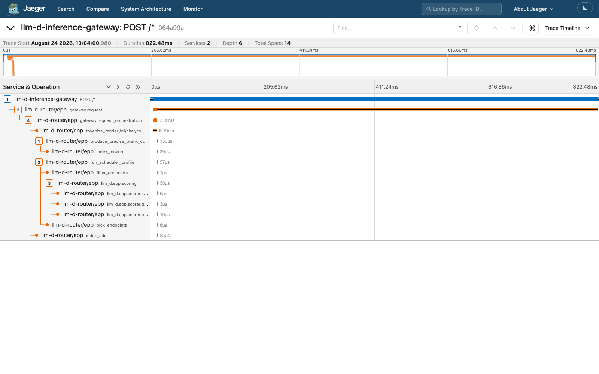
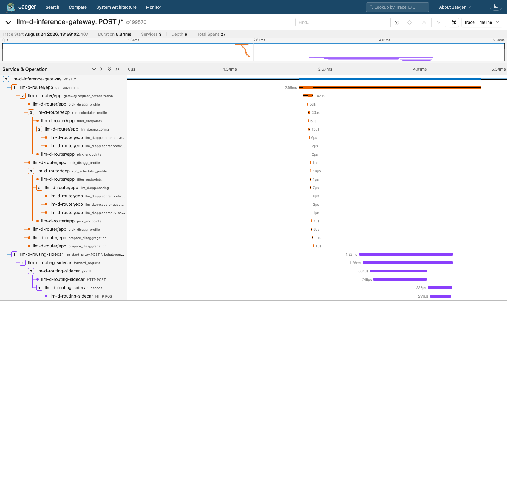
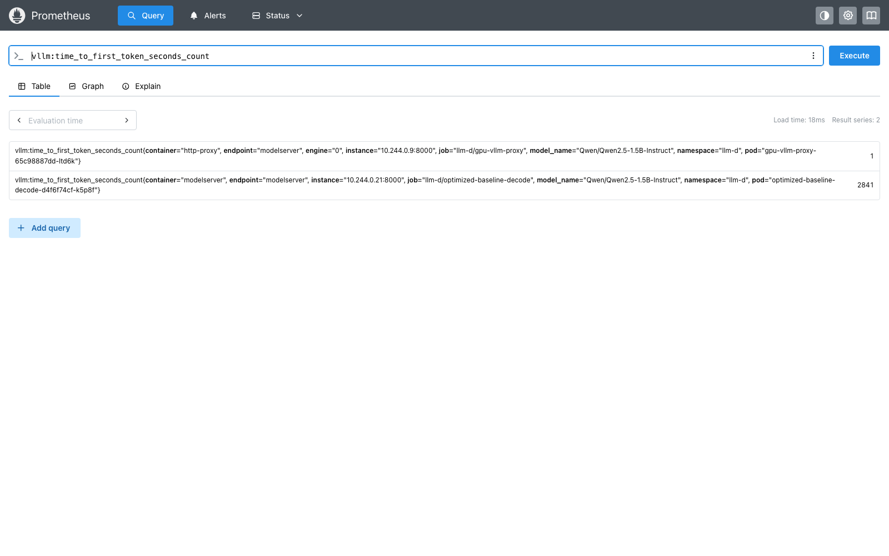
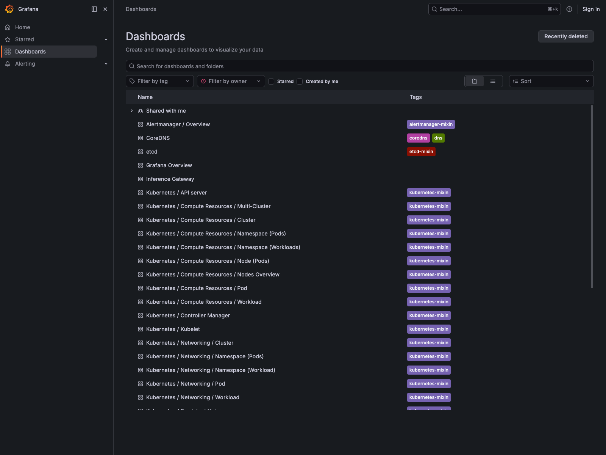
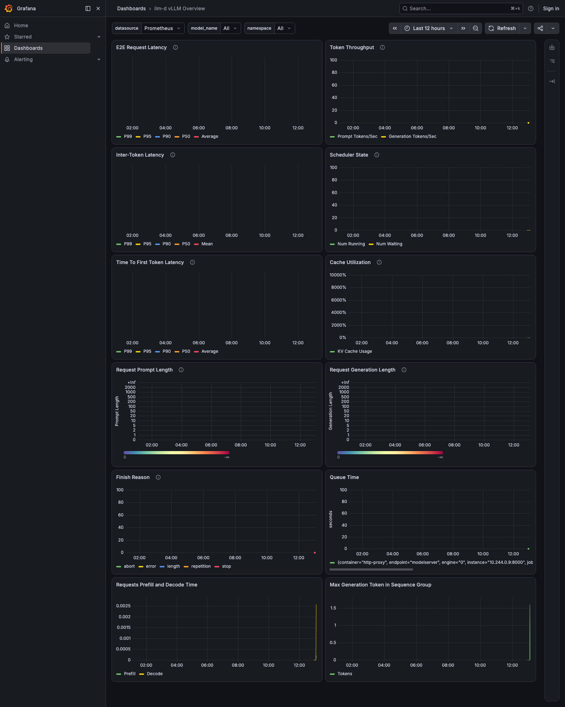
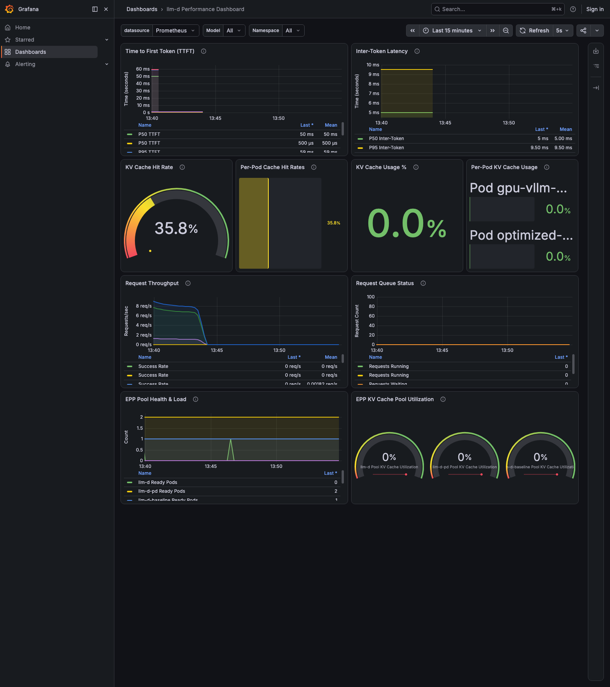

# llm-d on Kind — Real DGX Spark GPU Inference with Full Observability

*[中文文档](README-zh.md)*

This document records a **Kind + real-GPU** deployment of llm-d: a local Kind cluster
(Gateway API / agentgateway mode) running all of llm-d's routing and observability
components, bridged to **real vLLM inference on an NVIDIA DGX Spark GPU node**
(`192.168.1.112`) over the LAN. It extends [`../llm-d-full-demo`](../llm-d-full-demo)
(which used CPU vLLM / simulators because the build machine has no GPU) with:

- **Real GPU inference** in the precise-prefix (KV-cache-aware) routing path.
- The same closed observability loop: distributed tracing (Jaeger) and metrics
  (Prometheus/Grafana) across gateway → IPP → EPP → model server.
- P/D disaggregation (scheduling real, KV transfer simulated — one physical GPU).
- Workload Variant Autoscaler (WVA) driving an HPA from live Prometheus metrics.

Everything below is **real, captured output** from a live run on 2026-08-24, not
illustrative samples.

---

## 1. Why a proxy Pod, not a Service, bridges the GPU node in

Kind cannot join a remote physical host as a real Kubernetes node — Kind nodes are
Docker containers on the *same* Docker host. So the GPU has to live outside the
cluster, as an independent process on the DGX Spark, and something inside the
cluster has to represent it to llm-d's routing.

llm-d's `InferencePool` selects backends by **Pod label**
(`router.modelServers.matchLabels` becomes `InferencePool.spec.selector`), and the
EPP resolves that selector via the **Kubernetes Pod API** — it dials Pod IPs
directly, never through a Service VIP. A Service pointing at an external IP would
therefore be invisible to the InferencePool selector.

The fix: a real in-cluster Pod that IS the InferencePool backend, whose containers
transparently tunnel TCP to the DGX Spark:

```text
DGX Spark (192.168.1.112, GPU, plain docker, NOT part of the Kind cluster)
  vllm-gpu-0  nvcr.io/nvidia/vllm:26.05-py3
              vllm serve Qwen/Qwen2.5-1.5B-Instruct --port 8000
              --kv-events-config zmq :5556   (real GPU inference + real KV events)

Kind cluster "llm-d-gpu" (Mac, Docker Desktop)
  namespace agentgateway-system: agentgateway control plane
  namespace llm-d:
    llm-d-inference-gateway (agentgateway data plane)      <- trace ROOT
    payload-processor (IPP)                                 ext_proc PreRouting
    llm-d-epp           (precise-prefix EPP, InferencePool "llm-d")
       gpu-vllm-proxy   <-- socat bridge Pod, IS the InferencePool "llm-d" backend
                            Pod:8000 -> DGX:8000 (HTTP)
                            Pod:5556 -> DGX:5556 (ZMQ KV-cache events)
    llm-d-pd-epp         (P/D EPP, InferencePool "llm-d-pd")
       pd-prefill / pd-decode (llm-d-inference-sim + routing-sidecar, KV transfer simulated)
    llm-d-baseline-epp   (optimized-baseline EPP, InferencePool "llm-d-baseline")
       optimized-baseline-decode (llm-d-inference-sim, HPA + WVA target)
    otel-collector + jaeger, kube-prometheus-stack (Prometheus/Grafana)
  wva-system: WVA controller + prometheus-adapter (external.metrics.k8s.io bridge)

  3 HTTPRoutes on 1 Gateway, header-selected:
    default "/"             -> InferencePool llm-d          (REAL GPU, precise-prefix)
    x-llm-d-pool: pd        -> InferencePool llm-d-pd        (sim, P/D)
    x-llm-d-pool: baseline  -> InferencePool llm-d-baseline  (sim, WVA-scaled)
```

`gpu-vllm-proxy` is a 2-container Pod using the public `alpine/socat` image (no
custom build): container `http-proxy` runs
`socat TCP-LISTEN:8000,fork,reuseaddr TCP:192.168.1.112:8000`, container `kv-proxy`
does the same for port 5556. Both HTTP and vLLM's ZMQ KV-event PUB stream (ZMTP is
plain framed TCP) tunnel through byte-transparently — Prometheus's `/metrics` scrape
and the EPP's OpenAI/ZMQ traffic all reach the real DGX process unmodified.

| Component | Namespace | Role |
| --- | --- | --- |
| `agentgateway` (control plane) | `agentgateway-system` | Gateway API + Inference Extension controller |
| `llm-d-inference-gateway` (data plane) | `llm-d` | The proxy; trace root span `POST /*` |
| `payload-processor` (IPP) | `llm-d` | `ext_proc` at `PreRouting`; rewrites body fields into routing headers |
| `llm-d-epp` | `llm-d` | Precise-prefix (KV-cache-aware) EPP for the **real-GPU** pool |
| `gpu-vllm-proxy` | `llm-d` | socat bridge Pod — the InferencePool `llm-d` backend, tunnels to the DGX Spark |
| `llm-d-pd-epp` / `pd-prefill` / `pd-decode` | `llm-d` | P/D-disaggregated pool (sim, KV transfer simulated) |
| `llm-d-baseline-epp` / `optimized-baseline-decode` | `llm-d` | WVA/HPA-scaled pool (sim) |
| `otel-collector` + `jaeger` | `llm-d` | Trace pipeline |
| `kube-prometheus-stack` (`llmd` release) | `llm-d-monitoring` | Prometheus + Grafana |
| `wva-controller-manager` + `prometheus-adapter` | `wva-system` | Autoscaling control loop |

Images used are pulled directly from published registries — **no local builds were
needed** for this run (the router/EPP/IPP/sim images are now multi-arch and
publicly pullable; only `llm-d-router-disagg-sidecar` required no build either, a
released tag was found). This is a simplification versus the CPU demo, which had to
build EPP/sidecar/IPP from `upstream/main` because those images weren't yet
released/multi-arch at the time.

> Last verified 2026-08-24 against `llm-d-router-gateway:v0` chart (digest
> `sha256:7cf1ad13…`), EPP image `ghcr.io/llm-d/llm-d-router-endpoint-picker:main`,
> IPP `v0.1.0`, routing-sidecar `ghcr.io/llm-d/llm-d-router-disagg-sidecar:v0.10.0`,
> inference-sim `:latest`, WVA controller `v0.9.0`, vLLM
> `nvcr.io/nvidia/vllm:26.05-py3` (vLLM 0.20.1 dev build for GB10/Blackwell).

---

## 2. The DGX Spark GPU node

Hardware: NVIDIA **GB10** (Grace-Blackwell "DGX Spark"), arm64 Grace CPU + Blackwell
GPU sharing one **130.667 GB unified memory pool**, CUDA 13.0, driver 580.126.09,
Docker 28.5.1 + nvidia-container-toolkit 1.18.2 (`--gpus all` works directly, no
explicit `--runtime=nvidia` needed on this box).

**No official `vllm/vllm-openai` image supports this arm64+Blackwell combination
yet.** The working image, confirmed by live testing, is NVIDIA's own DGX Spark
playbook image: **`nvcr.io/nvidia/vllm:26.05-py3`** (publicly pullable, no NGC
login), which bundles a vLLM `0.20.1+7124b12a.dev` build with GB10 support.

### GPU memory reality check — this is the load-bearing finding of this whole demo

The box is **shared**: the user's ComfyUI session was left running (by design — see
"Known limitations"). `nvidia-smi`'s aggregate memory query returns `Not Supported`
on GB10 (no fixed VRAM total to report — it's unified memory), and the number that
actually matters — `torch.cuda.mem_get_info()` free bytes — **swung wildly over the
course of this one session**, tracking ComfyUI's own activity (its process usage
was observed at both ~14 GiB and ~28 GiB minutes apart), with no way to predict it
in advance:

| Moment | Free VRAM (`mem_get_info`) | What happened |
| --- | --- | --- |
| Session start | ~5.3 GB | 1st replica (`--gpu-memory-utilization 0.04` ≈5.2GB) started fine, weights 2.89 GiB + KV cache 0.56 GiB |
| Right after | ~1.1 GB | No room for a 2nd replica at that instant |
| Mid-session retest | ~14.1 GB | **A 2nd real replica DID start successfully** (`REPLICA_1=true`) — both `vllm-gpu-0` and `vllm-gpu-1` reported `Application startup complete` |
| ~2 min later | (ComfyUI grew again) | `vllm-gpu-0` **crashed**: `RuntimeError: Engine core initialization failed` / `ValueError: No available memory for the cache blocks` |
| Later retest, 1 replica only | ~6.6 GB | Even the **single** replica at the same 0.04 budget **failed the same way** |
| Final retest | — | Succeeded again at a lowered `--gpu-memory-utilization 0.03` (~3.9GB) |

Two conclusions, both load-bearing for how to operate this demo: (1) **2 real
replicas is achievable** when the shared box happens to have headroom — the CPU
demo's "KV-routing decision becomes visible with 2 replicas" scenario is not
fundamentally blocked, just **not reliably reproducible on demand** on this shared
box; and (2) **a successful deploy is not a permanent state** — VRAM can be
reclaimed out from under a running vLLM process by another workload on the same
box at any time, with a real crash (not a graceful degradation) as the result.
`gpu-node/deploy-vllm.sh`'s default `GPU_MEM_UTIL` was lowered from 0.04 to 0.03
after this was observed, and `REPLICA_1=true` remains available as an escape
hatch — treat both as probabilistic, not guaranteed, and always confirm with
`bash gpu-node/healthcheck.sh` rather than assuming a past success still holds.
Full incident log: `docs/TEST_PLAN.md` TC-GPU-05.

Deploy script: `gpu-node/deploy-vllm.sh` (idempotent `docker run` over SSH).
Verified live:

```console
$ bash gpu-node/deploy-vllm.sh
...
(EngineCore pid=258) INFO gpu_model_runner.py:4879 Model loading took 2.89 GiB memory and 60.297843 seconds
(EngineCore pid=258) INFO gpu_worker.py:440 Available KV cache memory: 0.56 GiB
(EngineCore pid=258) INFO kv_cache_utils.py:1708 GPU KV cache size: 20,992 tokens
(EngineCore pid=258) INFO kv_events.py:329 Starting ZMQ publisher thread
INFO:     Application startup complete.
==> Smoke test
{"object": "list", "data": [{"id": "Qwen/Qwen2.5-1.5B-Instruct", ...}]}
```

A real chat completion, from the DGX Spark itself:

```console
$ curl -sS -X POST http://localhost:8000/v1/chat/completions -d '{"model":"Qwen/Qwen2.5-1.5B-Instruct","messages":[{"role":"user","content":"Say hello in 5 words"}],"max_tokens":20}'
{"choices":[{"message":{"content":"Hello! How can I assist you today?"}}], "usage":{"prompt_tokens":35,"completion_tokens":10}}
```

`nvidia-smi` confirms a real `VLLM::EngineCore` GPU process (4809 MiB) alongside
ComfyUI's two processes. Reachability from the Mac (and therefore from Kind pods,
since Docker Desktop routes outbound to the LAN) is confirmed with
`gpu-node/healthcheck.sh`.

---

## 3. Installation steps

Shared variables:

```console
export LLMD_REPO=$HOME/go/src/github.com/llm-d/llm-d
export ROUTER_REPO=$HOME/go/src/github.com/llm-d/llm-d-router
export IPP_REPO=$HOME/go/src/github.com/llm-d/llm-d-inference-payload-processor
export DEMO=$HOME/go/src/github.com/gyliu513/langX101/llm-d/llm-d-gpu-demo
```

### 3.1 Deploy vLLM on the DGX Spark

```console
cp $DEMO/.env.example $DEMO/.env   # DGX_HOST=192.168.1.112, DGX_USER=lgy, DGX_MODEL=Qwen/Qwen2.5-1.5B-Instruct
bash $DEMO/gpu-node/deploy-vllm.sh
bash $DEMO/gpu-node/healthcheck.sh
```

### 3.2 Create the Kind cluster

```console
kind create cluster --config $DEMO/kind/kind-config.yaml
kubectl apply -f $DEMO/manifests/00-namespace.yaml
```

No HF-cache hostPath mount is needed here (unlike the CPU demo) — the real model
weights live on the DGX Spark, not inside Kind.

### 3.3 Gateway API + GAIE + llm-d.ai CRDs

```console
kubectl apply -f https://github.com/kubernetes-sigs/gateway-api/releases/download/v1.5.1/standard-install.yaml
kubectl apply -f https://github.com/kubernetes-sigs/gateway-api-inference-extension/releases/download/v1.5.0/v1-manifests.yaml
kubectl apply -k $ROUTER_REPO/config/crd
```

### 3.4 agentgateway control plane + Gateway

```console
helm upgrade --install agentgateway-crds oci://cr.agentgateway.dev/charts/agentgateway-crds \
  --namespace agentgateway-system --create-namespace --version v1.1.0
helm upgrade --install agentgateway oci://cr.agentgateway.dev/charts/agentgateway \
  --namespace agentgateway-system --create-namespace --version v1.1.0 \
  --set inferenceExtension.enabled=true
kubectl apply -k "https://github.com/llm-d/llm-d/guides/recipes/gateway/agentgateway?ref=main" -n llm-d
```

### 3.5 OTel Collector + Jaeger

```console
bash $LLMD_REPO/guides/recipes/observability/install-otel-collector-jaeger.sh -n llm-d
```

### 3.6 The GPU bridge Pod (before the EPP release — it needs a backend to select)

```console
bash $LLMD_REPO/guides/recipes/observability/install-prometheus-grafana.sh --crds-only
kubectl apply -f $DEMO/manifests/optional/gpu-proxy/gpu-vllm-proxy.yaml
```

Verified live — a Pod inside Kind reaching real GPU inference through the tunnel:

```console
$ kubectl run trig2 --rm -i --restart=Never --image=curlimages/curl:8.7.1 -n llm-d -- \
  curl -sS -X POST http://10.244.0.9:8000/v1/chat/completions -d '{"model":"Qwen/Qwen2.5-1.5B-Instruct",...}'
{"id":"chatcmpl-96cf154a307c70a5", "choices":[{"message":{"content":"Hello! How can I assist you today?"}}]}
```

### 3.7 Precise-prefix router release (real GPU)

```console
kubectl create secret generic llm-d-hf-token -n llm-d --from-literal=HF_TOKEN="" --dry-run=client -o yaml | kubectl apply -f -
helm install llm-d oci://ghcr.io/llm-d/charts/llm-d-router-gateway --version v0 \
  -f $DEMO/manifests/optional/precise-prefix/precise-prefix-router.values.yaml \
  -f $DEMO/helm-values/tracing.values.yaml \
  -f $DEMO/helm-values/gw-kind.values.yaml \
  --set provider.name=none --set httpRoute.create=true \
  --set httpRoute.inferenceGatewayName=llm-d-inference-gateway \
  -n llm-d
```

> Chart/image names changed since the CPU demo was built three weeks earlier: the
> `-dev` suffix was dropped from both the OCI chart (`llm-d-router-gateway-dev` →
> `llm-d-router-gateway`) and the EPP image repo
> (`llm-d-router-endpoint-picker-dev` → `llm-d-router-endpoint-picker`). See
> "Upstream drift found in this run" below for the full list.

Verified live — EPP `2/2 Running`, ZMQ subscriber connected through the proxy Pod:

```console
$ kubectl logs -n llm-d deploy/llm-d-epp -c epp | grep zmq
{"logger":"zmq-subscriber","msg":"Connected subscriber socket","endpoint":"tcp://10.244.0.9:5556"}
```

### 3.8 IPP

```console
helm install ipp $IPP_REPO/config/charts/payload-processor -n llm-d \
  -f $DEMO/helm-values/ipp.values.yaml --set provider.name=none
kubectl apply -f - <<'EOF'
apiVersion: agentgateway.dev/v1alpha1
kind: AgentgatewayPolicy
metadata: {name: ipp-extproc, namespace: llm-d}
spec:
  targetRefs: [{group: gateway.networking.k8s.io, kind: Gateway, name: llm-d-inference-gateway}]
  traffic: {phase: PreRouting, extProc: {backendRef: {kind: Service, name: payload-processor, port: 9004}}}
EOF
```

### 3.9 Gateway tracing export

```console
kubectl apply -f - <<'EOF'
apiVersion: agentgateway.dev/v1alpha1
kind: AgentgatewayPolicy
metadata: {name: gateway-tracing, namespace: llm-d}
spec:
  targetRefs: [{group: gateway.networking.k8s.io, kind: Gateway, name: llm-d-inference-gateway}]
  frontend: {tracing: {backendRef: {kind: Service, name: otel-collector, port: 4317}, protocol: GRPC, randomSampling: "true"}}
EOF
```

### 3.10 P/D-disaggregated pool

```console
helm install llm-d-pd oci://ghcr.io/llm-d/charts/llm-d-router-gateway --version v0 \
  -f $DEMO/manifests/optional/pd/pd-router.values.yaml \
  -f $DEMO/helm-values/tracing.values.yaml \
  -f $DEMO/helm-values/gw-kind-pd.values.yaml \
  --set provider.name=none --set httpRoute.create=true \
  --set httpRoute.inferenceGatewayName=llm-d-inference-gateway \
  --set httpRoute.headerMatches.x-llm-d-pool=pd \
  -n llm-d
kubectl apply -f $DEMO/manifests/optional/pd/model-servers-pd.yaml
```

> The chart's `httpRoute.headerMatches` map (new since the CPU demo) creates the
> header-matched route directly — no hand-written `HTTPRoute` YAML needed anymore.

### 3.11 Baseline pool + HPA (WVA target)

```console
kubectl apply -f $DEMO/manifests/optional/baseline/model-servers-baseline.yaml
helm install llm-d-baseline oci://ghcr.io/llm-d/charts/llm-d-router-gateway --version v0 \
  -f $DEMO/helm-values/tracing.values.yaml \
  -f $DEMO/helm-values/gw-kind-baseline.values.yaml \
  --set provider.name=none --set httpRoute.create=true \
  --set httpRoute.inferenceGatewayName=llm-d-inference-gateway \
  --set httpRoute.headerMatches.x-llm-d-pool=baseline \
  -n llm-d
kubectl apply -f $DEMO/manifests/06-hpa.yaml
kubectl apply -f $DEMO/manifests/optional/baseline/podmonitor-baseline.yaml
```

> Without this last PodMonitor, Prometheus (and therefore WVA) has no
> visibility into `optimized-baseline-decode`'s own metrics — discovered live
> in TC-WVA-06, where WVA logged `"No saturation metrics available for
> model"` until this was added. If it doesn't show up in Prometheus targets
> within ~30s, force a resync (same PodMonitor-creation race as the CPU
> demo's `podMonitor/llm-d/decode`):
> `kubectl annotate podmonitor -n llm-d optimized-baseline-decode resync="$(date +%s)" --overwrite`.

### 3.12 Prometheus + Grafana

```console
bash $LLMD_REPO/guides/recipes/observability/install-prometheus-grafana.sh
```

### 3.13 Workload Variant Autoscaler

The WVA controller install flow **changed significantly** since the CPU demo (see
"Upstream drift" below) — `deploy/install.sh`'s default `SCALER_BACKEND=keda` and
its bundled Gateway API CRD reinstall (`v1.2.0`) conflict with an existing v1.5.1
install, so this run used the **Kustomize direct-controller path** instead:

```console
# temp worktree at upstream/main so the user's own branch checkout is untouched
git -C $HOME/go/src/github.com/llm-d/llm-d-workload-variant-autoscaler fetch upstream
git -C $HOME/go/src/github.com/llm-d/llm-d-workload-variant-autoscaler worktree add --detach /tmp/wva-main upstream/main
kubectl apply -k /tmp/wva-main/config/overlays/cluster-scoped/kubernetes   # image pinned to v0.9.0 in kustomization.yaml

# Point the controller at our plain-HTTP kube-prometheus-stack (patch the ConfigMap):
#   PROMETHEUS_BASE_URL: "http://llmd-kube-prometheus-stack-prometheus.llm-d-monitoring.svc.cluster.local:9090"
#   PROMETHEUS_ALLOW_HTTP: "true"
#   (drop PROMETHEUS_TLS_INSECURE_SKIP_VERIFY -- rejected when combined with ALLOW_HTTP)
kubectl set env deploy/wva-controller-manager -n wva-system PROMETHEUS_TOKEN_PATH-   # drop bearer-token auth over plain HTTP

# external.metrics.k8s.io bridge so the HPA can read wva_desired_replicas:
helm upgrade --install prometheus-adapter prometheus-community/prometheus-adapter -n wva-system \
  -f <(git -C $LLMD_REPO show upstream/main:guides/workload-autoscaling/components/prometheus-adapter/wva-adapter-values.yaml) \
  --set prometheus.url=http://llmd-kube-prometheus-stack-prometheus.llm-d-monitoring.svc.cluster.local \
  --set prometheus.port=9090
```

Verified live end-to-end (WVA emits the metric, prometheus-adapter serves it,
HPA consumes it):

```console
$ kubectl logs -n wva-system deploy/wva-controller-manager | tail -3
"msg":"Optimization completed successfully","mode":"saturation","modelsProcessed":1,"decisionsApplied":0
"msg":"EmitReplicaMetrics completed","variantName":"optimized-baseline-decode-hpa","currentReplicas":1,"desiredReplicas":1

$ curl -s http://localhost:9091/api/v1/query --data-urlencode 'query=wva_desired_replicas'
{"metric":{"variant_name":"optimized-baseline-decode-hpa","exported_namespace":"llm-d"}, "value":[..., "1"]}

$ kubectl get --raw /apis/external.metrics.k8s.io/v1beta1/namespaces/llm-d/wva_desired_replicas
{"items":[{"metricName":"wva_desired_replicas", ..., "value":"1"}]}

$ kubectl get hpa -n llm-d optimized-baseline-decode-hpa
NAME                             REFERENCE                              TARGETS     MINPODS  MAXPODS  REPLICAS
optimized-baseline-decode-hpa   Deployment/optimized-baseline-decode   1/1 (avg)   1        4        1
```

`AcceleratorNotResolved` warnings are expected and non-fatal — the baseline pool
runs `llm-d-inference-sim` (no GPU nodeSelector), same as the CPU demo.

---

## 4. Final state (this run)

```console
$ kubectl get pods -A   # kube-system, local-path-storage omitted
NAMESPACE             NAME                                      READY   STATUS
agentgateway-system   agentgateway-...                          1/1     Running
llm-d                 gpu-vllm-proxy-...                        2/2     Running
llm-d                 jaeger-...                                1/1     Running
llm-d                 llm-d-baseline-epp-...                    1/1     Running
llm-d                 llm-d-epp-...                              2/2     Running
llm-d                 llm-d-inference-gateway-...                1/1     Running
llm-d                 llm-d-pd-epp-...                          1/1     Running
llm-d                 optimized-baseline-decode-...              1/1     Running
llm-d                 otel-collector-...                        1/1     Running
llm-d                 payload-processor-...                     1/1     Running
llm-d                 pd-decode-...                              2/2     Running
llm-d                 pd-prefill-...                             1/1     Running
llm-d-monitoring      alertmanager-... / grafana / operator / kube-state-metrics / node-exporter / prometheus   all Running
wva-system            prometheus-adapter-...                    1/1     Running
wva-system            wva-controller-manager-...                1/1     Running

$ kubectl get inferencepool,httproute -n llm-d
inferencepool.../llm-d          inferencepool.../llm-d-baseline   inferencepool.../llm-d-pd
httproute.../llm-d              httproute.../llm-d-baseline       httproute.../llm-d-pd

$ kubectl describe node llm-d-gpu-control-plane | grep -A4 Allocated
Allocated resources:
  cpu     4035m (28%)   14950m (106%)
  memory  9178Mi (39%)  19782Mi (85%)
```

Everything fits on one Kind node (14 CPU / ~23 Gi Docker Desktop budget) *because*
the real inference work happens off-cluster on the DGX Spark — the in-cluster
footprint is just routing/observability plus two small `inference-sim` pools.

---

## 5. Test steps

See **[`docs/TEST_PLAN.md`](docs/TEST_PLAN.md)** for the full, detailed test-case
suite (TC-GPU-\*, TC-BRIDGE-\*, TC-ROUTE-\*, TC-TRACE-\*, TC-KV-\*, TC-PD-\*,
TC-WVA-\*, TC-METRICS-\*, TC-NEG-\*). Summary of what's verified live in this run:

| Item | Evidence | Result |
| --- | --- | --- |
| Real GPU inference | `nvidia-smi` shows `VLLM::EngineCore` process; real chat completion | ✅ |
| Proxy-Pod bridge (HTTP) | In-cluster curl through Pod IP reaches DGX, byte-identical response | ✅ |
| Proxy-Pod bridge (ZMQ) | EPP log `Connected subscriber socket endpoint=tcp://<proxy-pod-ip>:5556` | ✅ |
| 3-way HTTPRoute precedence | default / `x-llm-d-pool: pd` / `x-llm-d-pool: baseline` all return 200 to their respective pools | ✅ |
| Gateway → EPP trace stitching | `gateway.request` span has parent `llm-d-inference-gateway` (not orphan root) | ✅ |
| IPP → EPP trace stitching | **Not reproduced** this run — IPP emits its own disconnected root trace despite functioning correctly (header injection confirmed in logs). See "Upstream drift" | ⚠️ regression vs. CPU demo |
| Precise-prefix scheduler spans | `produce_precise_prefix_cache`, `run_scheduler_profile`, `llm_d.epp.scorer.*` (×3), `pick_endpoints`, `index_lookup`/`index_add` — 14 spans, 2 services on a real-GPU request | ✅ |
| Real KV-cache **hit** | **Not reproduced** — vLLM 0.20.1's KV-event payload `cache_kind` field isn't recognized by this router build; events transport correctly (`messages_received_total=1`) but are skipped (`stores_skipped_total{reason=unsupported_cache_kind}=1`). See "Upstream drift" | ⚠️ version-skew finding |
| P/D disaggregated trace | 27 spans / 3 services: `pick_disagg_profile` ×3, `prepare_disaggregation` ×2, sidecar `prefill`/`decode`/`forward_request` | ✅ |
| Metrics closed loop | Prometheus targets UP for 3 EPP ServiceMonitors + GPU-proxy PodMonitor; `vllm:time_to_first_token_seconds_count` = 6 (real GPU histogram) | ✅ |
| Grafana dashboards | 7 llm-d dashboards loaded; vLLM Overview panel shows live data points | ✅ |
| WVA autoscaling loop (metric → external API → HPA target) | `wva_desired_replicas` → external metrics API → HPA `1/1 (avg)` | ✅ |
| WVA actual scale-up under synthetic load | Found + fixed a missing PodMonitor for the baseline pool along the way; even after the fix, `llm-d-inference-sim` never showed measurable queue depth under the load driven (TC-WVA-06) | ⚠️ not reproduced |
| 2nd real GPU replica | Achieved once (`REPLICA_1=true`) when the shared box had headroom, then one replica crashed under renewed contention minutes later — see §2 | ⚠️ possible, not reliable |

---

## 6. Observability screenshots

All screenshots below are from this live run (`docs/screenshots/`), not mockups.

**Default route — real GPU precise-prefix trace** (14 spans / 2 services): the
full scheduler subtree — `tokenize_render`, `produce_precise_prefix_cache`,
`run_scheduler_profile` fanning out into 3 `llm_d.epp.scorer.*` children, then
`pick_endpoints` — on a request actually served by the DGX Spark GPU.



**P/D-disaggregated route trace** (27 spans / 3 services): `pick_disagg_profile`
×3 (prefill profile, decode profile, and the combining pass), two full
`run_scheduler_profile` subtrees, `prepare_disaggregation` ×2, and the
`llm-d-routing-sidecar` service's real two-leg proxy (`forward_request` →
`prefill` → `decode` → `HTTP POST` ×2).



**Prometheus targets** — all 3 EPP `ServiceMonitor`s and the `gpu-vllm-proxy`
`PodMonitor` UP; the only DOWN targets are the Kind control-plane components
that don't exist on this cluster (etcd/kube-proxy/scheduler/controller-manager),
which is expected.


**Prometheus query — real GPU TTFT histogram**, scraped through the
`gpu-vllm-proxy` tunnel (`vllm:time_to_first_token_seconds_count`):



**Grafana — the 7 llm-d dashboards loaded** by the installer:



**Grafana — llm-d vLLM Overview**, live data points visible in Token
Throughput, TTFT, Queue Time, Prefill/Decode Time, and Max Generation Token
panels:



**Grafana — llm-d Performance Dashboard** (E2E latency, KV-cache hit rate,
request throughput):



---

## 7. Upstream drift found in this run (2026-08-24, vs. the CPU demo's 2026-08-03 baseline)

The llm-d project moves fast; three weeks produced real breaking changes:

1. **Chart/image renames.** `llm-d-router-gateway-dev` → **`llm-d-router-gateway`**
   (dropped `-dev`); `llm-d-router-endpoint-picker-dev` → **`llm-d-router-endpoint-picker`**.
2. **`guides/recipes/router/` was deleted from `llm-d`.** The `base.values.yaml` /
   `features/monitoring.values.yaml` layering pattern is gone; monitoring is now a
   plain values flag (`router.monitoring.prometheus.enabled: true`,
   `.auth.enabled: false` for unauthenticated scraping).
3. **`httpRoute.headerMatches`** is now a first-class chart value — no more
   hand-written `HTTPRoute` YAML for header-routed pools.
4. **`llm-d-routing-sidecar` renamed to `llm-d-router-disagg-sidecar`**, with a
   real pinned release (`v0.10.0`) replacing the old floating `:main` build-from-source
   requirement. CLI flags unchanged (`--kv-connector`, `--model-server-port`,
   `--secure-proxy=false`, `--tracing`).
5. **WVA flip-flopped back to CRD-capable + now defaults to KEDA.** The prior CPU
   demo's finding ("`VariantAutoscaling` CRD is deprecated, use HPA annotations")
   is itself now partially superseded: `VariantAutoscaling` is documented again for
   multi-variant scenarios, while the simple HPA-annotation path (what this demo
   uses) still works unchanged. `deploy/install.sh`'s new default
   `SCALER_BACKEND=keda` plus a bundled Gateway API CRD downgrade attempt broke
   against our existing v1.5.1 CRDs — worked around with the Kustomize
   direct-controller install instead (§3.13).
6. **IPP does not stitch into the gateway→EPP trace on this agentgateway version**,
   despite functioning correctly (confirmed via IPP pod logs: request/response body
   processing and `X-Gateway-Model-Name` header injection all happen). It appears
   as its own disconnected Jaeger service/trace rather than the middle hop the CPU
   demo showed on 2026-08-03. Root cause not isolated (agentgateway ext_proc phase
   ordering vs. the native `InferencePool` ext_proc wiring is the leading
   hypothesis) — flagged here rather than silently "fixed" by tweaking until the
   old shape reappeared.
7. **KV-cache event schema version skew.** `nvcr.io/nvidia/vllm:26.05-py3`'s vLLM
   (`0.20.1+7124b12a.dev`) publishes KV-cache-event messages whose `cache_kind`
   field this router build's decoder does not recognize
   (`llm_d_epp_kv_cache_events_stores_skipped_total{reason="unsupported_cache_kind"}`).
   The transport (ZMQ tunnel through the proxy Pod) is proven working — one message
   was received and is present in the log/metric trail — the block is just never
   admitted to the prefix index, so `produce_precise_prefix_cache` always reports
   `max_match_blocks=0`. This looks like a genuine version mismatch between a very
   recent vLLM nightly and the router's event parser, worth reporting upstream
   rather than a bug in this demo's design.

---

## Known limitations (by design, not bugs)

- **Steady-state runs 1 real GPU replica; a 2nd is possible but not reliable.**
  See §2 — the DGX Spark's unified memory is shared with the user's ComfyUI
  session, whose usage fluctuates independently. A 2nd replica (`REPLICA_1=true`)
  did start successfully once, then one of the two crashed under renewed memory
  pressure minutes later. The demo ships with 1 replica as the dependable
  default; the CPU demo's "KV-routing decision becomes visible with 2 replicas"
  scenario is achievable opportunistically on this hardware, not guaranteed.
- **A successful vLLM deploy can be evicted later by unrelated GPU load on the
  same box.** Not just a startup-time risk — a running replica was observed to
  crash mid-session (`Engine core initialization failed`) once another process's
  memory usage grew. Always re-verify with `healthcheck.sh` rather than trusting
  an earlier success.
- **P/D KV transfer stays simulated.** True NIXL prefill/decode disaggregation
  needs ≥2 physical GPUs; this DGX Spark has 1. Scheduling, header handling, and
  the routing-sidecar's two-leg proxying are all real.
- **WVA/baseline pool runs on `llm-d-inference-sim`, not real GPU.** WVA is
  validated as a control-loop mechanism (Prometheus → external-metrics API → HPA),
  independent of which backend serves traffic — the same scope the CPU demo used.
- **Real KV-cache-hit routing is not demonstrated live** in this run — see
  "Upstream drift" item 7. The scheduler/scorer machinery around it (§6,
  `llm_d.epp.scorer.*` spans, `pick_endpoints`) is fully exercised and correct;
  only the specific hit/miss outcome differs from the CPU demo's result.
