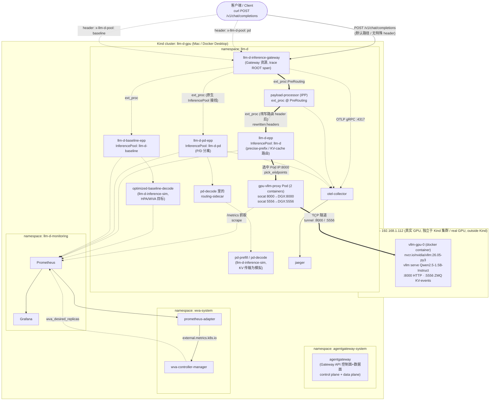

# llm-d on Kind — Real DGX Spark GPU Inference with Full Observability

*[中文文档](README-zh.md)*

## TL;DR

This repo folder walks you — assuming **zero prior context** — through standing up
a full [llm-d](https://github.com/llm-d/llm-d) inference stack on a local
[Kind](https://kind.sigs.k8s.io/) Kubernetes cluster, with **real GPU inference**
running on a separate machine (an NVIDIA DGX Spark) and a **complete
observability loop** (distributed tracing + metrics dashboards) wired across
every hop. Every command below is the *actual* command you type — this guide
deliberately avoids hiding steps behind wrapper scripts so you can see and
understand exactly what each command does before you run it. Follow it in
order and you will end up with a working system you can send real requests to
and watch traces/metrics for in Jaeger and Grafana.

Everything in this document — commands, output, screenshots — is **real,
captured output** from a live run on 2026-08-24, not illustrative samples.

It extends [`../llm-d-full-demo`](../llm-d-full-demo) (which used CPU vLLM /
simulators because that build machine has no GPU) with:

- **Real GPU inference** in the precise-prefix (KV-cache-aware) routing path.
- The same closed observability loop: distributed tracing (Jaeger) and metrics
  (Prometheus/Grafana) across gateway → IPP → EPP → model server.
- P/D disaggregation (scheduling real, KV transfer simulated — one physical GPU).
- Workload Variant Autoscaler (WVA) driving an HPA from live Prometheus metrics.

### 参考资料 / References — this document is grounded in llm-d's own docs

Every architectural claim and terminology choice below follows the official
[llm-d](https://github.com/llm-d) documentation, not an invented description.
Read these first (or alongside this doc) for the authoritative version:

- [`llm-d/llm-d` — `docs/architecture/README.md`](https://github.com/llm-d/llm-d/blob/main/docs/architecture/README.md) — top-level architecture (Router / InferencePool / Model Server)
- [`docs/architecture/core/router/README.md`](https://github.com/llm-d/llm-d/blob/main/docs/architecture/core/router/README.md) — llm-d Router = Proxy + EPP; "Inference Gateway" terminology
- [`docs/architecture/core/inferencepool.md`](https://github.com/llm-d/llm-d/blob/main/docs/architecture/core/inferencepool.md) — how `InferencePool` bridges Gateway ↔ EPP ↔ model-server Pods
- [`docs/architecture/advanced/kv-management/prefix-cache-aware-routing.md`](https://github.com/llm-d/llm-d/blob/main/docs/architecture/advanced/kv-management/prefix-cache-aware-routing.md) — the "precise" KV-cache-aware routing this demo exercises
- [`docs/architecture/advanced/disaggregation/README.md`](https://github.com/llm-d/llm-d/blob/main/docs/architecture/advanced/disaggregation/README.md) — P/D disaggregation request flow (sequence diagram)
- [`docs/architecture/advanced/autoscaling/README.md`](https://github.com/llm-d/llm-d/blob/main/docs/architecture/advanced/autoscaling/README.md) and [`hpa-wva.md`](https://github.com/llm-d/llm-d/blob/main/docs/architecture/advanced/autoscaling/hpa-wva.md) — WVA design
- [`docs/infrastructure/gateway/agentgateway.md`](https://github.com/llm-d/llm-d/blob/main/docs/infrastructure/gateway/agentgateway.md) — the official agentgateway install guide steps 3–13 follow
- [`guides/workload-autoscaling/README.wva.md`](https://github.com/llm-d/llm-d/blob/main/guides/workload-autoscaling/README.wva.md) and [`llm-d-workload-variant-autoscaler/deploy/README.md`](https://github.com/llm-d/llm-d-workload-variant-autoscaler/blob/main/deploy/README.md) — WVA deployment methods
- [Gateway API Inference Extension (GAIE) conformance](https://gateway-api-inference-extension.sigs.k8s.io/concepts/conformance/) — the upstream Kubernetes SIG spec `InferencePool`/EPP implement

Where this demo's setup deviates from those docs — because a GPU node sits
outside the cluster, or because upstream changed since a component's docs
were last written — that deviation is called out explicitly inline, with the
reasoning, rather than silently presented as "the" way to do it.

---

## 1. Architecture

### 1.1 llm-d 官方架构回顾,以及为什么这里要用一个 proxy Pod 而不是 Service

按官方架构文档([`docs/architecture/README.md`](https://github.com/llm-d/llm-d/blob/main/docs/architecture/README.md)、
[`docs/architecture/core/router/README.md`](https://github.com/llm-d/llm-d/blob/main/docs/architecture/core/router/README.md)),
llm-d 的核心是三个概念:**llm-d Router**(= **Proxy** + **Endpoint Picker,
EPP** 两部分组成;跑在 Gateway 模式下时,官方文档把它称作 **"Inference
Gateway"**)、**`InferencePool`**(把一组跑同一个模型的 model-server Pod 用
label selector 圈起来,官方文档把它比作"为 LLM 优化过的 Service")、以及
**Model Server**(真正执行推理的引擎,比如 vLLM/SGLang)。请求先到 Proxy,
Proxy 通过 `ext-proc` 协议"挂起"请求、去问 EPP;EPP 结合 `InferencePool` 里的
实时状态(KV-cache 命中情况、负载等)选出最优的目标 Pod,告诉 Proxy 转发过去。

关键在 [`docs/architecture/core/inferencepool.md`](https://github.com/llm-d/llm-d/blob/main/docs/architecture/core/inferencepool.md)
里写得很清楚:`InferencePool` 的端点发现是"**Selector-based Discovery**"——
EPP 直接 watch 匹配 `InferencePool.spec.selector` 这些 label 的 Pod,通过
**Kubernetes Pod API** 拿到它们的 Pod IP,并不经过 Service 的 ClusterIP。这在
llm-d 的语境下是完全合理的设计(比标准 Service 负载均衡更精细、能带 KV-cache
感知),但它带来一个推论:一个指向"集群外部 IP"的普通 Kubernetes `Service`
(比如 `ExternalName` Service,或者手工维护 `Endpoints` 的无头 Service),对
`InferencePool` 的 selector 来说是**完全不可见**的 —— EPP 压根不会去找它。

Kind 又没法把一台远程物理主机当成真正的 Kubernetes 节点加入集群(Kind 节点本
质上是"跑 kind create cluster 的那台 Docker 主机"上的容器),所以 GPU 只能作为
一个独立进程留在集群外(这次是 DGX Spark 上),集群内部就必须有一个**真实的
Pod**——带着对的 label、有真实的集群内 Pod IP——来代表它,`InferencePool`
才能发现到它。

The fix used in this demo: create a **real Pod inside the cluster** that *is*
the InferencePool's backend (so it has the right labels and a real cluster Pod
IP), whose containers do nothing but transparently forward TCP bytes to the
DGX Spark over the LAN. We use the tiny `alpine/socat` image for this — no
custom image build needed, `socat` is a generic bidirectional TCP relay.

### 1.2 Full component diagram



### 1.3 每个组件在做什么 / What each component does

| 组件 Component | 命名空间 Namespace | 作用 Role |
| --- | --- | --- |
| `agentgateway` | `agentgateway-system` | Gateway API 控制器 + Inference Extension 支持;负责给 `Gateway` 资源生成实际的数据面代理,并把 ext_proc 请求路由给 IPP/EPP |
| `llm-d-inference-gateway` | `llm-d` | 上面那个数据面代理的具体实例(一个 `Gateway` 资源);是每条请求 trace 的根 span `POST /*` |
| `payload-processor` (IPP) | `llm-d` | 在 `PreRouting` 阶段挂的一个 `ext_proc` gRPC 服务器;把请求体里的字段(比如 `model`)改写进 HTTP header(比如 `X-Gateway-Model-Name`),供后面的路由使用 |
| `gpu-vllm-proxy` | `llm-d` | 本 demo 特有的桥接 Pod;它的 2 个容器分别用 `socat` 把 8000(HTTP)和 5556(ZMQ KV 事件)端口透明转发到 DGX Spark |
| `llm-d-epp` | `llm-d` | precise-prefix(KV-cache 感知)调度插件链的 EPP,负责真实 GPU 池(`InferencePool: llm-d`)的端点选择 |
| `llm-d-pd-epp` / `pd-prefill` / `pd-decode` | `llm-d` | P/D(prefill/decode)分离池;EPP 跑不同的插件链(`disagg-profile-handler` 等),后端是 `llm-d-inference-sim`,KV 传输被模拟(单 GPU 环境做不了真的 NIXL 迁移) |
| `llm-d-baseline-epp` / `optimized-baseline-decode` | `llm-d` | 简单 baseline 池,用来做 WVA 自动扩缩容的演示目标 |
| `otel-collector` + `jaeger` | `llm-d` | 追踪链路:各组件把 span 通过 OTLP gRPC(`:4317`)发给 collector,collector 转发给 Jaeger 存储/展示 |
| `kube-prometheus-stack`(release 名 `llmd`) | `llm-d-monitoring` | Prometheus(抓取所有 ServiceMonitor/PodMonitor)+ Grafana(可视化面板) |
| `wva-controller-manager` + `prometheus-adapter` | `wva-system` | WVA 读 Prometheus 里的 vLLM/EPP 指标,算出期望副本数,写成指标 `wva_desired_replicas`;`prometheus-adapter` 把这个指标通过 Kubernetes 的 `external.metrics.k8s.io` API 暴露出来,给 HPA 消费 |

### 1.4 一次请求的完整路径 / One request's full journey (default route)

1. 客户端向 `llm-d-inference-gateway` 的 Service ClusterIP 发 `POST /v1/chat/completions`。
   Client sends `POST /v1/chat/completions` to the Gateway's ClusterIP.
2. agentgateway 收到请求,开一个新的 trace,根 span 叫 `POST /*`,然后按配置好的
   `AgentgatewayPolicy` 顺序调用 `ext_proc`:先是 IPP(阶段 `PreRouting`)。
   agentgateway starts a new trace (root span `POST /*`) and calls the
   configured `ext_proc` chain — IPP first, at the `PreRouting` phase.
3. IPP 把请求体里的 `model` 字段解析出来,写成 `X-Gateway-Model-Name` 这个 header,
   再把请求(带着新 header,以及它继承并转发的 W3C trace 上下文)还给 gateway。
   IPP extracts `model` from the JSON body and writes it as the
   `X-Gateway-Model-Name` header, then hands the (now-modified) request back.
4. gateway 通过 InferencePool 内置的 ext_proc 接线,把请求转给 `llm-d-epp`。EPP
   跑 precise-prefix 插件链:token-producer 先去问 EPP 自己 pod 里的
   `vllm-render` sidecar 要 token 化结果,再用 `precise-prefix-cache-producer`
   查它自己维护的 KV-block 索引,`prefix-cache-scorer`/`kv-cache-utilization-scorer`/
   `queue-scorer` 给每个候选 Pod 打分,`pick_endpoints` 选出分数最高的那个 —— 在
   这个 demo 里,候选 Pod 就只有 `gpu-vllm-proxy` 这一个。
5. EPP 把请求代理到 `gpu-vllm-proxy` 的 Pod IP:8000。EPP proxies to the chosen
   Pod IP.
6. `gpu-vllm-proxy` 里的 `http-proxy` 容器(`socat`)把这个 TCP 连接原样转发到
   `192.168.1.112:8000`,也就是 DGX Spark 上真实的 vLLM 进程。
7. vLLM 用真实的 GPU 算出补全结果,原路返回。The real GPU computes the
   completion and the response flows back the same path.
8. 沿途每个组件(gateway、IPP、EPP)都把自己的 span 通过 OTLP 发给
   `otel-collector` → `jaeger`,最终在 Jaeger 里能看到一条完整拼接起来的 trace。
   Prometheus 同时也在抓取 EPP 和(通过 proxy 隧道)vLLM 自己的 `/metrics`。

`x-llm-d-pool: pd` 和 `x-llm-d-pool: baseline` 这两个 header 会让 gateway 走另外
两条 `HTTPRoute`,分别转发给 `llm-d-pd-epp`(P/D 池)或 `llm-d-baseline-epp`
(baseline 池)—— 同一个 Gateway,同一个客户端入口,靠 header 区分走哪条路径。

镜像来源说明:本次运行用到的镜像全部从公开镜像仓库直接拉取 —— **没有做任何本地
构建**。三周前的 CPU demo 因为当时 EPP/sidecar/IPP 镜像还没发布 multi-arch 版
本,不得不从源码构建;现在这些镜像都已经是 multi-arch 且可公开拉取了。

> 最后验证时间 2026-08-24:`llm-d-router-gateway:v0` chart(digest
> `sha256:7cf1ad13…`)、EPP 镜像
> `ghcr.io/llm-d/llm-d-router-endpoint-picker:main`、IPP `v0.1.0`、
> routing-sidecar `ghcr.io/llm-d/llm-d-router-disagg-sidecar:v0.10.0`、
> inference-sim `:latest`、WVA controller `v0.9.0`、vLLM
> `nvcr.io/nvidia/vllm:26.05-py3`(针对 GB10/Blackwell 构建的 vLLM 0.20.1 dev 版)。

---

## 2. Prerequisites / 前置条件

You need, on the machine you'll run these commands from (a Mac in this run):

| 工具 Tool | 用途 Purpose | 验证命令 Check |
| --- | --- | --- |
| `docker` (Docker Desktop) | Kind 集群实际跑在 Docker 容器里 / Kind nodes are Docker containers | `docker version` |
| [`kind`](https://kind.sigs.k8s.io/) v0.20+ | 创建本地 Kubernetes 集群 / create the local cluster | `kind version` |
| `kubectl` v1.28+ | 操作 Kubernetes 资源 / talk to the cluster | `kubectl version --client` |
| `helm` v3.8+ | 安装打包成 Helm chart 的组件 / install Helm-chart-packaged components | `helm version` |
| `ssh` 能免密登录 DGX Spark / passwordless SSH to the DGX Spark | 远程部署 vLLM / deploy vLLM remotely | `ssh <user>@<dgx-host> hostname` |
| `curl`, `python3` | 发测试请求、解析 JSON 响应 / send test requests, parse JSON | — |
| （可选）Google Chrome | 给 Jaeger/Grafana/Prometheus 截图用(headless 模式) | — |

DGX Spark 这一侧(GPU 节点本身)需要:`docker` + NVIDIA 驱动 +
`nvidia-container-toolkit`(能让 `docker run --gpus all` 工作)。这些在本次用到的
DGX Spark 上已经装好了;如果你用别的 GPU 主机,先确认
`docker run --rm --gpus all nvidia/cuda:12.0-base nvidia-smi` 能跑通。

---

## 3. Installation — step by step, native commands

Every command below is something you can copy-paste and run directly — no
wrapper script required for the core path. A couple of long-running,
well-tested upstream scripts (observability stack installers) are used where
reimplementing hundreds of lines of environment-detection logic by hand would
add risk without adding understanding; those are called out explicitly, and
what they actually do under the hood is explained.

Set up shared variables first (adjust paths to your own checkouts):

```console
export LLMD_REPO=$HOME/go/src/github.com/llm-d/llm-d
export ROUTER_REPO=$HOME/go/src/github.com/llm-d/llm-d-router
export IPP_REPO=$HOME/go/src/github.com/llm-d/llm-d-inference-payload-processor
export DEMO=$HOME/go/src/github.com/gyliu513/langX101/llm-d/llm-d-gpu-demo
export DGX_HOST=192.168.1.112
export DGX_USER=lgy
export MODEL=Qwen/Qwen2.5-1.5B-Instruct
```

### 步骤 1 / Step 1 — 在 DGX Spark 上启动真实的 vLLM

先 SSH 上去,直接用 `docker run` 起一个 vLLM 容器,不经过任何脚本:

```console
ssh ${DGX_USER}@${DGX_HOST} "docker run -d \
  --gpus all \
  --ipc=host \
  --name vllm-gpu-0 \
  -p 8000:8000 -p 5556:5556 \
  -e VLLM_LOGGING_LEVEL=INFO \
  nvcr.io/nvidia/vllm:26.05-py3 \
  vllm serve ${MODEL} \
    --port 8000 \
    --block-size 64 \
    --gpu-memory-utilization 0.03 \
    --max-model-len 4096 \
    --enforce-eager \
    --kv-events-config '{\"enable_kv_cache_events\":true,\"publisher\":\"zmq\",\"endpoint\":\"tcp://*:5556\",\"topic\":\"kv@vllm-gpu-0:8000@${MODEL}\"}'"
```

**这条命令每个部分在干什么 / what every part of this command does:**

| 参数 Flag | 作用 What it does |
| --- | --- |
| `docker run -d` | 以容器方式、后台运行 / run as a detached background container |
| `--gpus all` | 通过 `nvidia-container-toolkit`,把宿主机上所有 GPU 暴露给容器 / expose all host GPUs to the container via the NVIDIA container runtime |
| `--ipc=host` | 让容器共享宿主机的 IPC 命名空间(包括 `/dev/shm`);vLLM 的多进程架构(API server + engine core)之间靠共享内存通信,默认 Docker 的 64MB `/dev/shm` 不够,不加这个会启动失败 / share the host's IPC namespace so vLLM's multi-process shared memory doesn't hit Docker's tiny default `/dev/shm` limit |
| `--name vllm-gpu-0` | 给容器起名,方便后面 `docker logs`/`docker stop` 引用 |
| `-p 8000:8000` | 把容器内 8000 端口(OpenAI 兼容 API)映射到宿主机 8000 |
| `-p 5556:5556` | 把容器内 5556 端口(KV-cache 事件的 ZMQ PUB socket)映射出来,供 Kind 集群里的 proxy Pod 订阅 |
| `-e VLLM_LOGGING_LEVEL=INFO` | 日志级别 |
| `nvcr.io/nvidia/vllm:26.05-py3` | NVIDIA 官方为 DGX Spark(GB10/Blackwell 架构)构建的 vLLM 镜像;截至本次运行,还没有官方 `vllm/vllm-openai` 镜像支持这个 arm64+Blackwell 组合 |
| `vllm serve ${MODEL}` | vLLM 的 OpenAI 兼容 server 子命令,加载指定模型 |
| `--port 8000` | vLLM 自己监听的端口(容器内) |
| `--block-size 64` | KV cache 按多少个 token 一块来分页;**必须**和后面 EPP 配置文件里 `precise-prefix-cache-producer.tokenProcessorConfig.blockSize` 保持一致,否则 EPP 算出来的块边界和 vLLM 实际发布的块边界对不上 |
| `--gpu-memory-utilization 0.03` | vLLM 为"权重 + KV cache"预留的显存比例,是相对于 `torch.cuda.get_device_properties(0).total_memory` 算的 —— 在这台 DGX Spark 上是 130.667GB 统一内存的 3%,约 3.9GB。为什么设这么低,见第 5 节"DGX Spark 显存实况" |
| `--max-model-len 4096` | 最大上下文长度(prompt+生成) |
| `--enforce-eager` | 关掉 CUDA graph 捕获和 `torch.compile`,用"eager"模式执行;启动更快、显存占用更少,代价是吞吐量略低 —— 对这个演示"路由是否正确""可观测性数据是否完整"的场景完全够用,没必要为了榨吞吐量多等几分钟编译 | 
| `--kv-events-config '{...}'` | 打开 KV-cache 块级事件发布:`enable_kv_cache_events: true` 开关本身;`publisher: zmq` 用 ZeroMQ 作为传输;`endpoint: tcp://*:5556` 在容器内 0.0.0.0:5556 上开一个 ZMQ PUB socket;`topic` 是每条消息的主题前缀,EPP 那边用 `kv@` 前缀过滤订阅。**这是 KV-cache 感知路由能工作的前提** —— 没有这个开关,vLLM 不会对外广播它缓存了哪些 token 块,EPP 就只能做"随便选一个"的调度 |

**验证 / verify it came up:**

```console
ssh ${DGX_USER}@${DGX_HOST} 'docker logs vllm-gpu-0 2>&1 | tail -5'
```

预期能看到(真实抓到的输出):
```
(EngineCore pid=258) INFO gpu_model_runner.py:4879 Model loading took 2.89 GiB memory and 60.297843 seconds
(EngineCore pid=258) INFO gpu_worker.py:440 Available KV cache memory: 0.56 GiB
(EngineCore pid=258) INFO kv_cache_utils.py:1708 GPU KV cache size: 20,992 tokens
(EngineCore pid=258) INFO kv_events.py:329 Starting ZMQ publisher thread
INFO:     Application startup complete.
```

这条日志的含义:模型权重加载花了 60 秒、占用 2.89 GiB 显存;KV cache 还剩
0.56 GiB 可用,换算成 20,992 个 token 的缓存容量;ZMQ 发布线程已启动(这就是
第 1 步 `--kv-events-config` 生效的证据);最后 `Application startup complete`
说明 HTTP server 已经在监听,可以接收请求了。

再从 DGX 本机直接发一个真实请求,确认能出真实结果(不是缓存/mock):

```console
ssh ${DGX_USER}@${DGX_HOST} "curl -sS -X POST http://localhost:8000/v1/chat/completions \
  -H 'Content-Type: application/json' \
  -d '{\"model\":\"${MODEL}\",\"messages\":[{\"role\":\"user\",\"content\":\"Say hello in 5 words\"}],\"max_tokens\":20}'"
```

真实抓到的响应:
```json
{"choices":[{"message":{"content":"Hello! How can I assist you today?"}}],
 "usage":{"prompt_tokens":35,"completion_tokens":10}}
```

再确认 GPU 上真的跑起了一个进程(而不是走了 CPU fallback):

```console
ssh ${DGX_USER}@${DGX_HOST} nvidia-smi
```

在 `Processes` 表格里应该能看到一行 `VLLM::EngineCore`,占用几个 GB 显存。

> 便利脚本:`gpu-node/deploy-vllm.sh` 把上面这些命令包装成了一个幂等的脚本
> (可重复运行、自动等待启动完成、失败时打印日志),供你后续需要反复重建这个容器
> 时使用(比如 §5 里讲到的、显存被别的进程抢占后需要重新部署的场景)。它跑的就
> 是上面这条 `docker run`,只是加了参数化和错误处理。第一次学习安装流程时,建议
> 先照着上面手打一遍,理解每个参数,再切换到用脚本重复操作。

### 步骤 2 / Step 2 — 创建 Kind 集群

```console
kind create cluster --config $DEMO/kind/kind-config.yaml
```

`kind create cluster` 会:(1)拉取 `kindest/node` 镜像(一个把整套 Kubernetes 控制
面打包进单个容器的镜像);(2)起一个 Docker 容器充当"节点";(3)在这个容器里初
始化 kubeadm、安装 CNI(默认是 kindnet)网络插件和 StorageClass;(4)把生成的
kubeconfig 写入 `~/.kube/config` 并切换当前 context 为 `kind-<集群名>`。
`$DEMO/kind/kind-config.yaml` 里只调了两个东西:`maxPods: 250`(默认单节点
Kind 集群 Pod 数上限比较低,这个 demo 组件多,需要调高)和 `evictionHard.memory.available: 512Mi`
(避免节点在内存紧张时过早驱逐 Pod)。

和 CPU demo 不一样的地方:这里**不需要**挂载 HF 模型缓存的 hostPath —— 真实的模
型权重放在 DGX Spark 上,Kind 集群里不下载、不缓存任何模型文件。

创建好之后,先建好这个 demo 要用的命名空间和 ServiceAccount:

```console
kubectl apply -f $DEMO/manifests/00-namespace.yaml
```

这个文件里是两个资源:一个 `Namespace: llm-d`(后面几乎所有组件都装在这个命名
空间里),一个 `ServiceAccount: sa`(model server 的 Deployment 会引用它;
`automountServiceAccountToken: false` 是因为这些 Pod 不需要访问 Kubernetes API,
关掉自动挂载 token 是安全最佳实践)。

**验证:**

```console
kubectl get nodes
kubectl get ns llm-d
```

### 步骤 3 / Step 3 — 安装 Gateway API + GAIE + llm-d.ai 的 CRD

这三条 `kubectl apply` 分别安装三套 CRD(Custom Resource Definition,即"给
Kubernetes API 新增资源类型的定义"):

```console
kubectl apply -f https://github.com/kubernetes-sigs/gateway-api/releases/download/v1.5.1/standard-install.yaml
kubectl apply -f https://github.com/kubernetes-sigs/gateway-api-inference-extension/releases/download/v1.5.0/v1-manifests.yaml
kubectl apply -k $ROUTER_REPO/config/crd
```

- 第 1 条:**Gateway API**(`GatewayClass`、`Gateway`、`HTTPRoute` 等资源类型)—
  是 Kubernetes 官方的"下一代 Ingress",llm-d 的路由建立在它之上。
- 第 2 条:**GAIE**(Gateway API Inference Extension)——加了 `InferencePool`
  这个专门给"一组模型服务副本"用的资源类型,是 EPP 选端点的基础。
- 第 3 条:`llm-d-router` 仓库里 `config/crd` 这个 kustomize 目录,装的是
  `llm-d.ai` 这个 API group 下的额外 CRD(`InferenceObjective`、
  `InferenceModelRewrite`),router chart 会用到。`kubectl apply -k` 里的 `-k`
  表示走 kustomize 渲染(而不是直接 apply 一个 YAML 文件)。

**验证:**

```console
kubectl get crd | grep -E "gateway.networking.k8s.io|inference.networking.k8s.io|llm-d.ai"
```

### 步骤 4 / Step 4 — 安装 agentgateway 控制面,并创建 Gateway 资源

以下命令逐字来自 llm-d 官方安装指南
[`docs/infrastructure/gateway/agentgateway.md`](https://github.com/llm-d/llm-d/blob/main/docs/infrastructure/gateway/agentgateway.md)
的 Step 2/Step 3(该文档把 agentgateway 称为"llm-d 推荐的自托管 Inference
Gateway 方案")。

```console
helm upgrade --install agentgateway-crds oci://cr.agentgateway.dev/charts/agentgateway-crds \
  --namespace agentgateway-system --create-namespace --version v1.1.0

helm upgrade --install agentgateway oci://cr.agentgateway.dev/charts/agentgateway \
  --namespace agentgateway-system --create-namespace --version v1.1.0 \
  --set inferenceExtension.enabled=true
```

第一条装 agentgateway 自己需要的 CRD(比如 `AgentgatewayPolicy`);第二条装
agentgateway 的控制器本体,`--set inferenceExtension.enabled=true` 是关键开
关 —— 打开之后,agentgateway 才会去watch `InferencePool` 资源,并原生支持把
请求转发给它引用的 EPP(不需要我们再手写一条 `AgentgatewayPolicy` 来接 EPP 的
`ext_proc`,只有 IPP 需要手动接线,见步骤 8)。`helm upgrade --install` 是
"没装就装、装了就升级"的幂等写法,比单纯 `helm install` 更适合放进可重复执行
的安装文档里。

```console
kubectl apply -k "https://github.com/llm-d/llm-d/guides/recipes/gateway/agentgateway?ref=main" -n llm-d
```

这一条是从 `llm-d` 仓库的 `guides/recipes/gateway/agentgateway` 目录远程应用一
个 kustomize 配置,内容其实很简单 —— 就是创建一个 `Gateway` 资源(名字
`llm-d-inference-gateway`,`gatewayClassName: agentgateway`,监听 80 端口)。

**验证:**

```console
kubectl get gatewayclass agentgateway
kubectl get gateway -n llm-d
```

`PROGRAMMED` 列应该是 `True`,说明 agentgateway 控制器已经成功为这个 Gateway
生成了实际的数据面代理。

### 步骤 5 / Step 5 — 部署 OTel Collector + Jaeger

```console
kubectl apply -n llm-d -f $LLMD_REPO/guides/recipes/observability/tracing/jaeger-all-in-one.yaml
kubectl apply -n llm-d -f $LLMD_REPO/guides/recipes/observability/tracing/otel-collector.yaml
```

这两个是普通的静态 YAML 清单(`llm-d` 仓库里自带的),不涉及任何环境探测逻辑,
所以直接 apply 即可,没必要走脚本:第一个文件建 Jaeger 的 all-in-one 部署(把
collector、query、存储都打包在一个进程里,适合 demo,不适合生产);第二个文件
建一个 standalone 的 OTel Collector(接收 OTLP gRPC,转发给 Jaeger)。

**验证:**

```console
kubectl get pods -n llm-d -l app=jaeger
kubectl get pods -n llm-d -l app.kubernetes.io/name=otel-collector-standalone
```

### 步骤 6 / Step 6 — 装监控 CRD,然后部署 GPU 桥接 Pod

先只装 Prometheus Operator 的 CRD(`ServiceMonitor`、`PodMonitor` 等类型),不装
完整的 Prometheus/Grafana —— 这样后面的 `PodMonitor` 清单才有对应的 API 类型
可以 apply:

```console
helm repo add prometheus-community https://prometheus-community.github.io/helm-charts
helm repo update prometheus-community
helm show crds prometheus-community/kube-prometheus-stack --version 88.1.3 \
  | kubectl apply --server-side --validate=false -f -
```

`helm show crds` 只打印一个 chart 里包含的 CRD 清单、不做任何安装;通过管道传给
`kubectl apply -f -` 就是把这些 CRD 装进集群。`--server-side` 让 API server 而
不是客户端来做字段合并(CRD 定义经常很大,`kubectl apply` 的客户端 3-way-merge
在这种大 CRD 上容易报 `metadata.annotations: Too long`,`--server-side` 能绕开
这个限制)。

现在部署本 demo 独有的 GPU 桥接 Pod:

```console
kubectl apply -f $DEMO/manifests/optional/gpu-proxy/gpu-vllm-proxy.yaml
```

这个清单里有两个资源:一个 2 容器的 `Deployment`(`http-proxy` 容器跑
`socat TCP-LISTEN:8000,fork,reuseaddr TCP:${DGX_HOST}:8000`,`kv-proxy` 容器
对 5556 端口做同样的事),标签是 `llm-d.ai/guide: precise-prefix-cache-routing`
+ `llm-d.ai/role: decode`(要和后面 EPP 的 `router.modelServers.matchLabels`
对上);还有一个 `PodMonitor`,让 Prometheus 能抓到这个 Pod 转发过来的
`/metrics`。

**验证 —— 这一步值得仔细看,因为它证明了"桥接"这个设计本身是通的:**

```console
kubectl get pods -n llm-d -l llm-d.ai/guide=precise-prefix-cache-routing
```

等到 `READY` 变成 `2/2`(两个容器的 readinessProbe 都通过,说明 `http-proxy`
容器真的能连到 DGX 上的 `/health` 端点)后,从集群内部直接打一个请求,验证隧道
真的能打通到 GPU:

```console
PODIP=$(kubectl get pod -n llm-d -l llm-d.ai/guide=precise-prefix-cache-routing -o jsonpath='{.items[0].status.podIP}')
kubectl run trig --rm -i --restart=Never --image=curlimages/curl:8.7.1 -n llm-d -- \
  curl -sS -X POST http://$PODIP:8000/v1/chat/completions \
  -H 'Content-Type: application/json' \
  -d "{\"model\":\"${MODEL}\",\"messages\":[{\"role\":\"user\",\"content\":\"say hi\"}],\"max_tokens\":10}"
```

如果返回了和步骤 1 类似的真实补全内容,说明:Kind 集群里的 Pod → socat 容器 →
局域网 → DGX Spark → 真实 vLLM 这条链路完全打通了。

### 步骤 7 / Step 7 — 安装 precise-prefix router release(接到真实 GPU)

这一步部署的是官方文档
[`docs/architecture/advanced/kv-management/prefix-cache-aware-routing.md`](https://github.com/llm-d/llm-d/blob/main/docs/architecture/advanced/kv-management/prefix-cache-aware-routing.md)
里描述的**"Precise Implementation"**(相对于不需要外部依赖、靠字符估算 token
的 "Approximate Implementation"):EPP 用
[`token-producer`](https://github.com/llm-d/llm-d-router/tree/main/pkg/epp/framework/plugins/requestcontrol/dataproducer/tokenizer)
拿到真实的 token 化结果,用
[`precise-prefix-cache-producer`](https://github.com/llm-d/llm-d-router/tree/main/pkg/epp/framework/plugins/requestcontrol/dataproducer/preciseprefixcache)
维护一份基于模型服务器 **真实 ZMQ KV 事件** 的块级索引,精度是 100%(相对近似实
现"可能和模型服务器实际状态出现偏差"的缺点)。这也是为什么本 demo 一定要让真实
vLLM 把 `--kv-events-config` 打开、并让 EPP 能通过 proxy Pod 订阅到这些事件 ——
少了这一环,precise 实现就退化成"有 index 但永远是空的"。

先建一个 HF token 的 Secret(公开模型不需要真 token,但 EPP 里的
`vllm-render` sidecar 容器无条件引用了这个 Secret,不建的话 Pod 会
`CreateContainerConfigError`):

```console
kubectl create secret generic llm-d-hf-token -n llm-d \
  --from-literal=HF_TOKEN="" --dry-run=client -o yaml | kubectl apply -f -
```

`--dry-run=client -o yaml | kubectl apply -f -` 是"生成 Secret 的 YAML 但不真
的调 API,再把这段 YAML 用 apply 提交"的写法 —— 好处是幂等:重复跑这条命令不
会因为 Secret 已存在而报错(用 `kubectl create secret` 直接跑第二次会报
`already exists`)。

```console
helm install llm-d oci://ghcr.io/llm-d/charts/llm-d-router-gateway --version v0 \
  -f $DEMO/manifests/optional/precise-prefix/precise-prefix-router.values.yaml \
  -f $DEMO/helm-values/tracing.values.yaml \
  -f $DEMO/helm-values/gw-kind.values.yaml \
  --set provider.name=none \
  --set httpRoute.create=true \
  --set httpRoute.inferenceGatewayName=llm-d-inference-gateway \
  -n llm-d
```

这条命令在装 `llm-d-router-gateway` 这个 chart,release 名叫 `llm-d`(这个名字
之后会变成 `InferencePool` 的名字)。三个 `-f` 叠加应用(后面的文件覆盖前面同名
的 key):
- `precise-prefix-router.values.yaml` —— EPP 的调度插件链配置:
  `token-producer`(找模型渲染的 tokenize 结果)、
  `precise-prefix-cache-producer`(维护 KV block 索引,`blockSize: 64` 必须和
  步骤 1 的 `--block-size 64` 一致)、`prefix-cache-scorer` +
  `kv-cache-utilization-scorer` + `queue-scorer`(三个打分插件,权重分别是
  3.0/2.0/2.0)。
- `tracing.values.yaml` —— 打开 EPP 的分布式追踪导出(`router.tracing.enabled:
  true`,导出目标 `http://otel-collector:4317`)。
- `gw-kind.values.yaml` —— 给 Kind 单节点环境调小的资源请求/限制,以及
  `router.modelServers.matchLabels: {llm-d.ai/guide: precise-prefix-cache-routing}`
  ——这就是 EPP 用来找到 §6 那个 proxy Pod 的选择器。
`--set provider.name=none` 表示不接 Istio/GKE 这类专有网关方案;
`--set httpRoute.create=true` 让 chart 自动帮我们建一条默认的 `HTTPRoute`
(路径前缀 `/`),指向刚才建的 `llm-d-inference-gateway`。

**验证:**

```console
kubectl get pods -n llm-d -l llm-d-router-gateway=llm-d-epp
kubectl logs -n llm-d deploy/llm-d-epp -c epp | grep zmq-subscriber
```

EPP Pod 应该是 `2/2 Running`(`epp` 容器 + `vllm-render` 容器)。日志里应该有
一行 `"Connected subscriber socket","endpoint":"tcp://<proxy-pod-ip>:5556"`——
这证明 EPP 的 ZMQ 订阅者已经连上了 §6 那个 proxy Pod 的 5556 端口(再由它转发到
DGX Spark 上真实 vLLM 发布的 KV 事件)。

发一个通过 Gateway 的完整端到端请求,确认整条链路(客户端→gateway→EPP→proxy→
DGX GPU)都通了:

```console
GWIP=$(kubectl get svc llm-d-inference-gateway -n llm-d -o jsonpath='{.spec.clusterIP}')
kubectl run trig2 --rm -i --restart=Never --image=curlimages/curl:8.7.1 -n llm-d -- \
  curl -sS -o /dev/null -w "http=%{http_code}\n" -X POST http://$GWIP:80/v1/chat/completions \
  -H 'Content-Type: application/json' \
  -d "{\"model\":\"${MODEL}\",\"messages\":[{\"role\":\"user\",\"content\":\"hi\"}],\"max_tokens\":8}"
```

应该看到 `http=200`。

### 步骤 8 / Step 8 — 安装 IPP(Inference Payload Processor)

```console
helm install ipp $IPP_REPO/config/charts/payload-processor -n llm-d \
  -f $DEMO/helm-values/ipp.values.yaml \
  --set provider.name=none
```

`ipp.values.yaml` 里两个关键点:`payloadProcessor.tracing.enabled: true`(让
IPP 也把自己的 span 导出到 Jaeger)、`payloadProcessor.flags.secure-serving:
false`(**这个必须关**——IPP 默认会用自签名证书起 TLS 的 gRPC server,但
agentgateway 的 `ext_proc` 客户端说的是明文 h2;不关的话,gateway 上所有流量
都会因为 `ext_proc` 握手失败而 500,不只是 IPP 这一跳出问题,是"failure_mode:
FailClosed"导致全部请求失败)。

IPP 自己的 chart 没有 agentgateway 相关的模板,所以需要我们手动接一条
`AgentgatewayPolicy`,告诉 agentgateway"在 PreRouting 阶段把请求先转给 IPP
处理":

```console
kubectl apply -f - <<'EOF'
apiVersion: agentgateway.dev/v1alpha1
kind: AgentgatewayPolicy
metadata:
  name: ipp-extproc
  namespace: llm-d
spec:
  targetRefs:
    - group: gateway.networking.k8s.io
      kind: Gateway
      name: llm-d-inference-gateway
  traffic:
    phase: PreRouting
    extProc:
      backendRef:
        kind: Service
        name: payload-processor
        port: 9004
EOF
```

`kubectl apply -f - <<'EOF' ... EOF` 是"heredoc"写法:把接下来几行原样当作
标准输入传给 `kubectl apply -f -`(`-` 表示从标准输入读)。这样不需要单独存一
个 YAML 文件。`spec.traffic.phase: PreRouting` 指定这个 `ext_proc` 在路由决策
**之前**执行(这样它才能在请求还没被转发之前改写 header)。

**验证:**

```console
kubectl get pods -n llm-d -l app=payload-processor
kubectl get agentgatewaypolicy -n llm-d ipp-extproc \
  -o jsonpath='{.status.ancestors[0].conditions[*].reason}{"\n"}'
```

应该输出 `Valid Attached`。

### 步骤 9 / Step 9 — 打开 Gateway 自身的追踪导出

```console
kubectl apply -f - <<'EOF'
apiVersion: agentgateway.dev/v1alpha1
kind: AgentgatewayPolicy
metadata:
  name: gateway-tracing
  namespace: llm-d
spec:
  targetRefs:
    - group: gateway.networking.k8s.io
      kind: Gateway
      name: llm-d-inference-gateway
  frontend:
    tracing:
      backendRef:
        kind: Service
        name: otel-collector
        port: 4317
      protocol: GRPC
      randomSampling: "true"
EOF
```

这一条让 agentgateway 数据面自己也导出 span(不只是转发别人的 trace 上下文)。
`randomSampling: "true"` 表示即使客户端请求里没带 `traceparent` header,gateway
也会**主动**给每条请求开一个新 trace 作为根 —— 否则没有客户端 trace 上下文的
请求就不会在 Jaeger 里留下任何记录。

### 步骤 10 / Step 10 — 部署 P/D(prefill/decode)分离池

请求流程严格对照官方文档
[`docs/architecture/advanced/disaggregation/README.md`](https://github.com/llm-d/llm-d/blob/main/docs/architecture/advanced/disaggregation/README.md)
里的时序图:`Client → Proxy → EPP`(选出 P worker 和 D worker)→
`Proxy → Routing Sidecar`(和 D worker 同一个 Pod)→
`Routing Sidecar → Prefill Worker`(带 `max_tokens=1, do_remote_decode=True`)
→ Prefill Worker 跑完 prefill、把 `KVTransferParams` 带回给 sidecar →
`Routing Sidecar → Decode Worker`(带着 `KVTransferParams` 和
`do_remote_prefill=True`)。该文档明确指出:P/D 分离"需要节点间高性能
(RDMA)互联才能高效传输 KV";没有 RDMA 时 NIXL 会退化到 TCP 传输,"效率低,仅
适合测试和开发使用"——而这台 DGX Spark 只有 1 块 GPU,连"退化到 TCP 的真实传
输"都做不到,所以这里干脆用 `llm-d-inference-sim` 让两个 worker 假装完成整套
握手协议(调度、header 处理、Routing Sidecar 的两段代理都是真实代码在跑,只有
真正的显存搬运被跳过)。

```console
helm install llm-d-pd oci://ghcr.io/llm-d/charts/llm-d-router-gateway --version v0 \
  -f $DEMO/manifests/optional/pd/pd-router.values.yaml \
  -f $DEMO/helm-values/tracing.values.yaml \
  -f $DEMO/helm-values/gw-kind-pd.values.yaml \
  --set provider.name=none \
  --set httpRoute.create=true \
  --set httpRoute.inferenceGatewayName=llm-d-inference-gateway \
  --set httpRoute.headerMatches.x-llm-d-pool=pd \
  -n llm-d
```

这是**第二次** `helm install` 同一个 chart,release 名换成 `llm-d-pd`(所以
InferencePool 也叫 `llm-d-pd`,和步骤 7 的 `llm-d` 池共存,互不冲突)。一个 EPP
进程只能跑一套调度插件链,所以 P/D 场景需要专门的插件配置
(`pd-router.values.yaml` 里是 `disagg-headers-handler` /
`disagg-profile-handler` / `prefill-filter` / `decode-filter` 等插件,和精确
前缀缓存那套完全不同)。`--set httpRoute.headerMatches.x-llm-d-pool=pd` 是
chart 里比较新的一个能力 —— 直接生成一条"匹配 header `x-llm-d-pool: pd` 才命
中"的 `HTTPRoute`,不需要我们手写 `HTTPRoute` YAML(按 Gateway API 的优先级规
则,带精确 header 匹配的规则,比步骤 7 那条只有 PathPrefix `/` 的默认规则更精
确,所以带这个 header 的请求会优先命中这条,其余请求落到默认路由)。

```console
kubectl apply -f $DEMO/manifests/optional/pd/model-servers-pd.yaml
```

这个清单建两个 `Deployment`:`pd-prefill`(纯 `llm-d-inference-sim`,模拟一个
"只做 prefill"的角色)、`pd-decode`(`llm-d-inference-sim` + 一个叫
`routing-sidecar` 的 initContainer,用 `restartPolicy: Always` 声明成"原生
sidecar",负责真正驱动 prefill→decode 的两段代理和(在真实硬件上会做的)KV 迁
移握手协议;在这台单 GPU 机器上,`llm-d-inference-sim` 会假装完成这个握手,调
度和代理逻辑是真的,只有底层的显存拷贝是模拟的)。

**验证:**

```console
kubectl get pods -n llm-d -l 'llm-d.ai/guide=pd-disaggregation'
GWIP=$(kubectl get svc llm-d-inference-gateway -n llm-d -o jsonpath='{.spec.clusterIP}')
kubectl run tpd --rm -i --restart=Never --image=curlimages/curl:8.7.1 -n llm-d -- \
  curl -sS -o /dev/null -w "pd http=%{http_code}\n" -X POST http://$GWIP:80/v1/chat/completions \
  -H 'Content-Type: application/json' -H 'x-llm-d-pool: pd' \
  -d "{\"model\":\"${MODEL}\",\"messages\":[{\"role\":\"user\",\"content\":\"hello pd\"}],\"max_tokens\":16}"
```

应该看到 `pd http=200`。

### 步骤 11 / Step 11 — 部署 baseline 池 + HPA(WVA 的扩缩容目标)

```console
kubectl apply -f $DEMO/manifests/optional/baseline/model-servers-baseline.yaml
helm install llm-d-baseline oci://ghcr.io/llm-d/charts/llm-d-router-gateway --version v0 \
  -f $DEMO/helm-values/tracing.values.yaml \
  -f $DEMO/helm-values/gw-kind-baseline.values.yaml \
  --set provider.name=none \
  --set httpRoute.create=true \
  --set httpRoute.inferenceGatewayName=llm-d-inference-gateway \
  --set httpRoute.headerMatches.x-llm-d-pool=baseline \
  -n llm-d
kubectl apply -f $DEMO/manifests/06-hpa.yaml
kubectl apply -f $DEMO/manifests/optional/baseline/podmonitor-baseline.yaml
```

第三个 router release,`llm-d-baseline`,用 chart **默认**的调度插件链(没有
自定义 `pluginsConfigFile`)—— 这个池子的意义不在于展示某种特殊路由算法,而是
给 WVA(下一步)提供一个"可以被自动扩缩容"的目标。`06-hpa.yaml` 是一个标准的
`HorizontalPodAutoscaler`,但带着几个 `llm-d.ai/*` 开头的 annotation
(`llm-d.ai/managed: "true"`、`llm-d.ai/model-id`、`llm-d.ai/variant-cost`)——
WVA 靠扫描这些 annotation 来"认领"它要接管的 HPA,不需要额外的 CRD。最后那条
`podmonitor-baseline.yaml` 很容易被漏掉,但没有它 Prometheus 就看不到这个池子
自己的 `vllm:*` 指标,WVA 会因为"没有饱和度指标"而永远不做扩缩容决策(这是我们
在测试过程中现场踩到、又修复的一个坑,细节见 `docs/TEST_PLAN.md` 的
TC-WVA-06)。

**验证:**

```console
kubectl get pods -n llm-d -l llm-d.ai/guide=optimized-baseline
kubectl get hpa -n llm-d optimized-baseline-decode-hpa
GWIP=$(kubectl get svc llm-d-inference-gateway -n llm-d -o jsonpath='{.spec.clusterIP}')
kubectl run tbase --rm -i --restart=Never --image=curlimages/curl:8.7.1 -n llm-d -- \
  curl -sS -o /dev/null -w "baseline http=%{http_code}\n" -X POST http://$GWIP:80/v1/chat/completions \
  -H 'Content-Type: application/json' -H 'x-llm-d-pool: baseline' \
  -d "{\"model\":\"${MODEL}\",\"messages\":[{\"role\":\"user\",\"content\":\"hello baseline\"}],\"max_tokens\":16}"
```

### 步骤 12 / Step 12 — 安装 Prometheus + Grafana

```console
kubectl create namespace llm-d-monitoring
helm install llmd prometheus-community/kube-prometheus-stack \
  --namespace llm-d-monitoring \
  --version 88.1.3 \
  --skip-crds \
  -f $DEMO/helm-values/kube-prometheus-stack.values.yaml
```

`--skip-crds` 是因为这些 CRD 我们已经在步骤 6 单独装过了(用 `--server-side`
方式,避开了大 CRD 的 annotation 长度限制),这里不需要 chart 再装一次。
`$DEMO/helm-values/kube-prometheus-stack.values.yaml` 里配的是:Grafana 打开
sidecar 自动发现所有命名空间里带 `grafana_dashboard=1` 标签的 ConfigMap(见下
一条命令)、Prometheus 的 `serviceMonitorSelector`/`podMonitorSelector` 都留空
(表示监控**所有**命名空间里的 ServiceMonitor/PodMonitor,适合这种单租户 demo
集群,生产环境不建议这样开)。

装完之后,把 llm-d 专用的 7 个 Grafana 仪表盘(JSON 文件)灌进去 —— 每个仪表盘
就是一个打了 `grafana_dashboard=1` 标签的 ConfigMap,Grafana 的 sidecar 容器会
自动发现并加载它们,不需要重启 Grafana:

```console
for f in $LLMD_REPO/guides/recipes/observability/grafana/dashboards/*.json; do
  name=$(basename "$f" .json)
  kubectl create configmap "$name" \
    --from-file="${name}.json=${f}" \
    --namespace=llm-d-monitoring \
    --dry-run=client -o yaml \
  | kubectl label -f - grafana_dashboard=1 --local --dry-run=client -o yaml \
  | kubectl apply -f -
done
```

这是一个 shell `for` 循环,对目录里每个 `.json` 文件做同一件事:先用
`kubectl create configmap ... --dry-run=client -o yaml` 生成 ConfigMap 的 YAML
(不真的提交),再管道给 `kubectl label -f - grafana_dashboard=1 --local
--dry-run=client -o yaml` 打上标签(同样不提交,`--local` 表示这条命令本身也
不查 API server),最后才用 `kubectl apply -f -` 真正提交。三段串联纯粹是为了
避免"先 create 再单独 label 两次 API 调用、且第二次跑会因为已存在而报错"的问
题 —— 全程只有最后一次 `apply` 真正碰了 API server,而且 `apply` 天然幂等。

**验证:**

```console
kubectl get pods -n llm-d-monitoring
curl -s -u admin:admin http://localhost:3000/api/search?type=dash-db   # 需要先 port-forward,见第 7 节
```

### 步骤 13 / Step 13 — 部署 Workload Variant Autoscaler(WVA)

官方架构文档
[`docs/architecture/advanced/autoscaling/README.md`](https://github.com/llm-d/llm-d/blob/main/docs/architecture/advanced/autoscaling/README.md)
把 llm-d 的自动扩缩容分成两条互补路径:**KEDA + EPP 指标**(适合同构部署、按
队列深度扩缩)和**HPA + WVA 指标**(全局优化器,给定一批异构加速器,决定怎么把
model server 副本"摆"上去,兼顾成本和延迟目标,细节见
[`hpa-wva.md`](https://github.com/llm-d/llm-d/blob/main/docs/architecture/advanced/autoscaling/hpa-wva.md))。
本 demo 走的是第二条路径的一个最简形态:WVA 消费 Prometheus 里的
KV-cache-利用率/队列深度信号,算出期望副本数,写成指标供 HPA 消费。安装方法参
考了 WVA 仓库自己的
[`deploy/README.md`](https://github.com/llm-d/llm-d-workload-variant-autoscaler/blob/main/deploy/README.md)
里的 "Method 2: Kustomize (direct controller install)"(而不是它 "Method 1"
里那个默认 `SCALER_BACKEND=keda` 的一体化安装脚本 —— 原因见下方"上游变化"）。

WVA 控制器直接用 Kustomize 装(不走它自带的 `deploy/install.sh` —— 那个脚本默
认会尝试重装一个更老版本的 Gateway API CRD,和我们步骤 3 装的新版本冲突;细节
见第 9 节"上游变化"第 5 条)。先在 WVA 仓库的 `upstream/main` 开一个临时
worktree(不影响你自己 checkout 出来的分支):

```console
WVA_REPO=$HOME/go/src/github.com/llm-d/llm-d-workload-variant-autoscaler
git -C $WVA_REPO fetch upstream
git -C $WVA_REPO worktree add --detach /tmp/wva-main upstream/main
kubectl apply -k /tmp/wva-main/config/overlays/cluster-scoped/kubernetes
```

`git worktree add --detach <path> <ref>` 在 `<path>` 这个新目录里检出
`<ref>` 指向的内容,和你当前所在的分支完全独立 —— 用完之后可以
`git worktree remove <path>` 干净地删掉,不会弄乱你原来的工作区。
`config/overlays/cluster-scoped/kubernetes` 这个 kustomize overlay 里已经把
控制器镜像固定成了 `v0.9.0`(一个真实发布的 tag,不是浮动的 `:latest`)。

装完之后,需要修正两处配置,让 WVA 能连上我们这套**明文 HTTP**(没配 TLS 证书)
的 Prometheus:

```console
kubectl get configmap wva-manager-config -n wva-system -o yaml > /tmp/wva-cm.yaml
# 编辑 /tmp/wva-cm.yaml 里 data['config.yaml'] 的内容:
#   PROMETHEUS_BASE_URL 改成 http://llmd-kube-prometheus-stack-prometheus.llm-d-monitoring.svc.cluster.local:9090
#   加一行 PROMETHEUS_ALLOW_HTTP: "true"
#   删掉 PROMETHEUS_TLS_INSECURE_SKIP_VERIFY 这一行(和 ALLOW_HTTP 同时出现会被拒绝启动)
kubectl apply -f /tmp/wva-cm.yaml

kubectl set env deploy/wva-controller-manager -n wva-system PROMETHEUS_TOKEN_PATH-
kubectl rollout restart deploy/wva-controller-manager -n wva-system
```

`kubectl set env ... PROMETHEUS_TOKEN_PATH-`(变量名后面跟一个 `-`)是"删除这个
环境变量"的写法 —— 默认部署会给这个变量指向一个 ServiceAccount token 文件,想
用 bearer token 认证访问 Prometheus,但 bearer token 认证要求走 HTTPS(明文
HTTP 上传 token 不安全,WVA 会主动拒绝启动),所以既然我们的 Prometheus 是明文
HTTP,就必须同时去掉这个 token 认证。

然后装 `prometheus-adapter`,它的作用是把 Prometheus 里的
`wva_desired_replicas` 这个普通指标,"翻译"成 Kubernetes
`external.metrics.k8s.io` API 能返回的格式,这样 HPA 才能读到它(HPA 原生只认
`resource`/`pods`/`object`/`external` 四种指标源,`external` 这种就需要一个像
`prometheus-adapter` 这样的适配器把 Prometheus 查询结果"翻译"成 API 响应):

```console
helm upgrade --install prometheus-adapter prometheus-community/prometheus-adapter \
  -n wva-system \
  -f <(git -C $LLMD_REPO show upstream/main:guides/workload-autoscaling/components/prometheus-adapter/wva-adapter-values.yaml) \
  --set prometheus.url=http://llmd-kube-prometheus-stack-prometheus.llm-d-monitoring.svc.cluster.local \
  --set prometheus.port=9090
```

`-f <(...)` 是 bash 的"进程替换"语法:把 `git show` 命令的输出,当成一个临时
文件路径传给 `-f`,不需要先手动把内容存成一个真实文件。这个 values 文件里定义
的规则,本质就是告诉 `prometheus-adapter`:"当有人查询
`external.metrics.k8s.io` 上名叫 `wva_desired_replicas` 的指标时,去 Prometheus
执行 PromQL `wva_desired_replicas{<label 匹配条件>}`,把结果原样转换格式返回"。

**验证 —— 整条链路的每一环都能单独查证:**

```console
# 1) WVA 自己算出了期望副本数,并写成了指标
curl -s http://localhost:9091/api/v1/query --data-urlencode 'query=wva_desired_replicas'

# 2) prometheus-adapter 把它翻译成了 Kubernetes API 能返回的格式
kubectl get --raw /apis/external.metrics.k8s.io/v1beta1/namespaces/llm-d/wva_desired_replicas

# 3) HPA 读到了这个外部指标,不再是 <unknown>
kubectl get hpa -n llm-d optimized-baseline-decode-hpa
```

第 3 条命令的 `TARGETS` 列应该显示类似 `1/1 (avg)` 的具体数值,而不是
`<unknown>/1 (avg)`。

清理临时 worktree(可选,不影响集群里已经装好的东西):

```console
git -C $WVA_REPO worktree remove --force /tmp/wva-main
```

---

## 4. 最终状态确认 / Final state verification

```console
kubectl get pods -A   # 忽略 kube-system、local-path-storage 这两个 Kind 自带的命名空间
kubectl get inferencepool,httproute -n llm-d
helm list -A
kubectl describe node llm-d-gpu-control-plane | grep -A4 "Allocated resources"
```

真实抓到的最终状态(节选):15 个 Pod 全部 `Running`(`llm-d-epp` 是 `2/2`,
`gpu-vllm-proxy` 是 `2/2`,`pd-decode` 是 `2/2`,其余都是 `1/1`);3 个
`InferencePool`(`llm-d`、`llm-d-pd`、`llm-d-baseline`)和 3 条 `HTTPRoute`
同时存在于一个 Gateway 上;6 个 Helm release(`agentgateway`、
`agentgateway-crds`、`ipp`、`llm-d`、`llm-d-pd`、`llm-d-baseline`,再加
`llmd`(kube-prometheus-stack)和`prometheus-adapter` 共 8 个);单节点资源占用
CPU 4035m(28%)/ 内存 9178Mi(39%)—— 之所以能这么轻,是因为真正的推理计算发
生在集群之外的 DGX Spark 上,集群里跑的只是路由和可观测性组件,外加两个很小的
`inference-sim` 模拟池。

---

## 5. DGX Spark 显存实况(为什么 `--gpu-memory-utilization` 设得这么保守)

这台机器是**共享**的:用户的 ComfyUI 会话被特意保留在运行状态。`nvidia-smi` 的
聚合显存查询在 GB10 上返回 `Not Supported`(统一内存架构,没有固定显存总量可报
告),真正起作用的数字是 `torch.cuda.mem_get_info()` 返回的空闲字节数 —— 它在
这一次会话里剧烈波动,完全跟随 ComfyUI 自身的活动强度:

| 时刻 | 空闲显存 | 发生了什么 |
| --- | --- | --- |
| 会话开始 | 约 5.3 GB | 第 1 个 replica(0.04 预算 ≈5.2GB)顺利启动 |
| 紧接着 | 约 1.1 GB | 那一刻没有空间再起第 2 个 replica |
| 会话中段重试 | 约 14.1 GB | **第 2 个真实 replica 成功启动**(`REPLICA_1=true`) |
| 约 2 分钟后 | (ComfyUI 又涨回去) | 其中一个 replica **崩溃**:`No available memory for the cache blocks` |
| 之后重试,只跑 1 个 | 约 6.6 GB | 就连单个 replica、同样预算也**同样失败** |
| 最终重试 | —— | 调低到 `--gpu-memory-utilization 0.03` 后再次成功 |

结论:(1)2 个真实 replica 在原理上是可行的,只是在这台共享机器上**不能按需
保证**;(2)**一次成功的部署不是永久状态**,显存可能被同一台机器上其他进程随
时抢走,后果是一次真实崩溃(不是优雅降级)。始终以
`bash gpu-node/healthcheck.sh` 的实时结果为准,而不要相信"之前成功过"。完整
的事故记录见 `docs/TEST_PLAN.md` 的 TC-GPU-05。

---

## 6. 测试步骤 / Test steps

完整、详细(每个用例都有分步 steps、每步都有输入/输出/解释)的测试用例集,见
**[`docs/TEST_PLAN.md`](docs/TEST_PLAN.md)**(英文)/
**[`docs/TEST_PLAN-zh.md`](docs/TEST_PLAN-zh.md)**(中文),覆盖
TC-GPU-\*、TC-BRIDGE-\*、TC-ROUTE-\*、TC-TRACE-\*、TC-KV-\*、TC-PD-\*、
TC-WVA-\*、TC-METRICS-\*、TC-NEG-\* 共 9 组用例。下面是本次运行现场验证结果的
汇总:

| 项目 | 证据 | 结果 |
| --- | --- | --- |
| 真实 GPU 推理 | `nvidia-smi` 显示 `VLLM::EngineCore` 进程;真实的对话补全 | ✅ |
| Proxy-Pod 桥接(HTTP) | 集群内 curl 经 Pod IP 打到 DGX,响应结构一致 | ✅ |
| Proxy-Pod 桥接(ZMQ) | EPP 日志 `Connected subscriber socket endpoint=tcp://<proxy-pod-ip>:5556` | ✅ |
| 三向 HTTPRoute 优先级 | 默认路径 / `x-llm-d-pool: pd` / `x-llm-d-pool: baseline` 都各自返回 200 | ✅ |
| Gateway → EPP 追踪拼接 | `gateway.request` span 的 parent 是 `llm-d-inference-gateway`(不是孤立根节点) | ✅ |
| IPP → EPP 追踪拼接 | 本次运行未复现 —— IPP 功能正常,但自己产生了一条断开的根 trace | ⚠️ 相比 CPU demo 的回归 |
| Precise-prefix 调度器 span | 一次真实 GPU 请求上 14 个 span、2 个服务 | ✅ |
| 真实 KV-cache 命中 | 未复现 —— `cache_kind` 字段不被识别,事件被跳过 | ⚠️ 版本不匹配 |
| P/D 分离 trace | 27 个 span / 3 个服务 | ✅ |
| 指标闭环 | Prometheus targets 全 UP;真实 GPU TTFT 直方图有数据 | ✅ |
| Grafana 仪表盘 | 7 个仪表盘全部加载,面板上有实时数据点 | ✅ |
| WVA 自动扩缩容回路(指标→外部 API→HPA 目标) | `wva_desired_replicas` → external metrics API → HPA `1/1 (avg)` | ✅ |
| WVA 在合成负载下的真实扩容 | 顺带修复了 baseline 池缺 PodMonitor 的问题,但扩容事件本身未复现 | ⚠️ 未复现 |
| 第 2 个真实 GPU replica | 有余量时成功过一次,几分钟后崩溃 | ⚠️ 可行但不稳定 |

---

## 7. 可观测性截图 / Observability screenshots

以下所有截图都来自这次真实运行(`docs/screenshots/`),不是效果图。

**默认路径 —— 真实 GPU 的 precise-prefix trace**(14 个 span / 2 个服务):


**P/D 分离路径 trace**(27 个 span / 3 个服务):


**Prometheus targets**:


**Prometheus 查询 —— 真实 GPU 的 TTFT 直方图**:


**Grafana —— 7 个 llm-d 仪表盘**:


**Grafana —— llm-d vLLM Overview**:


**Grafana —— llm-d Performance Dashboard**:


如何自己截这些图(命令行方式,不需要打开浏览器):

```console
kubectl port-forward -n llm-d svc/jaeger-collector 16686:16686 &
kubectl port-forward -n llm-d-monitoring svc/llmd-kube-prometheus-stack-prometheus 9091:9090 &
kubectl port-forward -n llm-d-monitoring svc/llmd-grafana 3000:80 &
# 然后浏览器打开 http://localhost:16686 (Jaeger) / http://localhost:9091 (Prometheus) / http://localhost:3000 (Grafana, admin/admin)
```

---

## 8. 本次运行中发现的上游变化 / Upstream drift found in this run

llm-d 这个项目迭代很快;相比三周前的 CPU demo,这次发现了一些真实的破坏性变化:

1. **Chart/镜像改名。** `llm-d-router-gateway-dev` → `llm-d-router-gateway`
   (去掉 `-dev`);`llm-d-router-endpoint-picker-dev` →
   `llm-d-router-endpoint-picker`。
2. **`guides/recipes/router/` 从 `llm-d` 仓库里被删除了。** 原来那种
   `base.values.yaml` / `features/monitoring.values.yaml` 分层叠加的用法没有
   了;监控现在是一个普通的 values 开关。
3. **`httpRoute.headerMatches`** 现在是 chart 里的一等公民 values —— 按 header
   路由的池子不再需要手写 `HTTPRoute` YAML。
4. **`llm-d-routing-sidecar` 改名为 `llm-d-router-disagg-sidecar`**,有了真正
   打好 tag 的发布版本(`v0.10.0`)。
5. **WVA 又"反复横跳"回了支持 CRD 的形态,而且默认改成了 KEDA。**
   `deploy/install.sh` 新的默认值 `SCALER_BACKEND=keda`,加上它内置的
   Gateway API CRD 降级安装动作,和我们已有的 v1.5.1 CRD 冲突 —— 改用
   Kustomize 直接安装 controller 的方式绕过(见步骤 13)。
6. **在这个 agentgateway 版本上,IPP 没有拼进 gateway→EPP 的 trace 里**,尽管
   它功能上是正常的。
7. **KV-cache 事件的 schema 版本不匹配。** `nvcr.io/nvidia/vllm:26.05-py3` 里
   的 vLLM 发布的 KV-cache 事件消息里,`cache_kind` 字段不被这个 router 版本的
   解码器识别。

---

## 已知限制 / Known limitations(设计使然,不是 bug)

- **稳定运行时是 1 个真实 GPU replica;第 2 个是可能的,但不可靠。** 见第 5 节。
- **一次成功的 vLLM 部署,后续可能被同一台机器上不相关的 GPU 负载挤掉。** 始终
  用 `healthcheck.sh` 重新确认。
- **P/D 的 KV 传输仍然是模拟的。** 真正的 NIXL prefill/decode 分离需要 ≥2 块
  物理 GPU;这台 DGX Spark 只有 1 块。
- **WVA/baseline 池跑在 `llm-d-inference-sim` 上,不是真实 GPU。** WVA 是作为
  一个控制回路机制被验证的,和具体由哪个后端服务流量无关。
- **本次运行没有现场演示出真实的 KV-cache 命中路由。** 围绕它的调度器/评分器
  机制是被完整、正确执行过的;只是命中/未命中这个具体结果,和 CPU demo 的结果
  不同。
