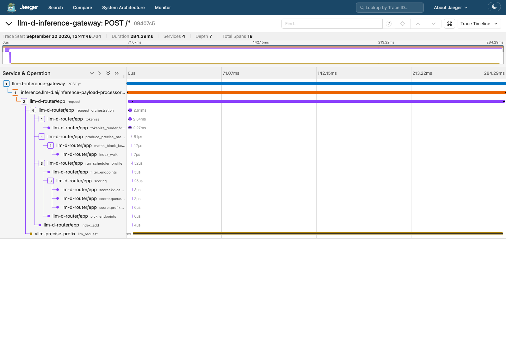
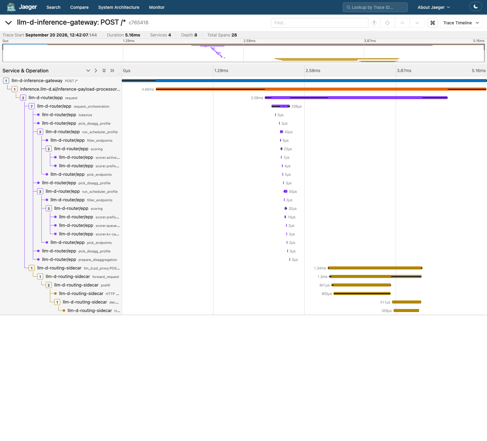
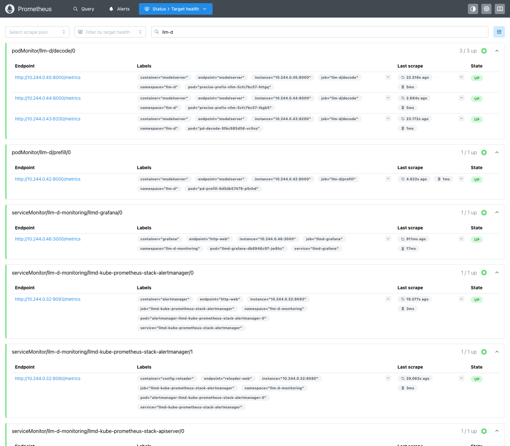
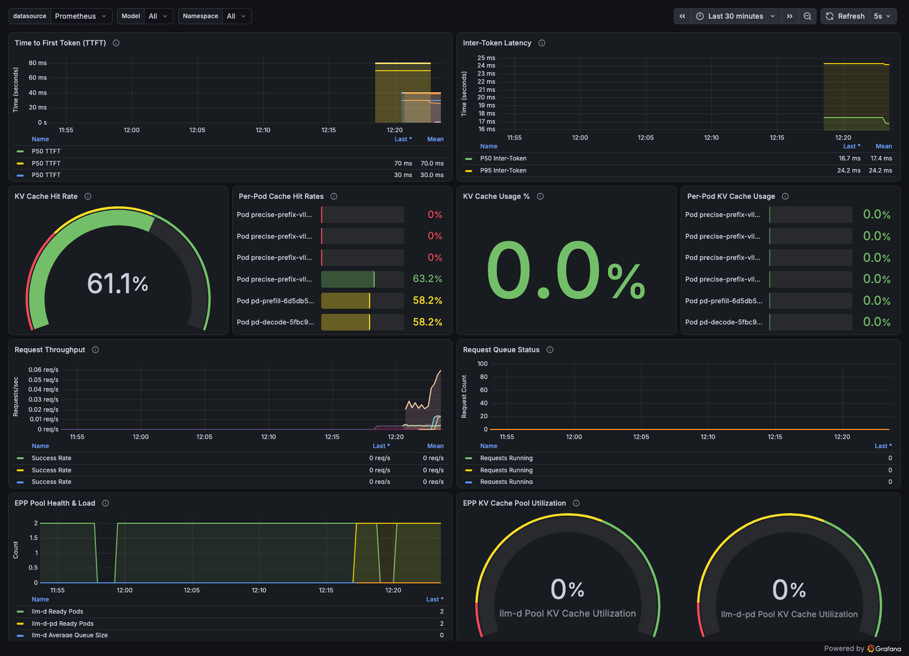
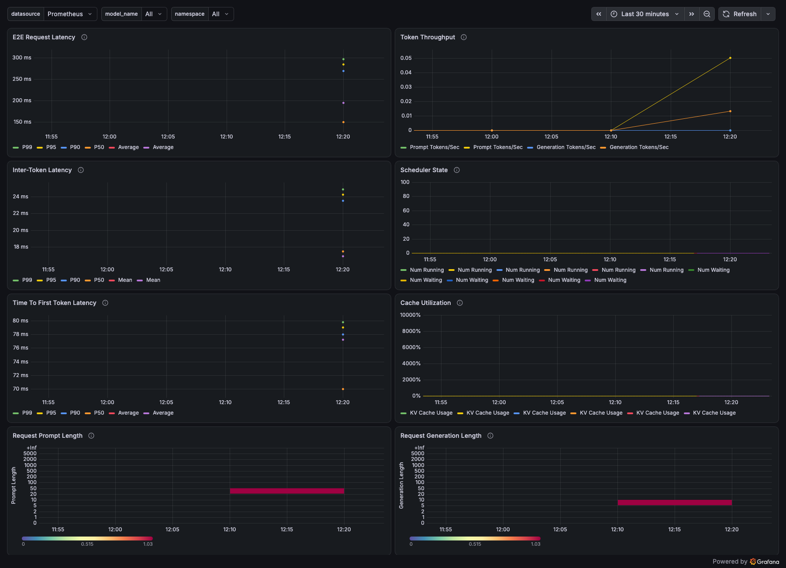

# llm-d 全栈 on Kind —— 原生跑在 DGX Spark GPU 上

本 demo 把 [`../llm-d-full-demo`](../llm-d-full-demo) 的整套 llm-d 栈（agentgateway →
IPP → 带精确 KV-cache 感知路由的 EPP → 模型服务，外加 P/D 分离池、OTel/Jaeger 追踪、
Prometheus/Grafana 指标）**完整搬到一台 NVIDIA DGX Spark 上**：**Kind 直接跑在 GPU 主机上**，
**vLLM 以普通 Kubernetes Pod 的形式跑在真实的 GB10 GPU 上**——没有 CPU vLLM，没有 socat
桥到远端机器，主路径上没有模拟器。

以下所有内容都是 **2026-09-20** 在一台干净的 DGX Spark（`spark-3bee`，Ubuntu 24.04.5，
GB10 Grace-Blackwell，aarch64，121 GiB 统一内存）上实际执行的。每一个 `console` 块都是从
真实会话里复制的，包括失败——其中三次失败花了不少时间，也是本文最有价值的部分。

English version: [`README.md`](README.md).

---

## 0. 做完之后你能得到什么

| 组件 | 跑在哪 | 真实 / 模拟 |
| --- | --- | --- |
| Kind 集群（`llm-d`，K8s v1.37.0） | DGX Spark 上，单个 node 容器 | 真实 |
| `nvidia.com/gpu` 作为可调度资源（time-slicing ×4） | Kind 内的 NVIDIA device plugin | 真实 |
| 2 × vLLM 0.27.1 副本，`Qwen2.5-1.5B-Instruct`，发布 KV-cache 事件 | Kind 内的 GPU Pod | **真实 GPU** |
| agentgateway（Gateway API + Inference Extension） | Kind | 真实 |
| Inference Payload Processor（IPP），从 `main` 构建 | Kind | 真实，在 trace 里 |
| 带 `precise-prefix-cache-producer` 的 EPP（KV 事件驱动路由） | Kind | 真实，**KV-cache 命中已复现** |
| P/D EPP + routing sidecar（2 个调度 profile，prefill→decode 两跳） | Kind | 调度真实，**KV 传输为模拟**（见 §7） |
| OTel Collector → Jaeger；agentgateway、EPP、sidecar **以及 vLLM 自己**都发 span | Kind | 真实 |
| kube-prometheus-stack，7 个 llm-d Grafana 看板 | Kind | 真实 |

请求路径以及它产生的 trace：

```text
                                       default route ──────────────▶ InferencePool llm-d (EPP: precise-prefix)
                                       │                                   ├──▶ vLLM replica 1 (GPU) ┐ KV events
 client ─HTTP─▶ agentgateway ─ext_proc─▶ IPP  ──▶ (route) ──┤                                  └──▶ vLLM replica 2 (GPU) ┘ ZMQ :5556 ─▶ EPP
               (trace ROOT)            (PreRouting)         │
                                                            └── x-llm-d-pool: pd ──▶ InferencePool llm-d-pd (EPP: P/D)
                                                                                           │
                                                                             routing-sidecar ──prefill──▶ pd-prefill (sim)
                                                                             (in pd-decode)  ──decode───▶ pd-decode  (sim)

 spans   ─── OTLP gRPC :4317 ──▶ otel-collector ──▶ Jaeger
 metrics ─── ServiceMonitor (EPPs) + PodMonitor (model servers) ──▶ Prometheus ──▶ Grafana
```

```console
$ python3 scripts/trace-tree.py        # one /v1/chat/completions, 18 spans, 4 services
[llm-d-inference-gateway] POST /*  (284.2 ms)
  [inference.llm-d.ai/inference-payload-processor] gateway.request
    [llm-d-router/epp] request
      [llm-d-router/epp] request_orchestration
        [llm-d-router/epp] tokenize
          [llm-d-router/epp] tokenize_render /v1/chat/completions/render
        [llm-d-router/epp] produce_precise_prefix_cache
          [llm-d-router/epp] match_block_keys
            [llm-d-router/epp] index_walk
        [llm-d-router/epp] run_scheduler_profile
          [llm-d-router/epp] filter_endpoints
          [llm-d-router/epp] scoring
            [llm-d-router/epp] scorer.kv-cache-utilization-scorer
            [llm-d-router/epp] scorer.queue-scorer
            [llm-d-router/epp] scorer.prefix-cache-scorer
          [llm-d-router/epp] pick_endpoints
        [llm-d-router/epp] index_add
      [vllm-precise-prefix] llm_request               # <- real vLLM's own span
```

## 1. 和 `llm-d-full-demo` 的区别

| | `llm-d-full-demo`（Mac） | 本 demo（DGX Spark） |
| --- | --- | --- |
| Kind 宿主 | Apple Silicon 上的 Docker Desktop | GPU 机器上的 Ubuntu + Docker |
| 模型服务 | `vllm/vllm-openai-cpu:v0.19.1`，`Qwen2.5-0.5B` | `nvcr.io/nvidia/vllm:26.08-py3`（vLLM 0.27.1）跑在 GB10 上，`Qwen2.5-1.5B` |
| GPU | 无 | `nvidia.com/gpu`，经 `RuntimeClass/nvidia` + NVIDIA device plugin（time-slicing ×4） |
| EPP 用的 tokenizer | EPP Pod 里的 `vllm-render` sidecar（4 CPU / 8 Gi） | 一个直接指向模型服务自身 `/render` 端点的 Service（当前上游写法） |
| KV-cache 命中路由（`top_scores=[7,4]`） | 已复现 | **在真实 vLLM KV 事件上复现**（上一次 DGX Spark 尝试没有复现） |
| trace 里有 vLLM | 从来没有（sim 不导出任何 span） | **有**——`vllm-precise-prefix` 服务，`llm_request` span |
| P/D 池 | `llm-d-inference-sim`（CPU vLLM 没有 NIXL） | `llm-d-inference-sim`（NIXL 在 GB10 上无法初始化——§7） |
| 本地构建的镜像 | 3 个（EPP、sidecar、IPP 的 arm64 版） | **1 个**——从 `main` 构建的 IPP（它的 `v0.1.0` 发布版早于 trace-context 传播）；EPP 和 sidecar 都有 multi-arch 发布 |
| TTFT p50 | 秒级（CPU） | **31 ms** |

## 2. 使用的版本

| 组件 | 版本 |
| --- | --- |
| DGX Spark | Ubuntu 24.04.5 LTS，内核 `6.17.0-1032-nvidia`，NVIDIA GB10，driver **580.173.02**（CUDA 13.0） |
| docker-ce / nvidia-container-toolkit（宿主机） | 29.2.1 / 1.20.0 |
| kind / kubectl / helm / yq | v0.33.0 / v1.37.0 / v3.22.0 / v4.53.6 |
| Kind node 镜像 | `kindest/node:v1.37.0`（Debian 13，containerd 2.3.4），内部装 nvidia-container-toolkit **1.20.1** |
| NVIDIA k8s-device-plugin | `nvcr.io/nvidia/k8s-device-plugin:v0.20.0` |
| Gateway API / GAIE CRD | v1.5.1 / v1.5.0（llm-d `install-gateway-crds.sh` 的默认值） |
| agentgateway | v1.4.1（llm-d CI 所 pin 的版本） |
| llm-d router chart | `oci://ghcr.io/llm-d/charts/llm-d-router-gateway` `v0`；EPP `ghcr.io/llm-d/llm-d-router-endpoint-picker:main` |
| IPP | chart `payload-processor-0.2.0`，镜像从 `main` @ `77418c1`（2026-09-17）构建为 `…:main-local`——见 Step 11 |
| routing sidecar / inference-sim | `llm-d-router-disagg-sidecar:v0.10.0` / `llm-d-inference-sim:v0.11.0` |
| vLLM | `nvcr.io/nvidia/vllm:26.08-py3` = vLLM `0.27.1+93523f72.dev`，torch `2.14.0a0+nv26.08`，CUDA 13.4（digest `sha256:4b16878d…`） |
| kube-prometheus-stack | 91.4.1（operator v0.94.0） |
| llm-d 仓库 | `main` @ `7921182b`（2026-09-18） |

## 3. 前置条件

| 要求 | 原因 | 检查 |
| --- | --- | --- |
| 带 NVIDIA GPU + driver 的 Linux 主机 | Kind 的 node 容器 GPU 透传技巧在 Docker Desktop 上不存在（它的 VM 没有 GPU 透传） | `nvidia-smi` |
| 宿主机装有 `nvidia-container-toolkit` | 提供 `nvidia-ctk` 和 `nvidia-container-runtime` | `dpkg -l \| grep nvidia-container-toolkit` |
| 用户在 `docker` 组里 | 后面所有操作都不需要 `sudo` | `docker ps` |
| **四条一次性**命令需要 `sudo` | docker 组、`/etc/docker/daemon.json`、`/etc/nvidia-container-runtime/config.toml`、`systemctl restart docker` | — |
| 约 40 GB 磁盘给镜像 + 模型 | 光 `nvcr.io/nvidia/vllm:26.08-py3` 就 25.5 GB | `df -h /` |
| 足够的**空闲统一内存** | 见下面的 ComfyUI 说明 | `torch.cuda.mem_get_info()` |

主机的初始状态：

```console
$ uname -a
Linux spark-3bee 6.17.0-1032-nvidia #32-Ubuntu SMP PREEMPT_DYNAMIC Wed Aug 19 17:40:46 UTC 2026 aarch64 GNU/Linux
$ nvidia-smi --query-gpu=name,driver_version --format=csv
name, driver_version
NVIDIA GB10, 580.173.02
$ dpkg -l | grep -E "nvidia-container-toolkit |docker-ce " | awk '{print $2, $3}'
docker-ce 5:29.2.1-1~ubuntu.24.04~noble
nvidia-container-toolkit 1.20.0-1
$ free -h
               total        used        free      shared  buff/cache   available
Mem:           121Gi        94Gi       6.7Gi       100Mi        22Gi        27Gi
```

> ### ⚠️ GB10 是统一内存：`free -h` 不是你的 GPU 预算
>
> 这台机器上跑着 ComfyUI，占了 **42.5 GB** GPU 内存。CUDA 实际看到的空闲量比 `free -h`
> 暗示的少得多：
> ```console
> $ docker run --rm --gpus all --entrypoint python3 nvcr.io/nvidia/vllm:26.08-py3 -c \
>   'import torch; f,t=torch.cuda.mem_get_info(); print(round(f/1e9,1), round(t/1e9,1))'
> 1.9 130.7          # <- 1.9 GB free out of a 130.7 GB unified pool
> ```
> 连一个 vLLM 都不够。ComfyUI 有一个 `/free` API，可以卸载它缓存的模型而不用杀进程：
> ```console
> $ curl -sS -X POST http://127.0.0.1:8188/free -H 'Content-Type: application/json' \
>   -d '{"unload_models":true,"free_memory":true}' -w 'http=%{http_code}\n'
> http=200
> $ nvidia-smi --query-compute-apps=pid,process_name,used_memory --format=csv
> 601168, /home/gyliu/ComfyUI/.venv/bin/python, 1927 MiB      # was 42503 MiB
> $ # mem_get_info() now: 86.0 130.7
> ```
> 在这台机器上规划 GPU 工作负载，永远以 `mem_get_info()` 为准，不要看 `free -h` 或
> `nvidia-smi`（它的内存查询在 GB10 上返回 `Not Supported`）。

---

## 4. 安装——逐步执行

所有命令都**在 DGX Spark 上**、在 `~/llm-d-spark-full-demo`（本目录，`rsync` 过去）里执行，
llm-d 仓库 clone 到 `~/llm-d`：

```console
$ git clone https://github.com/llm-d/llm-d.git ~/llm-d       # main @ 7921182b
```

### Step 1 —— kind、kubectl、helm、yq（不需要 sudo）

```console
$ mkdir -p ~/bin && cd ~/bin
$ curl -sSL -o kind https://kind.sigs.k8s.io/dl/v0.33.0/kind-linux-arm64 && chmod +x kind
$ curl -sSL -o kubectl https://dl.k8s.io/release/v1.37.0/bin/linux/arm64/kubectl && chmod +x kubectl
$ curl -sSL https://get.helm.sh/helm-v3.22.0-linux-arm64.tar.gz | tar xz --strip-components=1 -C ~/bin linux-arm64/helm
$ curl -sSL -o yq https://github.com/mikefarah/yq/releases/latest/download/yq_linux_arm64 && chmod +x yq
$ echo 'export PATH=$HOME/bin:$PATH' >> ~/.bashrc && export PATH=$HOME/bin:$PATH
$ kind version; kubectl version --client | head -1; helm version --short
kind v0.33.0 go1.26.7 linux/arm64
Client Version: v1.37.0
v3.22.0+g144ca65
```

> Helm **4.x** 已经是当前的 `latest`；本 demo 固定用 Helm 3（`v3.22.0`），这是 llm-d
> 安装脚本所测试的版本。

### Step 2 —— 配置 Docker 的 GPU 透传（root，一次性）

```console
$ sudo usermod -aG docker $USER
$ sudo nvidia-ctk runtime configure --runtime=docker --set-as-default
$ sudo sed -i 's/#accept-nvidia-visible-devices-as-volume-mounts = false/accept-nvidia-visible-devices-as-volume-mounts = true/' /etc/nvidia-container-runtime/config.toml
$ sudo systemctl restart docker
$ cat /etc/docker/daemon.json
{
    "default-runtime": "nvidia",
    "runtimes": { "nvidia": { "args": [], "path": "nvidia-container-runtime" } }
}
$ grep '^accept-nvidia-visible-devices-as-volume-mounts' /etc/nvidia-container-runtime/config.toml
accept-nvidia-visible-devices-as-volume-mounts = true
```

每一行做的事：

- `nvidia-ctk runtime configure --set-as-default` 在 Docker 里注册 `nvidia` runtime，
  **并把它设为默认**。`nvidia-container-runtime` 是 `runc` 的一层薄封装：只有当容器申请
  GPU 时才注入 `/dev/nvidia*` 和驱动库；否则行为和 `runc` 一模一样。
- `accept-nvidia-visible-devices-as-volume-mounts = true` 是让 Kind 能工作的关键技巧。
  **Kind 没有 `--gpus` 参数。** 打开它之后，runtime 会把*目标路径*为
  `/var/run/nvidia-container-devices/<id>` 的 bind mount 当作 `NVIDIA_VISIBLE_DEVICES=<id>`
  来处理——而 Kind *是*支持任意 `extraMounts` 的。
- `systemctl restart docker` 会停掉所有没有 restart policy 的运行中容器。这台主机上没有
  （`pgrep -c containerd-shim` → 0），所以是安全的；在共享机器上做之前先检查一下。

### Step 3 —— 用 GPU 挂载创建 Kind 集群

[`kind/kind-config.yaml`](kind/kind-config.yaml)：

```yaml
kind: Cluster
apiVersion: kind.x-k8s.io/v1alpha4
name: llm-d
nodes:
- role: control-plane
  kubeadmConfigPatches:
  - |
    kind: KubeletConfiguration
    maxPods: 250
    evictionHard:
      memory.available: "512Mi"
  extraMounts:
  - hostPath: /dev/null                                   # source is irrelevant
    containerPath: /var/run/nvidia-container-devices/all  # destination = "NVIDIA_VISIBLE_DEVICES=all"
  - hostPath: /home/gyliu/llm-d-cache                     # persistent HF model cache
    containerPath: /root/.cache
```

```console
$ mkdir -p ~/llm-d-cache/huggingface
$ kind create cluster --config kind/kind-config.yaml
Creating cluster "llm-d" ...
 ✓ Ensuring node image (kindest/node:v1.37.0) 🖼
 ✓ Preparing nodes 📦
 ✓ Writing configuration 📜
 ✓ Starting control-plane 🕹️
 ✓ Installing CNI 🔌
 ✓ Installing StorageClass 💾
Set kubectl context to "kind-llm-d"
real	1m27.206s
$ kubectl get nodes -o wide
NAME                  STATUS   ROLES           AGE   VERSION   OS-IMAGE                       KERNEL-VERSION               CONTAINER-RUNTIME
llm-d-control-plane   Ready    control-plane   35s   v1.37.0   Debian GNU/Linux 13 (trixie)   6.17.0-1032-nvidia (arm64)   containerd://2.3.4
```

确认 GPU 已经进到 **node 容器**里（这一步是 Docker 做的，还不是 Kubernetes）：

```console
$ docker exec llm-d-control-plane ls /dev | grep -i nvidia
nvidia-caps  nvidia-fs0 … nvidia-fs15  nvidia-modeset  nvidia-uvm  nvidia-uvm-tools  nvidia0  nvidiactl
$ docker exec llm-d-control-plane nvidia-smi --query-gpu=name,driver_version --format=csv
name, driver_version
NVIDIA GB10, 580.173.02
```

### Step 4 —— 给*嵌套的* containerd 也加上 GPU 支持

Pod 不是由宿主机的 Docker 启动的，而是由 node 容器**内部**的 containerd 启动的，而原版
`kindest/node` 镜像里没有任何 NVIDIA 工具。在里面装上，并注册一个 `nvidia` runtime
handler（刻意*不*设为默认——只有通过 `runtimeClassName: nvidia` 主动选择的 Pod 才会拿到
GPU 注入）：

```console
$ docker exec llm-d-control-plane bash -c '
  apt-get update -qq && apt-get install -y -qq curl gnupg
  curl -fsSL https://nvidia.github.io/libnvidia-container/gpgkey | gpg --dearmor -o /usr/share/keyrings/nvidia-container-toolkit-keyring.gpg
  curl -s -L https://nvidia.github.io/libnvidia-container/stable/deb/nvidia-container-toolkit.list \
    | sed "s#deb https://#deb [signed-by=/usr/share/keyrings/nvidia-container-toolkit-keyring.gpg] https://#g" \
    > /etc/apt/sources.list.d/nvidia-container-toolkit.list
  apt-get update -qq && apt-get install -y -qq nvidia-container-toolkit
  nvidia-ctk runtime configure --runtime=containerd --config=/etc/containerd/config.toml
  systemctl restart containerd'
Setting up nvidia-container-toolkit (1.20.1-1) ...
INFO Using CRI runtime plugin name "io.containerd.grpc.v1.cri"
INFO Wrote updated config to /etc/containerd/conf.d/99-nvidia.toml
$ docker exec llm-d-control-plane grep -A3 'runtimes.nvidia\]' /etc/containerd/conf.d/99-nvidia.toml
        [plugins."io.containerd.grpc.v1.cri".containerd.runtimes.nvidia]
          base_runtime_spec = "/etc/containerd/cri-base.json"
          runtime_type = "io.containerd.runc.v2"
$ kubectl get nodes
NAME                  STATUS   ROLES           AGE   VERSION
llm-d-control-plane   Ready    control-plane   35s   v1.37.0      # stayed Ready through the containerd restart
```

> containerd 2.x 会读取 `/etc/containerd/conf.d/*.toml` 的 drop-in 配置，所以 `nvidia-ctk`
> 没有动 `config.toml` 本身。

### Step 5 —— RuntimeClass、device plugin（time-slicing ×4）、冒烟测试

[`manifests/00-gpu-runtime.yaml`](manifests/00-gpu-runtime.yaml) 里有三个对象：

- `RuntimeClass/nvidia` → `handler: nvidia`（上面那个 containerd handler）。
- `ConfigMap/nvidia-device-plugin-config`，开启 **time-slicing**：
  ```yaml
  sharing:
    timeSlicing:
      resources:
      - name: nvidia.com/gpu
        replicas: 4
  ```
  物理上只有一块 GPU，但本 demo 要在上面跑多个 vLLM Pod（2 个 precise-prefix 副本 +
  P/D 的 prefill + decode）。`replicas: 4` 让 plugin 广播 `nvidia.com/gpu: 4`，每个 Pod
  可以申请 `nvidia.com/gpu: 1`，调度器做真实的计数。slice 之间没有内存隔离——每个 vLLM
  自己控制自己的 KV 预算。
- `DaemonSet/nvidia-device-plugin-daemonset`（`v0.20.0`，`--config-file`，它自己也跑在
  `runtimeClassName: nvidia` 下）。

```console
$ kubectl apply -f manifests/00-gpu-runtime.yaml
$ kubectl -n kube-system logs -l name=nvidia-device-plugin-ds --tail 4
W0920 14:27:50 devices.go:77] Ignoring error getting device memory: Not Supported
I0920 14:27:50 server.go:198] Starting GRPC server for 'nvidia.com/gpu'
I0920 14:27:50 server.go:142] Starting to serve 'nvidia.com/gpu' on /var/lib/kubelet/device-plugins/nvidia-gpu.sock
I0920 14:27:50 server.go:149] Registered device plugin for 'nvidia.com/gpu' with Kubelet
$ kubectl get node llm-d-control-plane -o jsonpath='{.status.allocatable}' | tr ',' '\n' | grep gpu
"nvidia.com/gpu":"4"
```

> `Ignoring error getting device memory: Not Supported` 就是 GB10 的统一内存怪癖（NVML
> 报不出 VRAM 总量）。device-plugin **< v0.17.4** 的版本会把它当成致命错误
> （[NVIDIA/k8s-device-plugin#1482](https://github.com/NVIDIA/k8s-device-plugin/issues/1482)）。

> 这一步第一次尝试注册出来的是 **`nvidia.com/gpu: 0`**，日志是
> `open /config/config.yaml: no such file or directory`——ConfigMap 作为 volume 挂上了，
> 但 `volumeMounts` 那一项漏了。如果你手抄 DaemonSet，值得留意。

用一个申请 `nvidia.com/gpu: 1` 并运行 `nvidia-smi` 的 Pod 验证整条链路（宿主机 Docker →
node → 嵌套 containerd → Pod）：

```console
$ kubectl apply -f manifests/gpu-smoke-test.yaml
$ kubectl wait --for=jsonpath='{.status.phase}'=Succeeded pod/gpu-smoke-test --timeout=180s
$ kubectl logs gpu-smoke-test | head -9
Sun Sep 20 14:27:02 2026
+-----------------------------------------------------------------------------------------+
| NVIDIA-SMI 580.173.02             Driver Version: 580.173.02     CUDA Version: 13.0     |
|   0  NVIDIA GB10                    On  |   0000000F:01:00.0 Off |                  N/A |
| N/A   45C    P0             10W /  N/A  | Not Supported          |      0%      Default |
$ kubectl delete pod gpu-smoke-test
```

### Step 6 —— Namespace、CRD、agentgateway、Gateway

```console
$ kubectl apply -f manifests/01-namespace.yaml          # Namespace llm-d + ServiceAccount sa
$ kubectl apply -f https://github.com/kubernetes-sigs/gateway-api/releases/download/v1.5.1/standard-install.yaml
$ kubectl apply -f https://github.com/kubernetes-sigs/gateway-api-inference-extension/releases/download/v1.5.0/v1-manifests.yaml
$ kubectl apply -k "https://github.com/llm-d/llm-d-router/config/crd?ref=main"
customresourcedefinition.apiextensions.k8s.io/inferencemodelrewrites.llm-d.ai created
customresourcedefinition.apiextensions.k8s.io/inferenceobjectives.llm-d.ai created
customresourcedefinition.apiextensions.k8s.io/inferencepools.inference.networking.k8s.io configured
$ helm upgrade --install agentgateway-crds oci://cr.agentgateway.dev/charts/agentgateway-crds \
    --namespace agentgateway-system --create-namespace --version v1.4.1
$ helm upgrade --install agentgateway oci://cr.agentgateway.dev/charts/agentgateway \
    --namespace agentgateway-system --create-namespace --version v1.4.1 \
    --set inferenceExtension.enabled=true
$ kubectl get gatewayclass agentgateway
NAME           CONTROLLER                      ACCEPTED   AGE
agentgateway   agentgateway.dev/agentgateway   True       1s
$ kubectl apply -k ~/llm-d/guides/recipes/gateway/agentgateway -n llm-d
gateway.gateway.networking.k8s.io/llm-d-inference-gateway created
$ kubectl get gateway -n llm-d
NAME                      CLASS          ADDRESS   PROGRAMMED   AGE
llm-d-inference-gateway   agentgateway             True         15s
```

三套 CRD 分别是：**Gateway API**（`GatewayClass`、`Gateway`、`HTTPRoute`），**GAIE**
（`InferencePool`——"同一个模型的一组模型服务副本"），以及 **llm-d 自己的**
（`InferenceObjective`、`InferenceModelRewrite`）。`--set inferenceExtension.enabled=true`
让 agentgateway 把 `InferencePool` 类型的 backend 理解成"问这个 EPP 该选哪个 Pod"，
而不是"对一个 Service 做负载均衡"。

> llm-d 的文档里还写着 agentgateway `v1.1.0`；它的 CI 脚本
> （`.github/scripts/install-agentgateway-crds.sh`）pin 的是 **v1.4.1**，本 demo 用的就是
> 这个。chart 的 `latest` 是 1.5.0。

### Step 7 —— OTel Collector + Jaeger、Prometheus operator CRD

```console
$ bash ~/llm-d/guides/recipes/observability/install-otel-collector-jaeger.sh -n llm-d
[OK]    OTel Collector + Jaeger deployed successfully.
[INFO]  Components should export OTLP traces to: http://otel-collector:4317
$ bash ~/llm-d/guides/recipes/observability/install-prometheus-grafana.sh --crds-only
✅ Monitoring CRDs installed.
```

这些 CRD 必须在 Step 8 之前就位：router chart 会渲染一个 `ServiceMonitor`。

### Step 8 —— Router（EPP + InferencePool + HTTPRoute）

```console
$ kubectl create secret generic llm-d-hf-token -n llm-d --from-literal=HF_TOKEN="" \
    --dry-run=client -o yaml | kubectl apply -f -        # public model; the chart still references it
$ helm install llm-d oci://ghcr.io/llm-d/charts/llm-d-router-gateway --version v0 \
    -f helm-values/router-precise-prefix.values.yaml \
    -f helm-values/tracing.values.yaml \
    -f helm-values/router-spark.values.yaml \
    --set provider.name=none \
    --set httpRoute.create=true \
    --set httpRoute.inferenceGatewayName=llm-d-inference-gateway \
    -n llm-d
NAME: llm-d
STATUS: deployed
$ kubectl get httproute,inferencepool,servicemonitor -n llm-d
NAME                                        HOSTNAMES   AGE
httproute.gateway.networking.k8s.io/llm-d               5s
NAME                                              AGE
inferencepool.inference.networking.k8s.io/llm-d   5s
NAME                                                     AGE
servicemonitor.monitoring.coreos.com/llm-d-epp-monitor   5s
$ kubectl get pods -n llm-d
NAME                                       READY   STATUS    RESTARTS   AGE
jaeger-554cff9d46-b4m7x                    1/1     Running   0          6m42s
llm-d-epp-6bc4b9596-vz7ld                  1/1     Running   0          5s      # 1/1: no tokenizer sidecar
llm-d-inference-gateway-58b9564597-xgk6j   1/1     Running   0          7m3s
otel-collector-b6fd97bfb-gcsbj             1/1     Running   0          6m42s
```

三个 values 文件：

- [`router-precise-prefix.values.yaml`](helm-values/router-precise-prefix.values.yaml)
  —— EPP 插件链（§8.3 逐个解释每个插件）。从 llm-d 2026-09-18 的
  `guides/precise-prefix-cache-routing/router/` 移植过来，相比 full demo 时期有变化：
  `blockSize` → **`blockSizeTokens`**、新增 `replaySocketPort: 5559`、tokenizer 不再是
  sidecar。
- [`router-spark.values.yaml`](helm-values/router-spark.values.yaml) —— 已发布的
  `llm-d-router-endpoint-picker:main` 镜像（multi-arch，不用构建）、`tokenizer.enabled: false`、
  `modelServers.matchLabels`（`llm-d.ai/guide: precise-prefix-cache-routing`——**EPP 和
  vLLM Pod 之间唯一的关联**），以及 `monitoring.prometheus.enabled: true`。
- [`tracing.values.yaml`](helm-values/tracing.values.yaml) —— EPP 的 span 导出到
  `otel-collector:4317`，100 % 采样。

### Step 9 —— 两个真实的 vLLM GPU 副本

**(a) 拿到镜像。** 上游 `docker.io/vllm/vllm-openai` 没有 GB10/aarch64 构建；能用的是
NVIDIA 的 DGX Spark playbook 镜像。Kind 的嵌套 containerd 有**独立的镜像存储**，所以在宿主机
拉一次再导入 node，而不是让 kubelet 再拉 25 GB：

```console
$ docker pull nvcr.io/nvidia/vllm:26.08-py3                 # 26.08 is the newest tag; 25.5 GB
$ docker save nvcr.io/nvidia/vllm:26.08-py3 | docker exec -i llm-d-control-plane ctr -n k8s.io images import -
Importing	elapsed: 238.7s
$ docker exec llm-d-control-plane ctr -n k8s.io images ls -q | grep vllm
nvcr.io/nvidia/vllm:26.08-py3
```

**(b) 预下载模型缓存**到宿主机目录——`kind-config.yaml` 把它挂到 node 的 `/root/.cache`，
Pod 再把它挂成 `HF_HOME`：

```console
$ docker run --rm -e HF_HOME=/hf -v ~/llm-d-cache/huggingface:/hf \
    --entrypoint hf nvcr.io/nvidia/vllm:26.08-py3 download Qwen/Qwen2.5-1.5B-Instruct
Fetching 10 files: 100%|██████████| 10/10 [00:41<00:00,  4.12s/it]
✓ Downloaded
$ du -sh ~/llm-d-cache/huggingface
2.9G	/home/gyliu/llm-d-cache/huggingface
```

**(c) 部署** [`manifests/02-model-servers.yaml`](manifests/02-model-servers.yaml)
—— 一个 2 副本的 Deployment，外加 `precise-prefix-cache-routing-render` Service。关键部分：

```yaml
spec:
  template:
    metadata:
      labels:
        llm-d.ai/role: decode
        llm-d.ai/guide: precise-prefix-cache-routing      # <- InferencePool selector
    spec:
      runtimeClassName: nvidia                            # <- GPU injection opt-in
      containers:
        - name: modelserver
          image: nvcr.io/nvidia/vllm:26.08-py3
          # NO `command:` -- keep the image ENTRYPOINT (see incident 3)
          args:
            - "vllm"
            - "serve"
            - "Qwen/Qwen2.5-1.5B-Instruct"
            - "--port=8000"
            - "--block-size=64"                           # == blockSizeTokens in the EPP config
            - "--max-model-len=8192"
            - "--enforce-eager"
            - "--kv-cache-memory-bytes=6442450944"        # incident 1
            - "--gpu-memory-utilization=0.10"             # incident 2
            - "--kv-events-config"
            - '{"enable_kv_cache_events":true,"publisher":"zmq","endpoint":"tcp://*:5556","replay_endpoint":"tcp://*:5559","topic":"kv@$(POD_IP):8000@Qwen/Qwen2.5-1.5B-Instruct"}'
            - "--otlp-traces-endpoint=http://otel-collector:4317"
            - "--collect-detailed-traces=all"
          env:
            - { name: OTEL_SERVICE_NAME, value: vllm-precise-prefix }
            - { name: HF_HOME, value: /root/.cache/huggingface }
            - { name: HF_HUB_OFFLINE, value: "1" }
          resources:
            limits: { cpu: "4", memory: 16Gi, nvidia.com/gpu: 1 }   # <- one of the 4 slices
```

```console
$ kubectl apply -f manifests/02-model-servers.yaml
$ kubectl -n llm-d rollout status deploy/precise-prefix-vllm --timeout=540s
deployment "precise-prefix-vllm" successfully rolled out
$ kubectl get pods -n llm-d -l llm-d.ai/guide=precise-prefix-cache-routing -o wide
NAME                                   READY   STATUS    RESTARTS   AGE   IP            NODE
precise-prefix-vllm-5858978586-56jrs   1/1     Running   0          81s   10.244.0.23   llm-d-control-plane
precise-prefix-vllm-5858978586-8lh29   1/1     Running   0          81s   10.244.0.24   llm-d-control-plane
$ kubectl -n llm-d logs deploy/precise-prefix-vllm | grep -E 'Forward Compat|Using CUDA|KV cache size|startup complete'
NOTE: CUDA Forward Compatibility mode ENABLED.
  Using CUDA 13.4 driver version 615.65.02 with kernel driver version 580.173.02.
(EngineCore pid=354) INFO [kv_cache_utils.py:2235] GPU KV cache size: 224,640 tokens
(APIServer pid=1) INFO:     Application startup complete.
$ nvidia-smi --query-compute-apps=pid,process_name,used_memory --format=csv
1527324, VLLM::EngineCore, 10468 MiB
1527352, VLLM::EngineCore, 10468 MiB
```

这次干净的 rollout 是**第三次尝试**才成功的。每一次失败都是 GB10/NGC 特有的坑：

> ### ⚠️ 事故 1 —— `Error in memory profiling`（统一内存）
>
> 第一版用的是常规的 `--gpu-memory-utilization=0.08`，两个副本一起 crash-loop：
> ```text
> AssertionError: Error in memory profiling. Initial free memory 98.0 GiB, current free
> memory 100.59 GiB. This happens when other processes sharing the same container release
> GPU memory while vLLM is profiling during initialization.
> ```
> vLLM 计算 KV cache 大小的方式是跑一次 profiling 前向，并断言这期间空闲内存没有*变多*。
> 在 GB10 上"空闲 GPU 内存"就是空闲的*系统*内存——page cache 以及旁边正在启动的另一个 Pod
> 会让它双向波动，于是断言触发。**修复：** `--kv-cache-memory-bytes=6442450944`（6 GiB）
> 显式指定 KV 预算，并且按 `gpu_worker.py` 的实现*完全跳过 memory profiling*。对这个模型
> 6 GiB = 224,640 个 token（28 层 × 2 × 2 个 KV head × 128 × bf16 = 28 KiB/token）。

> ### ⚠️ 事故 2 —— `Free memory on device ... is less than desired GPU memory utilization`
>
> 只加 `--kv-cache-memory-bytes` 之后，*另一个*启动检查触发了：
> ```text
> ValueError: Free memory on device cuda:0 (104.5/121.69 GiB) on startup is less than
> desired GPU memory utilization (0.92, 111.95 GiB).
> ```
> 默认的 0.92 utilization 会在其他任何事情之前先和空闲内存比一次。**修复：** 在显式 KV
> 预算旁边保留一个小的 `--gpu-memory-utilization=0.10`。这两个参数在这里扮演不同角色：
> 0.10 × 121 GiB = 12 GiB 用来通过预检查，6 GiB 的预算才是真正分配的量。

> ### ⚠️ 事故 3 —— `the provided PTX was compiled with an unsupported toolchain`
>
> 下一次尝试死在了 `kernel_warmup → flashinfer_autotune → _dummy_run`：
> ```text
> torch.AcceleratorError: CUDA error: the provided PTX was compiled with an unsupported toolchain.
> Search for `cudaErrorUnsupportedPtxVersion' ...
> ```
> 镜像是用 CUDA **13.4** 构建的；宿主机的 driver 580 只支持 CUDA **13.0**。同样的命令在宿主机上
> 用普通 `docker run` 能跑，把每个参数和 cgroup 限制逐一二分也毫无变化——直到
> `--entrypoint=""` 让它在宿主机上也复现了。NGC 的 ENTRYPOINT（`/opt/nvidia/nvidia_entrypoint.sh`）
> 会 source 一批脚本，**把 `/usr/local/cuda/compat/lib.real` 前置到 `LD_LIBRARY_PATH`**，从而开启
> *CUDA Forward Compatibility*（用户态 driver 615.65 跑在内核 driver 580 上）：
> ```console
> $ diff <(docker run --rm --gpus all --entrypoint env IMG | sort) <(docker run --rm --gpus all IMG env | sort)
> > _CUDA_COMPAT_STATUS=CUDA Driver OK
> > LD_LIBRARY_PATH=/usr/local/cuda/compat/lib.real:/opt/ffmpeg-safe/lib:...
> > NOTE: CUDA Forward Compatibility mode ENABLED.
> >   Using CUDA 13.4 driver version 615.65.02 with kernel driver version 580.173.02.
> ```
> 我的 Pod spec 写了 `command: ["vllm", "serve"]`，这会**替换掉 ENTRYPOINT**——于是 Pod
> 用的是 580 的用户态 driver，它的 CUDA 13.0 JIT 编译不了 FlashInfer 生成的 13.4 PTX。
> **修复：** 不写 `command:`；把 `vllm serve …` 放进 `args:`（它只替换 `CMD`）。凡是在
> driver 比镜像 CUDA 版本旧的 Spark 上跑 NGC 镜像，这条都适用。

### Step 10 —— Gateway 追踪、Prometheus + Grafana、模型服务的 PodMonitor

```console
$ kubectl apply -f manifests/03-gateway-tracing-policy.yaml     # agentgateway -> otel-collector, root span
$ kubectl get agentgatewaypolicy -n llm-d
NAME              ACCEPTED   ATTACHED   AGE
gateway-tracing   True       True       20s
$ bash ~/llm-d/guides/recipes/observability/install-prometheus-grafana.sh
✅ 🎉 Prometheus and Grafana installation complete.
$ kubectl apply -k ~/llm-d/guides/recipes/modelserver/components/monitoring/ -n llm-d      # PodMonitor decode
$ kubectl get pods -n llm-d-monitoring
NAME                                                     READY   STATUS    RESTARTS   AGE
alertmanager-llmd-kube-prometheus-stack-alertmanager-0   2/2     Running   0          21m
llmd-grafana-65dd87fbc5-cr9fx                            3/3     Running   0          22m
llmd-kube-prometheus-stack-operator-d59cb896d-bjvrg      1/1     Running   0          22m
llmd-kube-state-metrics-687cbc6f8-kvxdb                  1/1     Running   0          22m
llmd-prometheus-node-exporter-gm5x9                      1/1     Running   0          22m
prometheus-llmd-kube-prometheus-stack-prometheus-0       2/2     Running   0          21m
```

### Step 11 —— Inference Payload Processor（IPP）

从 `main` 构建它（原生 arm64 构建，约 5 分钟）并导入 node——原因见下面的提示框：

```console
$ git clone https://github.com/llm-d/llm-d-inference-payload-processor.git ~/llm-d-inference-payload-processor
$ cd ~/llm-d-inference-payload-processor && git log -1 --format='%h %cd' --date=short
77418c1 2026-09-17
$ docker build -t ghcr.io/llm-d/llm-d-inference-payload-processor:main-local -f Dockerfile .
$ docker save ghcr.io/llm-d/llm-d-inference-payload-processor:main-local | docker exec -i llm-d-control-plane ctr -n k8s.io images import -
$ cd ~/llm-d-spark-full-demo
$ helm install ipp ~/llm-d-inference-payload-processor/config/charts/payload-processor \
    -n llm-d -f helm-values/ipp.values.yaml
$ kubectl apply -f manifests/04-ipp-extproc-policy.yaml         # PreRouting ext_proc on the Gateway
$ kubectl get agentgatewaypolicy -n llm-d
NAME              ACCEPTED   ATTACHED   AGE
gateway-tracing   True       True       56m
ipp-extproc       True       True       5s
```

[`ipp.values.yaml`](helm-values/ipp.values.yaml) 指定了 `main-local` 镜像、往 collector
导出 trace，以及 **`flags.secure-serving: false`**——配 agentgateway 时这是必须的（它的
ext_proc 走明文 h2；IPP 默认自签 TLS，而一个坏掉的 ext_proc 会让*全部*流量 fail-closed）。

> ### ⚠️ 为什么不用已发布的 `v0.1.0` 镜像
>
> 第一遍用的是 chart 默认的 `…:v0.1.0`（multi-arch，可以直接拉）。IPP 是工作的——它的日志
> 对每个请求都打出 `parsed field from body: field=model` 和 `updated base model header`——但它的
> `gateway.request` span 总是落在一条**单独的 trace** 里，有自己的 trace ID，而 EPP 直接挂在
> gateway 下面。`phase: PostRouting` 行为相同。这看起来像是 agentgateway 的回归
> （2026-08-03 在 v1.1.0 上的 full-demo 是串联的），直到查了 IPP 的历史：
> ```console
> $ git log -1 --format='v0.1.0 = %h %cd' --date=short v0.1.0
> v0.1.0 = bce1a1d 2026-07-12
> $ git merge-base --is-ancestor c719723 v0.1.0 || echo 'v0.1.0 lacks #159'
> v0.1.0 lacks #159      # "extract upstream traceparent, re-parent server span, inject on egress"
> $ git merge-base --is-ancestor 161bfcd v0.1.0 || echo 'v0.1.0 lacks #312'
> v0.1.0 lacks #312      # "export root spans without client traceparent on ext_proc"
> ```
> `v0.1.0` 来自 IPP 学会读取 `traceparent` **之前**；八月那次能串联，只是因为它用的是从 `main`
> 构建的镜像。换成 `main-local` 之后，紧接着的第一个请求就产生了 §5.2 里的 4 服务 trace——所以
> agentgateway v1.4.1 确实会把 trace context 传给 `PreRouting` 的 ext_proc，修复只是换一个更新的
> IPP 构建而已。值得向上游要一个包含 #159 的 release。

### Step 12 —— P/D 分离池

第二个 router release，带自己的 EPP 插件配置，外加 prefill 和 decode 两个 Deployment。
chart 现在会自己渲染 header 匹配的 `HTTPRoute`（`httpRoute.headerMatches`），不需要手写路由：

```console
$ helm install llm-d-pd oci://ghcr.io/llm-d/charts/llm-d-router-gateway --version v0 \
    -f helm-values/router-pd.values.yaml \
    -f helm-values/tracing.values.yaml \
    -f helm-values/router-pd-spark.values.yaml \
    --set provider.name=none -n llm-d
$ kubectl apply -f manifests/05-model-servers-pd.yaml
$ kubectl apply -k ~/llm-d/guides/recipes/modelserver/components/monitoring-pd/ -n llm-d   # PodMonitor prefill
$ kubectl get httproute,inferencepool -n llm-d
NAME                                           HOSTNAMES   AGE
httproute.gateway.networking.k8s.io/llm-d                  58m
httproute.gateway.networking.k8s.io/llm-d-pd               11s
NAME                                                 AGE
inferencepool.inference.networking.k8s.io/llm-d      58m
inferencepool.inference.networking.k8s.io/llm-d-pd   11s
$ kubectl get httproute llm-d-pd -n llm-d -o jsonpath='{.spec.rules[0].matches}'
[{"headers":[{"name":"x-llm-d-pool","type":"Exact","value":"pd"}],"path":{"type":"PathPrefix","value":"/"}}]
```

> ### ⚠️ 上游漂移：`plugin type 'disagg-headers-handler' is not registered`
>
> `llm-d-full-demo`（2026-08-28）里的 P/D 插件配置会让今天 `main` 构建的 EPP crash-loop：
> ```text
> "Failed to parse configuration" ... plugin type 'disagg-headers-handler' is not registered
> ```
> `disagg-headers-handler` 已经没有了，`disagg-profile-handler` 现在只接受 `deciders:`。
> [`router-pd.values.yaml`](helm-values/router-pd.values.yaml) 跟随 `main` 上的
> `guides/pd-disaggregation/router/pd-disaggregation.values.yaml`。`helm upgrade` 之后还需要
> `kubectl rollout restart deploy/llm-d-pd-epp`——Pod 上没有 config-checksum 注解。

P/D 池后面的模型服务是 `llm-d-inference-sim`，不是 vLLM。这不是原计划；§7 记录了换成 vLLM
时发生了什么。

### 最终状态

```console
$ kubectl get pods -A | grep -vE 'kube-system|local-path'
NAMESPACE             NAME                                                     READY   STATUS
agentgateway-system   agentgateway-7958c8487b-l4hbl                            1/1     Running
llm-d                 jaeger-554cff9d46-b4m7x                                  1/1     Running
llm-d                 llm-d-epp-6bc4b9596-vz7ld                                1/1     Running
llm-d                 llm-d-inference-gateway-58b9564597-xgk6j                 1/1     Running
llm-d                 llm-d-pd-epp-7cbdcb844d-96fbk                            1/1     Running
llm-d                 otel-collector-b6fd97bfb-gcsbj                           1/1     Running
llm-d                 payload-processor-6475bc45fd-7pjjj                       1/1     Running
llm-d                 pd-decode-5fbc985d56-vc5ns                               2/2     Running
llm-d                 pd-prefill-6d5db57479-p5nhd                              1/1     Running
llm-d                 precise-prefix-vllm-5cfc7bc57-httgq                      1/1     Running
llm-d                 precise-prefix-vllm-5cfc7bc57-tkgb5                      1/1     Running
llm-d-monitoring      alertmanager-llmd-kube-prometheus-stack-alertmanager-0   2/2     Running
llm-d-monitoring      llmd-grafana-db8946c97-jw8hz                             3/3     Running
llm-d-monitoring      llmd-kube-prometheus-stack-operator-d59cb896d-bjvrg      1/1     Running
llm-d-monitoring      llmd-kube-state-metrics-687cbc6f8-kvxdb                  1/1     Running
llm-d-monitoring      llmd-prometheus-node-exporter-gm5x9                      1/1     Running
llm-d-monitoring      prometheus-llmd-kube-prometheus-stack-prometheus-0       2/2     Running
$ kubectl -n kube-system get pods -l name=nvidia-device-plugin-ds
nvidia-device-plugin-daemonset-2j7dk   1/1     Running

$ helm list -A
NAME                NAMESPACE             CHART                          APP VERSION
agentgateway        agentgateway-system   agentgateway-v1.4.1            v1.4.1
agentgateway-crds   agentgateway-system   agentgateway-crds-v1.4.1       v1.4.1
ipp                 llm-d                 payload-processor-0.2.0        0.2.0
llm-d               llm-d                 llm-d-router-gateway-v0        v0
llm-d-pd            llm-d                 llm-d-router-gateway-v0        v0
llmd                llm-d-monitoring      kube-prometheus-stack-91.4.1   v0.94.0

$ kubectl describe node llm-d-control-plane | sed -n '/Allocated resources/,/Events/p' | grep -E 'cpu|memory|nvidia'
  cpu                7200m (36%)    18 (90%)
  memory             19306Mi (15%)  48724Mi (39%)
  nvidia.com/gpu     2              2                 # the two real vLLM Pods
```

---

## 5. 测试——端到端

`scripts/port-forward.sh` 把 Jaeger（:16686）、Prometheus（:9091）、Grafana（:3000）和
Gateway（:8080）暴露到 localhost。

### 5.1 一个请求穿过 Gateway

```console
$ ./scripts/port-forward.sh
$ curl -sS -X POST http://localhost:8080/v1/chat/completions -H 'Content-Type: application/json' \
    -d '{"model":"Qwen/Qwen2.5-1.5B-Instruct","messages":[{"role":"user","content":"Say hi in exactly three words."}],"max_tokens":20}'
{"id":"chatcmpl-16d7a6bc-1a18-4c2b-8720-d04883851fc0","object":"chat.completion","model":"Qwen/Qwen2.5-1.5B-Instruct",
 "choices":[{"index":0,"message":{"role":"assistant","content":"Hello there!"},"finish_reason":"stop"}],
 "system_fingerprint":"vllm-0.27.1+93523f72.dev-2f315c48",
 "usage":{"prompt_tokens":36,"total_tokens":40,"completion_tokens":4}}
```

EPP **直接按 Pod IP** 订阅了两个副本的 KV 事件 socket——中间没有任何代理：

```console
$ kubectl -n llm-d logs deploy/llm-d-epp | grep 'Connected subscriber'
{"logger":"zmq-subscriber","body":"Connected subscriber socket","endpoint":"tcp://10.244.0.24:5556"}
{"logger":"zmq-subscriber","body":"Connected subscriber socket","endpoint":"tcp://10.244.0.23:5556"}
```

### 5.2 串联起来的 trace（gateway → IPP → EPP → vLLM）

```console
$ curl -s http://localhost:16686/api/services | python3 -c "import sys,json;print(sorted(json.load(sys.stdin)['data']))"
['inference.llm-d.ai/inference-payload-processor', 'llm-d-inference-gateway', 'llm-d-router/epp', 'llm-d-routing-sidecar', 'vllm-precise-prefix']
$ python3 scripts/trace-tree.py
[llm-d-inference-gateway] POST /*  (284.2 ms)
  [inference.llm-d.ai/inference-payload-processor] gateway.request  (283.8 ms)
    [llm-d-router/epp] request  (282.3 ms)
      [llm-d-router/epp] request_orchestration  (2.6 ms)
        [llm-d-router/epp] tokenize  (2.3 ms)
          [llm-d-router/epp] tokenize_render /v1/chat/completions/render  (2.3 ms)
        [llm-d-router/epp] produce_precise_prefix_cache  (0.1 ms)
          [llm-d-router/epp] match_block_keys  (0.0 ms)
            [llm-d-router/epp] index_walk  (0.0 ms)
        [llm-d-router/epp] run_scheduler_profile  (0.1 ms)
          [llm-d-router/epp] filter_endpoints  (0.0 ms)
          [llm-d-router/epp] scoring  (0.0 ms)
            [llm-d-router/epp] scorer.kv-cache-utilization-scorer  (0.0 ms)
            [llm-d-router/epp] scorer.queue-scorer  (0.0 ms)
            [llm-d-router/epp] scorer.prefix-cache-scorer  (0.0 ms)
          [llm-d-router/epp] pick_endpoints  (0.0 ms)
        [llm-d-router/epp] index_add  (0.0 ms)
      [vllm-precise-prefix] llm_request  (277.1 ms)
-- traceID=09407c59fba819ce7280444822be185a spans=18 services=4
```



`Services 4 | Depth 7 | Total Spans 18`，一条以 gateway 为根的 trace。因为 IPP 跑在
`PreRouting` 并把 trace context 重新注入它转发的 header，**EPP 是 IPP 的子 span**，而不是
gateway 的。`tokenize_render` 这一跳是 EPP 调用模型服务的 `/render` 端点，
`match_block_keys` → `index_walk` 是 KV block 索引的查找，`index_add` 记录本请求将会创建的
block，而 `vllm-precise-prefix llm_request` 是 **vLLM 自己的 span**——由
`--otlp-traces-endpoint` 导出，并且因为 agentgateway 把 `traceparent` 头转发给了 Pod，它挂在
EPP 之下。

> 用已发布的 IPP `v0.1.0` 镜像时，这条 trace 只有 3 个服务，IPP 的 span 是一个单独的
> root——见 Step 11 的提示框。

### 5.3 基于真实 vLLM 事件的 KV-cache 感知路由

把同一个 >64 token 的 prompt 发六次，从 span 上读出路由决策：

```console
$ ./scripts/drive-traffic.sh 6
req1 http=200 time=0.313978s
req2 http=200 time=0.292445s
…
req6 http=200 time=0.286683s
$ python3 scripts/span-attrs.py 6
trace ac1287ccf65c2371
  produce_precise_prefix_cache   {'producer.candidate_endpoints': 2, 'producer.max_match_blocks': 0, 'producer.total_blocks': 1}
  pick_endpoints                 {'picker.candidate_endpoints': 2, 'picker.top_endpoints': '["…-httgq-rank-0","…-tkgb5-rank-0"]', 'picker.top_scores': '[4,4]'}
trace e2afe49fa5dea93f
  produce_precise_prefix_cache   {'producer.candidate_endpoints': 2, 'producer.max_match_blocks': 1, 'producer.total_blocks': 1}
  pick_endpoints                 {'picker.candidate_endpoints': 2, 'picker.top_endpoints': '["…-httgq-rank-0","…-tkgb5-rank-0"]', 'picker.top_scores': '[7,4]'}
trace b96b577bc15d4632
  produce_precise_prefix_cache   {… 'producer.max_match_blocks': 1 …}
  pick_endpoints                 {… 'picker.top_scores': '[7,4]'}
  (identical for traces a379ba…, 860026…, 15f437…)
```

解读：请求 1 没找到任何已索引的 block（`max_match_blocks: 0`），两个副本打平在 **4**
（`kv-cache-utilization` 2.0 + `queue` 2.0），picker 选了 `httgq`。随后 `httgq` 上的 vLLM
通过 ZMQ 发布一个 `BlockStored` 事件，EPP 把它索引起来，从请求 2 开始 prefix scorer 找到了
这个 block（`max_match_blocks: 1`）并加上它 **3.0** 的权重 → **7 对 4**，粘在 `httgq` 上。
vLLM 自己的计数器也一致：

```console
$ curl -s 'http://localhost:9091/api/v1/query' --data-urlencode 'query=sum by (pod) (vllm:prefix_cache_hits_total)'
320{pod=precise-prefix-vllm-5cfc7bc57-httgq}, 0{pod=precise-prefix-vllm-5cfc7bc57-tkgb5}
```

> 上一次 DGX Spark 尝试（2026-08-24，vLLM 0.20.1 经 socat 桥）同样的测试从未命中：router 以
> `stores_skipped_total{reason="unsupported_cache_kind"}` 拒绝了事件。换成 vLLM 0.27.1 和今天的
> router，这个计数器没有数据，命中路径闭合了。

### 5.4 P/D 的 trace

```console
$ curl -sS -X POST http://localhost:8080/v1/chat/completions -H 'Content-Type: application/json' \
    -H 'x-llm-d-pool: pd' \
    -d '{"model":"Qwen/Qwen2.5-1.5B-Instruct","messages":[{"role":"user","content":"hello pd"}],"max_tokens":16}'
{…"choices":[{"index":0,"finish_reason":"stop","message":{"role":"assistant","content":"Testing, testing "}}]}
$ python3 scripts/trace-tree.py
[llm-d-inference-gateway] POST /*  (5.2 ms)
  [inference.llm-d.ai/inference-payload-processor] gateway.request  (4.7 ms)
    [llm-d-router/epp] request  (2.6 ms)
      [llm-d-router/epp] request_orchestration
        [llm-d-router/epp] tokenize
        [llm-d-router/epp] pick_disagg_profile            # prefill profile
        [llm-d-router/epp] run_scheduler_profile
          [llm-d-router/epp] filter_endpoints
          [llm-d-router/epp] scoring
            [llm-d-router/epp] scorer.active-request-scorer
            [llm-d-router/epp] scorer.prefix-cache-scorer
          [llm-d-router/epp] pick_endpoints
        [llm-d-router/epp] pick_disagg_profile            # decode profile
        [llm-d-router/epp] run_scheduler_profile
          [llm-d-router/epp] filter_endpoints
          [llm-d-router/epp] scoring
            [llm-d-router/epp] scorer.prefix-cache-scorer
            [llm-d-router/epp] scorer.queue-scorer
            [llm-d-router/epp] scorer.kv-cache-utilization-scorer
          [llm-d-router/epp] pick_endpoints
        [llm-d-router/epp] pick_disagg_profile
        [llm-d-router/epp] prepare_disaggregation
      [llm-d-routing-sidecar] llm_d.pd_proxy.POST /v1/chat/completions
        [llm-d-routing-sidecar] forward_request
          [llm-d-routing-sidecar] prefill
            [llm-d-routing-sidecar] HTTP POST             # -> pd-prefill
            [llm-d-routing-sidecar] decode
              [llm-d-routing-sidecar] HTTP POST           # -> pd-decode (local)
-- traceID=c765418bfa80068caa9450d21239e026 spans=28 services=4
```



`Services 4 | Depth 8 | Total Spans 28`。

### 5.5 指标：Prometheus target 与查询

```console
$ curl -s 'http://localhost:9091/api/v1/targets?state=active' | python3 -c "
import sys,json
for t in json.load(sys.stdin)['data']['activeTargets']:
    if 'llm-d/' in t['scrapePool']: print(t['scrapePool'], t['health'], t['labels'].get('pod',''))"
podMonitor/llm-d/decode/0                  up  pd-decode-5fbc985d56-vc5ns
podMonitor/llm-d/decode/0                  up  precise-prefix-vllm-5cfc7bc57-httgq
podMonitor/llm-d/decode/0                  up  precise-prefix-vllm-5cfc7bc57-tkgb5
podMonitor/llm-d/prefill/0                 up  pd-prefill-6d5db57479-p5nhd
serviceMonitor/llm-d/llm-d-epp-monitor/0   up  llm-d-epp-6bc4b9596-vz7ld
serviceMonitor/llm-d/llm-d-pd-epp-monitor/0 up  llm-d-pd-epp-7cbdcb844d-96fbk

$ q() { curl -s http://localhost:9091/api/v1/query --data-urlencode "query=$1" | jq -r '.data.result[] | "\(.metric.pod // "") \(.value[1])"'; }
$ q 'sum(llm_d_epp_request_total)'
 10
$ q 'llm_d_epp_kv_cache_events_messages_received_total'
llm-d-epp-6bc4b9596-vz7ld 1
$ q 'llm_d_epp_prefix_indexer_size'
llm-d-epp-6bc4b9596-vz7ld 3
llm-d-pd-epp-7cbdcb844d-96fbk 2
$ q 'sum by (pod) (vllm:request_success_total)'
precise-prefix-vllm-5cfc7bc57-httgq 6
precise-prefix-vllm-5cfc7bc57-tkgb5 1
pd-decode-5fbc985d56-vc5ns 1
$ q 'histogram_quantile(0.5, sum by (le) (rate(vllm:time_to_first_token_seconds_bucket[10m])))'
 0.031134077502856548                          # TTFT p50 = 31 ms on the GB10
$ curl -s http://localhost:9091/api/v1/label/__name__/values | jq '[.data[] | select(startswith("vllm:"))] | length, ([.data[] | select(startswith("llm_d_epp"))] | length)'
103          # vllm:* families
73           # llm_d_epp_* families
```



### 5.6 Grafana

```console
$ curl -s -u admin:admin 'http://localhost:3000/api/search?type=dash-db' | jq -r '.[].title' | grep -E 'llm-d|Inference|P/D'
Inference Gateway
llm-d Diagnostic Drill-Down
llm-d Failure & Saturation Indicators
llm-d Performance Dashboard
llm-d SGLang Overview
llm-d vLLM Overview
P/D Coordinator Metrics
```

**llm-d Performance Dashboard**，上面那些流量跑完之后——KV cache 命中率 61.1 %，TTFT p50
30 ms，token 间延迟 p50 16.7 ms：



**llm-d vLLM Overview**：



---

## 6. 工作原理——一个请求，逐组件拆解

本节沿着 §5.1 那条 `curl` 走过每一跳，指出每一步对应的 Kubernetes 对象，以及证明这一步
的日志/span。

### 6.1 底下的 GPU 管道（在任何 llm-d 组件之前）

一个 Pod 要看到 GPU，三层必须都对齐，本 demo 把它贯穿了这三层：

1. **宿主机 Docker → node 容器。** `kind-config.yaml` 里 `extraMounts` 的
   `/var/run/nvidia-container-devices/all` 被宿主机的 `nvidia-container-runtime`（Step 2 的
   配置开关）翻译成 `NVIDIA_VISIBLE_DEVICES=all`，从而把 `/dev/nvidia*` 和匹配的驱动库
   （`libcuda.so.580.173.02`、`libnvidia-ml.so`……）注入 node 容器。证明：
   `docker exec llm-d-control-plane nvidia-smi`。
2. **嵌套 containerd → Pod。** node 里的 containerd 认识一个 `nvidia` handler
   （`/etc/containerd/conf.d/99-nvidia.toml`，Step 4），它会运行*node 内部的*
   `/usr/bin/nvidia-container-runtime`。带 `runtimeClassName: nvidia` 的 Pod 通过它创建，
   在下一层拿到同样的注入。证明：`gpu-smoke-test` Pod。
3. **调度器计数。** device plugin（Step 5）通过 NVML 枚举 GPU，并经
   `/var/lib/kubelet/device-plugins/nvidia-gpu.sock` 向 kubelet 注册 `nvidia.com/gpu`；
   time-slicing 让它变成 `4`。当一个 Pod 申请 `nvidia.com/gpu: 1`，kubelet 让 plugin
   *分配*一个 slice，plugin 的应答里包含 runtime hook 要读的设备 env/annotation。证明：
   两个 vLLM Pod 运行时 node 上的 `Allocated resources: nvidia.com/gpu 2`。

llm-d 的任何组件都不知道也不关心这些——整个 demo 里 GPU 相关的只有两个 vLLM Deployment
上的 `runtimeClassName: nvidia` 和 `nvidia.com/gpu: 1` 两行。

### 6.2 第 1 跳 —— 客户端到达 agentgateway

`curl` 打到 `llm-d-inference-gateway`（`ClusterIP 10.96.169.222:80`）。这个 Service 是
agentgateway **控制面**（`agentgateway-system`）在 reconcile Step 6 的 `Gateway` 对象时创建的：

```yaml
apiVersion: gateway.networking.k8s.io/v1
kind: Gateway
metadata: { name: llm-d-inference-gateway, namespace: llm-d }
spec: { gatewayClassName: agentgateway, listeners: [{ name: http, port: 80, protocol: HTTP }] }
```

`kubectl get gateway` 里的 `PROGRAMMED=True` 表示控制面生成了数据面配置并（经 xDS）推给了
`llm-d` 里的代理 Pod `llm-d-inference-gateway-…`。因为
`manifests/03-gateway-tracing-policy.yaml` 挂了一条 `frontend.tracing` policy，且
`randomSampling: "true"`，代理会为这个请求**开启一条 trace**（`POST /*`，§5.2 里的 root
span），并生成它将交给每一个下游跳的 W3C `traceparent`。

### 6.3 第 2 跳 —— IPP 把 body 改写成 header

`manifests/04-ipp-extproc-policy.yaml` 把 `payload-processor:9004` 挂成一个
**`PreRouting` ext_proc**。代理在匹配任何路由之前，先把请求头和 body 通过 gRPC 流给 IPP。
IPP 默认的插件链（`body-field-to-header`、`base-model-to-header`）从 JSON body 里取出
`"model": "Qwen/Qwen2.5-1.5B-Instruct"`，加上 `X-Gateway-Model-Name` / base-model 头：

```console
$ kubectl -n llm-d logs deploy/payload-processor --tail 400 | grep -E 'parsed field|updated base'
{"caller":"bodyfieldtoheader/body_field_to_header.go:121","msg":"parsed field from body","field":"model","value":"Qwen/Qwen2.5-1.5B-Instruct"}
{"caller":"basemodelextractor/base_model_to_header.go:105","msg":"updated base model header based on the request target model", …}
```

它存在的理由：Gateway API 路由能匹配 header，但匹配不了 JSON body 里的字段。把模型名放进
header 之后，`HTTPRoute` 就可以按模型路由（chart 里的 `httpRoute.baseModel`）——本 demo 只有
一个模型，所以这些 header 在这里只是信息性的。`secure-serving: false` 是让 agentgateway 的
明文 h2 ext_proc 能连上它的前提。

### 6.4 第 3 跳 —— 路由匹配选出的是 InferencePool，不是 Service

Gateway 上挂了两条 `HTTPRoute`：

```yaml
# httproute/llm-d (from the precise-prefix release)
rules:
- matches: [{ path: { type: PathPrefix, value: / } }]
  backendRefs: [{ group: inference.networking.k8s.io, kind: InferencePool, name: llm-d, weight: 1 }]
  timeouts: { request: 300s }
# httproute/llm-d-pd (from the P/D release)
rules:
- matches: [{ path: { type: PathPrefix, value: / }, headers: [{ type: Exact, name: x-llm-d-pool, value: pd }] }]
  backendRefs: [{ kind: InferencePool, name: llm-d-pd, … }]
```

Gateway API 的优先级规则偏向带 header 匹配的规则，所以带 `x-llm-d-pool: pd` 的请求去
`llm-d-pd`，其他一切去 `llm-d`。`backendRef` 的 kind 是 **`InferencePool`**——这就是整个
扩展点：因为 agentgateway 安装时带了 `inferenceExtension.enabled=true`，它知道这种 backend
的含义是"转发前先调用这个池的 endpoint picker"。

`InferencePool` 本身：

```yaml
spec:
  selector:
    matchLabels: { llm-d.ai/guide: precise-prefix-cache-routing }   # Pod labels, resolved via the Pod API
  targetPorts: [{ number: 8000 }]
  endpointPickerRef: { kind: Service, name: llm-d-epp, port: { number: 9002 }, failureMode: FailOpen }
status: Accepted=True, ResolvedRefs=True
```

selector 是一个 **Pod** 标签选择器——代理和 EPP 都是从实时的 Pod IP 解析池成员，从不经过
Service VIP。这就是为什么 EPP 的 ZMQ 订阅者（§5.1）和代理的上游都指向 `10.244.0.x` 的
Pod 地址。

### 6.5 第 4 跳 —— EPP 决定去哪个 Pod（插件链）

代理向 `llm-d-epp:9002` 再开一条 ext_proc 流，带着 IPP 重新注入的 `traceparent`，所以 EPP 的
`request` span 成为 IPP 的 `gateway.request`（它本身是 `POST /*` 的子 span）的子 span。在
`request_orchestration` 里，EPP 按
`router-precise-prefix.values.yaml` 的顺序跑这条链：

| 插件 | 对这个请求做了什么 | Span |
| --- | --- | --- |
| `token-producer` | 把 chat messages POST 到 `http://precise-prefix-cache-routing-render:8000/v1/chat/completions/render`——这个 Service 的 endpoint 就是两个 vLLM Pod——拿回 vLLM 将看到的精确 token ID（这里是 36 个）。没有单独的 tokenizer 进程。 | `tokenize` → `tokenize_render …` |
| `endpoint-notification-source` + `precise-prefix-cache-producer` | 把 token ID 切成 64-token 的 block（`blockSizeTokens: 64` = vLLM 的 `--block-size=64`），按 vLLM 的方式做哈希，然后在它的 **KV-block 索引**里逐个查找 block key：这是一个从 block hash → 当前持有该 block 的 Pod 集合的映射。索引由 ZMQ 侧信道（§6.8）喂数据，而不是由这个请求。结果属性：`producer.total_blocks`、`producer.max_match_blocks`。 | `produce_precise_prefix_cache` → `match_block_keys` → `index_walk` |
| `filter_endpoints` | 这个 profile 里没有 filter——两个 Pod 都是候选（`candidate_endpoints: 2`）。 | `filter_endpoints` |
| `kv-cache-utilization-scorer`（权重 2.0） | 按空闲 KV-cache 比例给每个 Pod 打分，数据来自 EPP 每 50 ms 从各 Pod `/metrics` 抓取的 `vllm:*` 指标（`metricsDataSource`）。 | `scorer.kv-cache-utilization-scorer` |
| `queue-scorer`（权重 2.0） | 按 `vllm:num_requests_waiting` 打分——队列短的赢。 | `scorer.queue-scorer` |
| `prefix-cache-scorer`（权重 3.0） | 用 producer 的匹配信息：持有最长匹配前缀的 Pod 得 1.0 × 3.0。 | `scorer.prefix-cache-scorer` |
| `max-score-picker`（隐式） | 对每个 Pod 汇总加权分并取最大值；平局随机。§5.3 的 `top_scores=[7,4]` 正是 3 + 2 + 2 对 0 + 2 + 2。 | `pick_endpoints` |
| 索引更新 | 记录本请求将在选中 Pod 上创建的 block key（`speculativeIndexing: true`），这样*下一个*相同请求在 vLLM 的事件到达之前就能匹配上。 | `index_add` |

EPP 在 ext_proc 流上回复选中 Pod 的 `IP:8000`（以代理会遵守的 header 形式），并打出
`EPP sent request body response(s) to proxy` 日志，其中的 `x-request-id` 也出现在 vLLM
响应的 `id` 里。

### 6.6 第 5 跳 —— 代理转发到 Pod；vLLM 在 GPU 上运行

agentgateway 把原始请求直接发到 `10.244.0.45:8000`（EPP 返回的 Pod IP），`traceparent`
仍然带着。vLLM 的 API server 接住它——`--otlp-traces-endpoint` 加上
`--collect-detailed-traces=all` 让它发出自己的 `llm_request` span 作为 EPP span 的子 span，
也就是 §5.2 里的 `vllm-precise-prefix` 叶子——engine core 在 GB10 上跑 prefill + decode。
响应沿同一条路径原路返回（IPP 也会看到响应 body，它的日志能证明）。

### 6.7 第 4–5 跳的 P/D 变体

对于 `x-llm-d-pool: pd`，`llm-d-pd-epp` 跑的是 `router-pd.values.yaml`：
`always-disagg-pd-decider` 说"总是分离"，于是 `disagg-profile-handler` 运行**两个调度
profile**——`prefill`（只有 `llm-d.ai/role: prefill` 的 Pod 能通过 `prefill-filter`）和
`decode`（`decode-filter`）——在 trace 里各自有一棵 `run_scheduler_profile` 子树，然后
`prepare_disaggregation` 把 prefill Pod 的地址打包进 `x-prefiller-host-port` header，并把
**decode** Pod 作为目标返回。在 decode Pod 上，请求落在 8000 端口，也就是
`llm-d-router-disagg-sidecar`（一个 `restartPolicy: Always` 的原生 sidecar `initContainer`）：
它先向 prefiller 发一个带 `kv_transfer_params` 的 `max_tokens=1` prefill 调用
（`prefill` → `HTTP POST`），再把真正的请求发给本地 8200 端口的模型服务
（`decode` → `HTTP POST`）——如果有真实的 NIXL connector，后者会拉取 prefill 的 KV block
而不是重新计算。用 `llm-d-inference-sim` 时，握手会被确认，decode 在本地生成。

### 6.8 侧信道：从 vLLM 到 EPP 的 KV-cache 事件

独立于任何请求，每个 vLLM Pod 都在 `:5556` 上跑一个 ZMQ **publisher**
（`--kv-events-config … "publisher":"zmq","endpoint":"tcp://*:5556"`），在 `:5559` 上跑一个
**replay** socket。引擎每分配或驱逐一个 KV block，就在 `kv@<podIP>:8000@<model>` 这个
topic 下发布 `BlockStored` / `BlockRemoved` 事件。EPP 这一侧由 `kvEventsConfig` 配置，
`discoverPods: true`：它 watch 池里的 Pod，按 `socketPort: 5556` 逐个拨**每个 Pod IP**
（就是那些 `Connected subscriber socket` 日志），解码 msgpack 载荷，更新
`precise-prefix-cache-producer` 读取的 block 索引。如果 EPP 重启，它会向 replay socket 索要
错过的事件。Prometheus 里的 `llm_d_epp_kv_cache_events_*` 计数器和 `llm-d Performance` 看板
的 "KV Cache Hit Rate" 仪表都是基于这个索引计算的。

### 6.9 可观测性——谁发了什么，怎么收集

**Trace。** 所有组件都通过 OTLP gRPC 发到 `otel-collector:4317`（Step 7 的独立 collector），
再转发给 Jaeger。生产者：

| 生产者 | 由什么开启 | Span | 父级 |
| --- | --- | --- | --- |
| agentgateway 代理 | `AgentgatewayPolicy/gateway-tracing`（`frontend.tracing`，`randomSampling: "true"`） | `POST /*` | root |
| IPP | chart 的 `payloadProcessor.tracing.enabled` | `gateway.request` | gateway（需要包含 #159 的构建——Step 11） |
| EPP（两个 release） | `router.tracing.enabled`（`tracing.values.yaml`） | `request`、`request_orchestration`、`tokenize*`、`produce_precise_prefix_cache`、`match_block_keys`、`index_walk`、`index_add`、`run_scheduler_profile`、`filter_endpoints`、`scoring`、`scorer.*`、`pick_endpoints`、`pick_disagg_profile`、`prepare_disaggregation` | gateway |
| routing sidecar | `--tracing=true` + `OTEL_*` 环境变量 | `llm_d.pd_proxy.*`、`forward_request`、`prefill`、`decode`、`HTTP POST` | P/D EPP |
| **vLLM** | `--otlp-traces-endpoint` + `--collect-detailed-traces=all`，`OTEL_SERVICE_NAME` | `llm_request` | EPP |
| inference-sim | `OTEL_*` 环境变量 | *（任何版本都不导出）* | — |

上下文传播就是普通的 W3C `traceparent`：代理创建它，在两条 ext_proc 流上和发往 Pod 的上游
HTTP 请求里传递；IPP 从 ext_proc 的请求头里提取它，再重新注入自己转发的 header（所以 EPP
挂在 IPP 之下）；sidecar 把它重新注入自己的两跳。
`llm-d-kv-cache` 永远不会作为 Jaeger 里的独立服务出现——它是编译进 EPP 的 Go 库，所以它的
span（`match_block_keys`、`index_walk`、`index_add`）带的是 EPP 的服务名。

**指标。** Prometheus operator 把两类 CR 转成抓取任务：

| CR | 由谁创建 | 抓取对象 | 值得注意的序列 |
| --- | --- | --- | --- |
| `ServiceMonitor/llm-d-epp-monitor`、`…/llm-d-pd-epp-monitor` | router chart（`monitoring.prometheus.enabled`） | EPP `:9090/metrics`，每 10 s | `llm_d_epp_request_total`、`llm_d_epp_request_duration_seconds`、`llm_d_epp_prefix_indexer_size`、`llm_d_epp_kv_cache_events_messages_received_total`、`llm_d_epp_pool_ready_pods`（73 个指标族） |
| `PodMonitor/decode`、`PodMonitor/prefill` | `guides/recipes/modelserver/components/monitoring{,-pd}` | 所有带 `llm-d.ai/role: decode|prefill` 的 Pod，端口 `modelserver`，`/metrics`，每 30 s | `vllm:num_requests_running`、`vllm:prefix_cache_hits_total`、`vllm:time_to_first_token_seconds`、`vllm:kv_cache_usage_perc`（103 个指标族） |

`install-prometheus-grafana.sh` 把 kube-prometheus-stack（Prometheus、Alertmanager、
Grafana、kube-state-metrics、node-exporter）装进 `llm-d-monitoring`，provision Prometheus
数据源，并把 `guides/recipes/observability/grafana/` 里的 7 个 llm-d 看板以 ConfigMap 形式
加载。`llm-d Performance` 的面板就是对这些序列的 PromQL——比如 "KV Cache Hit Rate" 仪表是
`sum(vllm:prefix_cache_hits_total{…}) / sum(vllm:prefix_cache_queries_total{…})`
（来自 `ConfigMap/llm-d-performance-kv-cache`）。

注意 EPP 自己也在抓同样的 `vllm:*` 指标（每 50 ms，用于打分）——Prometheus 是给人和看板
用的，EPP 的抓取是给路由用的。

---

## 7. 真 GPU 上的 P/D：是什么卡住了

原本的意图是像 llm-d 的 `guides/pd-disaggregation/modelserver/gpu/vllm` 那样，用真实的 vLLM
prefill/decode 加 NIXL KV 传输。发现按顺序如下：

1. **NGC 镜像有 connector 但没有运行时。**
   `vllm/distributed/kv_transfer/kv_connector/v1/nixl/` 存在，`factory.py` 也注册了
   `NixlConnector`，但 `import nixl` 失败。在镜像里 `pip install nixl==1.4.1` 是可行的
   （`nixl agent OK, backends: [... 'UCX']`）→
   [`images/vllm-nixl/Dockerfile`](images/vllm-nixl/Dockerfile)。
2. **`pip install nixl` 会让每个 Python 进程在退出时崩溃。** 这个元包会*同时*装上
   `nixl-cu12` 和 `nixl-cu13`；vLLM 的模型检查子进程随后
   `died with <Signals.SIGSEGV: 11>` → `Model architectures ['Qwen2ForCausalLM'] failed to be
   inspected`。只装 `nixl-cu13` 也没用——崩溃在 `nixl_ep`（针对上游 torch 2.14 构建的
   expert-parallel 算子，被 vLLM 的 MoE 层急切加载，与 NGC 的 `torch 2.14.0a0+nv26.08` ABI
   不兼容）。Dockerfile 里的修复：`--no-deps` 装 shim + `nixl-cu13` + 删掉 `nixl_ep*`。
   之后 `import vllm.model_executor.models.qwen2` 以 0 退出，NIXL agent 能初始化。
3. **NIXL worker 初始化在 GB10 上吃光所有内存。** 用修好的镜像，无论作为 Kind Pod 还是在
   宿主机上普通 `docker run`，引擎打出 `Initializing NIXL worker <id>` 之后进程的*主机*内存
   就无限增长直到 OOMKill——16 GiB、48 GiB 以及 `docker --memory` 的 60 GB 上限都在约
   3 分钟内触顶：
   ```console
   nx-default t=150s mem=45.82GiB / 60GiB [Initializing NIXL worker]
   nx-default t=168s mem=59.61GiB / 60GiB [Initializing NIXL worker]
   nx-tcp     … DIED (OOM?) true                      # UCX_TLS=tcp
   nx-cpu     … DIED OOM=true                         # kv_buffer_device=cpu
   ```
   同一块 GPU 上的普通 vLLM Pod 只占 3.1 GiB 的 cgroup 内存。NIXL/UCX 对 KV buffer 做的
   注册看起来在统一内存上被记到了进程头上，而且永远不收敛。没有再深究；manifest 保留为
   [`manifests/optional-05-model-servers-pd-vllm-nixl.yaml`](manifests/optional-05-model-servers-pd-vllm-nixl.yaml)，
   供想用更新的 NIXL/vLLM 构建重试的人使用。

所以 P/D 池跑在 `llm-d-inference-sim:v0.11.0` 上。模型服务上游的一切——P/D EPP 的双 profile
调度、`x-prefiller-host-port` 交接、routing sidecar 的 prefill→decode 两跳——都是真实的，
并且在 §5.4 的 27-span trace 里可见。

## 8. 相对早先 demo 的发现（2026-09-20）

| 领域 | 发现 |
| --- | --- |
| Kind 跑在 GPU 主机上 | 可行，需要三层 NVIDIA 工具（宿主机 toolkit → node toolkit → device plugin）。time-slicing（`replicas: 4`）是让多个 vLLM Pod 共享一块 GPU 且调度器能真实计数的关键。 |
| NGC 镜像的 ENTRYPOINT | **永远不要在 `nvcr.io/nvidia/vllm` 的 Pod 上设 `command:`**——它会关掉 CUDA Forward Compatibility，FlashInfer JIT 会以 `cudaErrorUnsupportedPtxVersion` 失败。只用 `args:`。 |
| GB10 上 vLLM 的内存规划 | 用 `--kv-cache-memory-bytes`（跳过 profiling）**加上**一个小的 `--gpu-memory-utilization`（通过空闲内存预检查）。 |
| KV-cache 命中路由 | 在真实 vLLM 事件上复现：`max_match_blocks 0→1`、`top_scores [4,4]→[7,4]`、粘住的副本上 `vllm:prefix_cache_hits_total` 达 320。 |
| Jaeger 里的 vLLM | 新增：真实 vLLM 导出 `llm_request` span 并挂在 EPP 之下；要设 `OTEL_SERVICE_NAME`，否则显示为 `unknown_service`。 |
| IPP trace | 已发布的 `v0.1.0` 镜像（2026-07-12）早于 trace-context 提取（#159），所以它的 span 是单独的 root；`main` 构建能串起 gateway → IPP → EPP → vLLM。不是 agentgateway 的问题。 |
| 2026-08-28 以来的上游漂移 | `disagg-headers-handler` 被移除；`blockSize` → `blockSizeTokens`；`replaySocketPort`；tokenizer 改走 render Service；`httpRoute.headerMatches`；llm-d 全部镜像 multi-arch；agentgateway CI pin v1.4.1；kube-prometheus-stack 91.4.1。 |
| GB10 上的 NIXL | 被卡住（§7）。 |

## 9. 清理

```console
$ kind delete cluster --name llm-d
```

Step 2 的主机配置（`default-runtime: nvidia`、volume-mounts 开关）会保留；如果想把默认改回
`runc`，手动改回并 `systemctl restart docker`。`~/llm-d-cache`（模型权重）和宿主机 Docker
的镜像缓存也会保留，所以重建集群可以跳过 25 GB 的拉取和模型下载。

## 10. 已知限制

- **单节点。** 一块物理 GPU，time-slicing 共享；vLLM Pod 之间没有内存隔离。
- **共享的统一内存。** 机器上的其他东西（ComfyUI、浏览器）都在和 vLLM 抢内存；按
  `mem_get_info()` 规划，预算一变就可能看到 `No available memory for the cache blocks`。
- **P/D 的 KV 传输是模拟的**（§7）。
- **IPP 必须从 `main` 构建**，直到出现比 `v0.1.0` 更新的 release（Step 11）。
- **`--enforce-eager`** 用一部分 decode 吞吐换来约 1 分钟的冷启动；做 benchmark 时去掉它
  （并预留 CUDA-graph 捕获的时间）。

## 文件

```text
kind/kind-config.yaml                         Kind cluster: GPU mount + HF cache mount
manifests/00-gpu-runtime.yaml                 RuntimeClass, device-plugin ConfigMap (time-slicing), DaemonSet
manifests/gpu-smoke-test.yaml                 nvidia-smi Pod
manifests/01-namespace.yaml                   Namespace llm-d, ServiceAccount sa
manifests/02-model-servers.yaml               2x vLLM GPU replicas + render Service
manifests/03-gateway-tracing-policy.yaml      agentgateway span export
manifests/04-ipp-extproc-policy.yaml          IPP as PreRouting ext_proc
manifests/05-model-servers-pd.yaml            P/D prefill/decode on inference-sim + routing sidecar
manifests/optional-05-model-servers-pd-vllm-nixl.yaml   the vLLM+NIXL attempt (does not start on GB10)
helm-values/router-precise-prefix.values.yaml EPP plugin chain (precise prefix cache)
helm-values/router-spark.values.yaml          EPP image/resources/selector/monitoring for this host
helm-values/router-pd.values.yaml             P/D EPP plugin chain
helm-values/router-pd-spark.values.yaml       P/D release overrides + header-matched HTTPRoute
helm-values/tracing.values.yaml               EPP -> otel-collector
helm-values/ipp.values.yaml                   IPP chart values (main-local image, secure-serving off)
images/vllm-nixl/Dockerfile                   NGC vLLM + nixl runtime (see §7)
scripts/port-forward.sh                       Jaeger/Prometheus/Grafana/Gateway on localhost
scripts/drive-traffic.sh                      N identical long prompts (optionally to the P/D pool)
scripts/trace-tree.py                         newest Jaeger trace as a span tree
scripts/span-attrs.py                         routing-decision attributes of the last N traces
docs/screenshots/                             captured from this run
```
