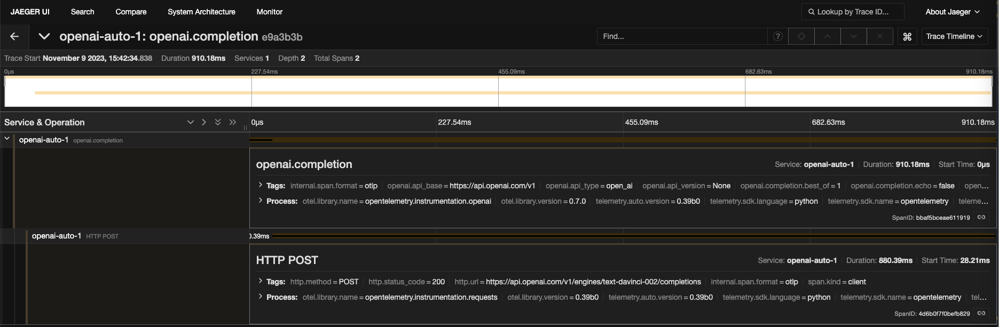

## Run OTEL Collector

- goto https://github.com/open-telemetry/opentelemetry-collector-contrib/tree/main/examples/demo and run the collector via `docker compose up -d`

## Install OTEL Packages

```
pip install opentelemetry-distro
opentelemetry-bootstrap -a install
pip install opentelemetry-exporter-otlp
```

## ignore SSL errors

```
export OTEL_EXPORTER_OTLP_INSECURE=true
```

## Run the openai script

```
(py311) guangyaliu@guangyas-mbp-2 openai-auto % opentelemetry-instrument \
    --traces_exporter console,otlp \
    --metrics_exporter console \
    --service_name openai-auto-1 \
    --exporter_otlp_endpoint 0.0.0.0:4317 \
    python openai-auto.py
{
    "resource_metrics": [
        {
            "resource": {
                "attributes": {
                    "telemetry.sdk.language": "python",
                    "telemetry.sdk.name": "opentelemetry",
                    "telemetry.sdk.version": "1.18.0",
                    "service.name": "openai-auto-1",
                    "telemetry.auto.version": "0.39b0"
                },
                "schema_url": ""
            },
            "scope_metrics": [
                {
                    "scope": {
                        "name": "opentelemetry.instrumentation.requests",
                        "version": "0.39b0",
                        "schema_url": ""
                    },
                    "metrics": [
                        {
                            "name": "http.client.duration",
                            "description": "measures the duration of the outbound HTTP request",
                            "unit": "ms",
                            "data": {
                                "data_points": [
                                    {
                                        "attributes": {
                                            "http.method": "POST",
                                            "http.scheme": "https",
                                            "http.host": "api.openai.com",
                                            "net.peer.name": "api.openai.com",
                                            "http.status_code": 200,
                                            "http.flavor": "1.1"
                                        },
                                        "start_time_unix_nano": 1699562555747094000,
                                        "time_unix_nano": 1699562555750344000,
                                        "count": 1,
                                        "sum": 880,
                                        "bucket_counts": [
                                            0,
                                            0,
                                            0,
                                            0,
                                            0,
                                            0,
                                            0,
                                            0,
                                            0,
                                            0,
                                            1,
                                            0,
                                            0,
                                            0,
                                            0,
                                            0
                                        ],
                                        "explicit_bounds": [
                                            0.0,
                                            5.0,
                                            10.0,
                                            25.0,
                                            50.0,
                                            75.0,
                                            100.0,
                                            250.0,
                                            500.0,
                                            750.0,
                                            1000.0,
                                            2500.0,
                                            5000.0,
                                            7500.0,
                                            10000.0
                                        ],
                                        "min": 880,
                                        "max": 880
                                    }
                                ],
                                "aggregation_temporality": 2
                            }
                        }
                    ],
                    "schema_url": ""
                }
            ],
            "schema_url": ""
        }
    ]
}
{
    "name": "HTTP POST",
    "context": {
        "trace_id": "0xe9a3b3b30e48562922ed409df24e84c3",
        "span_id": "0x4d6b0f7f0befb829",
        "trace_state": "[]"
    },
    "kind": "SpanKind.CLIENT",
    "parent_id": "0xbbaf5bceae611919",
    "start_time": "2023-11-09T20:42:34.866908Z",
    "end_time": "2023-11-09T20:42:35.747300Z",
    "status": {
        "status_code": "UNSET"
    },
    "attributes": {
        "http.method": "POST",
        "http.url": "https://api.openai.com/v1/engines/text-davinci-002/completions",
        "http.status_code": 200
    },
    "events": [],
    "links": [],
    "resource": {
        "attributes": {
            "telemetry.sdk.language": "python",
            "telemetry.sdk.name": "opentelemetry",
            "telemetry.sdk.version": "1.18.0",
            "service.name": "openai-auto-1",
            "telemetry.auto.version": "0.39b0"
        },
        "schema_url": ""
    }
}
{
    "name": "openai.completion",
    "context": {
        "trace_id": "0xe9a3b3b30e48562922ed409df24e84c3",
        "span_id": "0xbbaf5bceae611919",
        "trace_state": "[]"
    },
    "kind": "SpanKind.CLIENT",
    "parent_id": null,
    "start_time": "2023-11-09T20:42:34.838694Z",
    "end_time": "2023-11-09T20:42:35.748869Z",
    "status": {
        "status_code": "OK"
    },
    "attributes": {
        "openai.api_base": "https://api.openai.com/v1",
        "openai.api_type": "open_ai",
        "openai.api_version": "None",
        "openai.completion.suffix": "",
        "openai.completion.temperature": 1.0,
        "openai.completion.top_p": 1.0,
        "openai.completion.n": 1,
        "openai.completion.stream": false,
        "openai.completion.logprobs": -1,
        "openai.completion.echo": false,
        "openai.completion.stop": "",
        "openai.completion.max_tokens": 50,
        "openai.completion.presence_penalty": 0.0,
        "openai.completion.frequency_penalty": 0.0,
        "openai.completion.best_of": 1,
        "openai.completion.logit_bias": "",
        "openai.completion.user": "",
        "openai.completion.engine": "text-davinci-002",
        "openai.completion.prompt": "Generate some text...",
        "openai.completion.response.choices.0.text": "\n\nLorem ipsum dolor sit amet, consectetur adipiscing elit. Cras interdum dignissim nulla, malesuada egestas nibh aliquet in. Proin grav",
        "openai.completion.response.choices.0.index": 0,
        "openai.completion.response.choices.0.logprobs": "None",
        "openai.completion.response.choices.0.finish_reason": "length",
        "openai.completion.response.usage.prompt_tokens": 5,
        "openai.completion.response.usage.completion_tokens": 50,
        "openai.completion.response.usage.total_tokens": 55,
        "openai.completion.response.warning": "This model version is deprecated. Migrate before January 4, 2024 to avoid disruption of service. Learn more https://platform.openai.com/docs/deprecations",
        "openai.completion.response.id": "cmpl-8J69DuHPSsDDKE06X6g3uyKjQHQDL",
        "openai.completion.response.object": "text_completion",
        "openai.completion.response.created": 1699562555,
        "openai.completion.response.model": "text-davinci-002"
    },
    "events": [],
    "links": [],
    "resource": {
        "attributes": {
            "telemetry.sdk.language": "python",
            "telemetry.sdk.name": "opentelemetry",
            "telemetry.sdk.version": "1.18.0",
            "service.name": "openai-auto-1",
            "telemetry.auto.version": "0.39b0"
        },
        "schema_url": ""
    }
}
```



