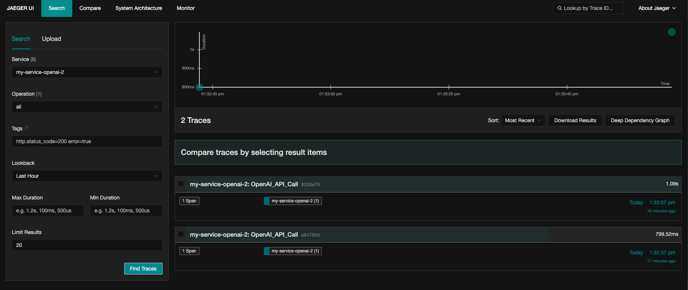
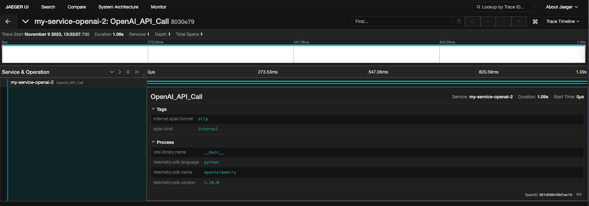

## Run OTEL Collector

- goto https://github.com/open-telemetry/opentelemetry-collector-contrib/tree/main/examples/demo and run the collector via `docker compose up -d`

## Install OTEL Packages

```
pip install opentelemetry-distro
opentelemetry-bootstrap -a install
pip install opentelemetry-exporter-otlp
```

## Run the openai script

```
python openai-manual.py
```

## Check from Jaeger

Open http://0.0.0.0:16686/


