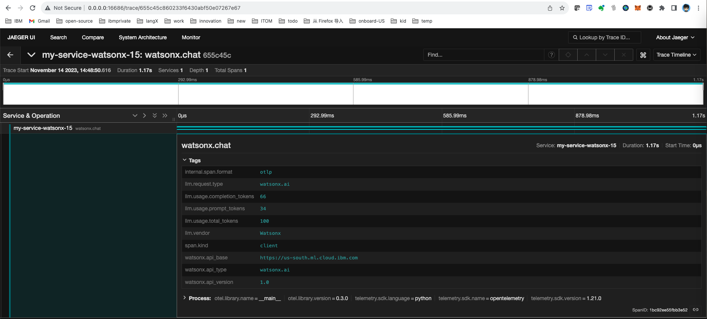

<!-- START doctoc generated TOC please keep comment here to allow auto update -->
<!-- DON'T EDIT THIS SECTION, INSTEAD RE-RUN doctoc TO UPDATE -->
**Table of Contents**  *generated with [DocToc](https://github.com/thlorenz/doctoc)*

- [Run OTEL Collector](#run-otel-collector)
- [Install OTEL Packages](#install-otel-packages)
- [ignore SSL errors](#ignore-ssl-errors)
- [Run the openai script](#run-the-openai-script)
- [Check Jaeger UI](#check-jaeger-ui)

<!-- END doctoc generated TOC please keep comment here to allow auto update -->

## Run OTEL Collector

- goto https://github.com/open-telemetry/opentelemetry-collector-contrib/tree/main/examples/demo and run the collector via `docker compose up -d`

## Install OTEL Packages

```
pip install opentelemetry-distro
opentelemetry-bootstrap -a install
pip install opentelemetry-exporter-otlp
```

## ignore SSL errors

```
export OTEL_EXPORTER_OTLP_INSECURE=true
```

## Run the watsonx script
```console
(py311) guangyaliu@guangyas-mbp-2 opentelemetry-instrumentation-watsonx % /Users/guangyaliu/py311/bin/python /Users/guangyaliu/go/src/github.com/
gyliu513/langX101/otel/opentelemetry-instrumentation-watsonx/watsonx-instrument.py
calling instrument
```

## Check Jaeger UI


