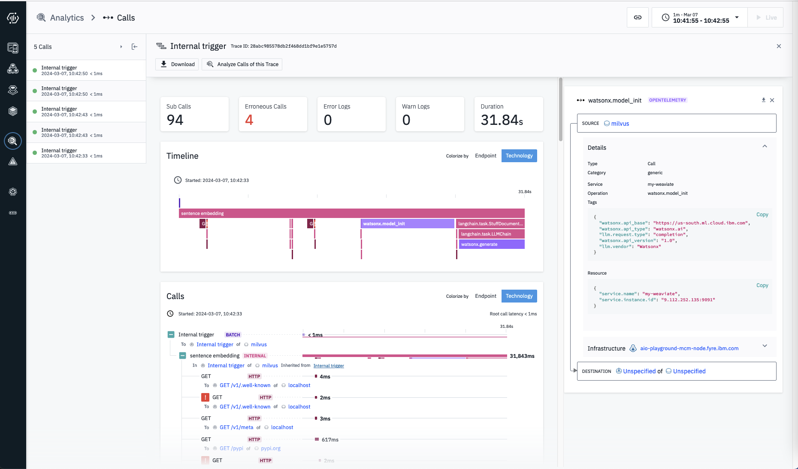

# Instrument RAG applications

## Code Example
- Prerequisite 
    - `pip install -r watsonx/requirements.txt`
- Sample Code
    - Weaviate
        - [watsonx/test_weaviate_langchain_traceloop.py](./test_weaviate_langchain_traceloop.py)
    - Chroma
        - [watsonx/test_chroma_langchain_traceloop.py](./test_chroma_langchain_traceloop.py)
    - Milvus
        - [watsonx/test_milvus_langchain_traceloop.py](./test_milvus_langchain_traceloop.py)
- In details
    - configure environment variables in `.env` file
        ```ini
        OTLP_EXPORTER_HTTP=http://9.112.252.135:4318
        OTEL_METRICS_EXPORTER=http://9.112.252.135:4318
        OTEL_EXPORTER_OTLP_INSECURE=true

        Huggingface_Token=
        LangChain_API_KEY=

        WATSONX_ENDPOINT=
        WATSONX_APIKEY=
        WATSONX_PROJECT_ID=

        WEAVIATE_SVC=my-weaviate
        WEAVIATE_URL=http://localhost:8080
        ```
    - import python modules
        ```python
        import os, logging
        from dotenv import load_dotenv

        from langchain_community.document_loaders import TextLoader
        from langchain_community.vectorstores import Weaviate
        from langchain_community.embeddings import HuggingFaceEmbeddings
        from langchain_text_splitters import CharacterTextSplitter
        from langchain.chains import RetrievalQA
        from langchain_community.document_loaders import TextLoader

        from opentelemetry import trace
        from traceloop.sdk import Traceloop
        from opentelemetry.sdk.trace import TracerProvider
        from opentelemetry.sdk.resources import Resource
        from opentelemetry.exporter.otlp.proto.grpc.trace_exporter import OTLPSpanExporter
        from opentelemetry.instrumentation.watsonx import WatsonxInstrumentor

        from ibm_watsonx_ai.foundation_models.utils.enums import ModelTypes
        from ibm_watsonx_ai.metanames import GenTextParamsMetaNames as GenParams
        from ibm_watsonx_ai.foundation_models.utils.enums import DecodingMethods

        from ibm_watsonx_ai.foundation_models.extensions.langchain.llm import WatsonxLLM
        from ibm_watsonx_ai.foundation_models import Model

        from opentelemetry.sdk.trace.export import (
            SimpleSpanProcessor,
        )
        ```
    - configure Traceloop
        ```python
        load_dotenv()

        Traceloop.init(api_endpoint=os.environ["OTLP_EXPORTER_HTTP"],
                    app_name=os.environ["WEAVIATE_SVC"],
                    )

        tracer_provider = TracerProvider(
            resource=Resource.create({'service.name': os.environ["WEAVIATE_SVC"]}),
        )

        # Create an OTLP Span Exporter
        otlp_exporter = OTLPSpanExporter(
            endpoint=os.environ["OTLP_EXPORTER_HTTP"],  
            insecure=True,
        )
        # trace.set_tracer_provider(tracer_provider)
        tracer =trace.get_tracer(__name__)

        WatsonxInstrumentor().instrument(tracer_provider=tracer_provider)
                    
        tracer_provider.add_span_processor(
            SimpleSpanProcessor(otlp_exporter)
        )

        ```
    - create a traceloop `span`
        ```python
        with tracer.start_as_current_span("sentence embedding"):
        ```
    - create a vector db query
        ```python
            loader = TextLoader("langchain/state_of_the_union.txt")
            documents = loader.load()
            text_splitter = CharacterTextSplitter(chunk_size=1000, chunk_overlap=0)
            docs = text_splitter.split_documents(documents)

            embeddings = HuggingFaceEmbeddings(
                model_name = 'sentence-transformers/all-mpnet-base-v2'
            )

            WEAVIATE_URL = os.getenv("WEAVIATE_URL", None)

            vector_db = Weaviate.from_documents(
                docs,
                embeddings,
                weaviate_url=WEAVIATE_URL,
            )

            query = "What did the president say about Ketanji Brown Jackson"
            docs = vector_db.similarity_search(query)

            print(docs[0].page_content)
        ```
    - create retrievalQA chain with vector db and watsonx model
        ```python
            filename = "watsonx/companyPolicies.txt"

            loader = TextLoader(filename)
            documents = loader.load()
            text_splitter = CharacterTextSplitter(chunk_size=1000, chunk_overlap=0)
            texts = text_splitter.split_documents(documents)
            print(len(texts))

            embeddings = HuggingFaceEmbeddings()
            # docsearch = Milvus.from_documents(texts, embeddings)
            docsearch = Weaviate.from_documents(texts, embeddings)
            print('documents ingested')

            model_id = ModelTypes.FLAN_UL2
            parameters = {
                GenParams.DECODING_METHOD: DecodingMethods.GREEDY,
                GenParams.MIN_NEW_TOKENS: 130,
                GenParams.MAX_NEW_TOKENS: 200
            }
            logger.debug(f'model_id = {model_id}')

            api_key = os.getenv("WATSONX_APIKEY", None)
            api_endpoint = os.getenv("WATSONX_ENDPOINT", None)
            project_id = os.getenv("WATSONX_PROJECT_ID", None)

            def get_credentials(api_key, api_endpoint):
                return {
                    "url" : api_endpoint,
                    "apikey" : api_key,
                }

            model = Model(
                model_id=model_id,
                params=parameters,
                credentials=get_credentials(api_key, api_endpoint),
                project_id=project_id
            )

            flan_ul2_llm = WatsonxLLM(model=model)

            qa = RetrievalQA.from_chain_type(llm=flan_ul2_llm, chain_type="stuff", retriever=docsearch.as_retriever())
            query = "mobile policy"
            qa.invoke(query)

        ```

## Instrument in Instana UI
### Weaviate
- 
- 
- 
- 
- 
### Chroma
- 
- 
- 
- 
- 
- 
### Milvus

- 
- 
- 
- 

## Setup vector DB

### Weaviate
- `docker-compose.yaml`
    ```yaml
    version: '3.4'
    services:
    weaviate:
        command:
        - --host
        - 0.0.0.0
        - --port
        - '8080'
        - --scheme
        - http
        image: cr.weaviate.io/semitechnologies/weaviate:1.24.1
        ports:
        - 8080:8080
        - 50051:50051
        volumes:
        - ./tools/dev/weaviate_data:/var/lib/weaviate
        restart: on-failure:0
        environment:
        QUERY_DEFAULTS_LIMIT: 25
        AUTHENTICATION_ANONYMOUS_ACCESS_ENABLED: 'true'
        PERSISTENCE_DATA_PATH: '/var/lib/weaviate'
        DEFAULT_VECTORIZER_MODULE: 'none'
        ENABLE_MODULES: 'text2vec-cohere,text2vec-huggingface,text2vec-palm,text2vec-openai,generative-openai,generative-cohere,generative-palm,ref2vec-centroid,reranker-cohere,qna-openai'
        CLUSTER_HOSTNAME: 'node1'
    contextionary:
        image: semitechnologies/contextionary:en0.16.0-v1.2.1
        ports:
        - "9999:9999"
        environment:
        EXTENSIONS_STORAGE_MODE: weaviate
    #      EXTENSIONS_STORAGE_ORIGIN: http://host.docker.internal:8080
        OCCURRENCE_WEIGHT_LINEAR_FACTOR: 0.75
        LOG_LEVEL: debug
    prometheus:
        image: prom/prometheus:v2.46.0
        volumes:
        - ./tools/dev/prometheus_config/:/etc/prometheus/
        - ./data/prometheus:/prometheus
        command:
        - '--config.file=/etc/prometheus/prometheus.yml'
        - '--storage.tsdb.path=/prometheus'
        - '--web.console.libraries=/usr/share/prometheus/console_libraries'
        - '--web.console.templates=/usr/share/prometheus/consoles'
        ports:
        - "9099:9090"

    ```
### Milvus
- docker-compose.yaml
  ```yaml
    version: '3.5'
    services:
    etcd:
        container_name: milvus-etcd
        image: quay.io/coreos/etcd:v3.5.5
        environment:
        - ETCD_AUTO_COMPACTION_MODE=revision
        - ETCD_AUTO_COMPACTION_RETENTION=1000
        - ETCD_QUOTA_BACKEND_BYTES=4294967296
        - ETCD_SNAPSHOT_COUNT=50000
        volumes:
        - ${DOCKER_VOLUME_DIRECTORY:-.}/volumes/etcd:/etcd
        command: etcd -advertise-client-urls=http://127.0.0.1:2379 -listen-client-urls http://0.0.0.0:2379 --data-dir /etcd

    minio:
        container_name: milvus-minio
        image: minio/minio:RELEASE.2023-03-20T20-16-18Z
        environment:
        MINIO_ACCESS_KEY: minioadmin
        MINIO_SECRET_KEY: minioadmin
        volumes:
        - ${DOCKER_VOLUME_DIRECTORY:-.}/volumes/minio:/minio_data
        command: minio server /minio_data
        healthcheck:
        test: ["CMD", "curl", "-f", "http://localhost:9000/minio/health/live"]
        interval: 30s
        timeout: 20s
        retries: 3

    standalone:
        container_name: milvus-standalone
        image: milvusdb/milvus:v2.3.3
        command: ["milvus", "run", "standalone"]
        environment:
        ETCD_ENDPOINTS: etcd:2379
        MINIO_ADDRESS: minio:9000
        volumes:
        - ${DOCKER_VOLUME_DIRECTORY:-.}/volumes/milvus:/var/lib/milvus
        ports:
        - "19530:19530"
        - "9091:9091"
        depends_on:
        - "etcd"
        - "minio"

    networks:
    default:
        name: milvus
    ```
- Configure OpenTelemetry in `config/milvus.yaml`
    ```yaml
    trace:
    # trace exporter type, default is stdout,
    # optional values: ['stdout', 'jaeger']
    exporter: otlp
    # fraction of traceID based sampler,
    # optional values: [0, 1]
    # Fractions >= 1 will always sample. Fractions < 0 are treated as zero.
    sampleFraction: 0
    otlp:
        endpoint: "9.112.252.135:4317"
    secure: false
    ```
### Chroma Workaround

- https://docs.trychroma.com/troubleshooting#sqlite
- https://gist.github.com/defulmere/8b9695e415a44271061cc8e272f3c300
- add this snippet in `python3.10/site-packages/chromadb/__init__.py`
    ```text
     __import__('pysqlite3')
     import sys
     sys.modules['sqlite3'] = sys.modules.pop('pysqlite3')
    ``` 
